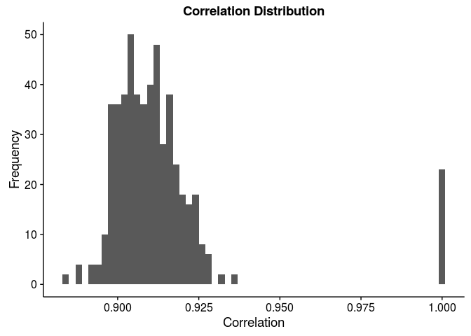

# Homework for STAT540
Sam Hinshaw  


Please view the HTML version of this document, not the GitHub rendering of the `.md` file for proper Table of Contents. 

# Setup

```r
# library(BiocInstaller) # or source("https://bioconductor.org/biocLite.R")
suppressPackageStartupMessages({
	library(limma) # biocLite("limma")
	library(edgeR) # biocLite("edgeR")
	library(DESeq2) # biocLite("DESeq2")
	library(dplyr)
	library(magrittr)
	library(devtools)
	library(broom)
	library(ggplot2)
	library(readr)
	library(knitr)
	library(xtable)
	library(pander)
	library(biomaRt)
	library(tidyr)
	library(RColorBrewer)
})
```

Let's check our R version & Packages are up-to-date
We want `R >= 3.2.3`, `limma >= 3.26.7`,  & `edgeR >= 3.12.0`

```r
sessioninfo <- devtools::session_info()
packages <- sessioninfo$packages
packages %>% 
	filter(package %in% c("limma", "edgeR"))
```

```
##   package * version       date       source
## 1   edgeR *  3.12.0 2015-12-17 Bioconductor
## 2   limma *  3.26.7 2016-01-30 Bioconductor
```

```r
sessioninfo$platform$version
```

```
## [1] "R version 3.2.3 (2015-12-10)"
```

Looks good, let's continue

# Data Inspection

## Download Data

For this, I am using a makefile to avoid downloading the datasets more than once. 
See [Makefile](./Makefile) in this directory. Contents pasted here:
```
all: homework

clean: 
	rm -rf SamHinshawHomework.md SamHinshawHomework.html data_fixed.txt design_fixed.txt

data: 
	curl -o data.txt.gz 'http://stat540-ubc.github.io/homework/assignment/homework_data/NHBE_transcriptome_data.txt.gz?raw=true'
	gunzip -kq data.txt.gz

design: 
	curl -o design.txt 'http://stat540-ubc.github.io/homework/assignment/homework_data/NHBE_design.txt?raw=true'

gitignore: data.txt.gz design.txt data.txt
	grep -q -F 'data.txt' ../.gitignore || echo 'data.txt' >> ../.gitignore
	grep -q -F 'data.txt.gz' ../.gitignore || echo 'data.txt.gz' >> ../.gitignore
	grep -q -F 'design.txt' ../.gitignore || echo 'design.txt' >> ../.gitignore
	grep -q -F 'design_fixed.txt' ../.gitignore || echo 'design_fixed.txt' >> ../.gitignore
	grep -q -F 'data_fixed.txt' ../.gitignore || echo 'data_fixed.txt' >> ../.gitignore

data_fixed: data.txt
	cp data.txt data_fixed.txt
	sed -i -e 's/^"GSE10718_Biomat_1"/"ProbeID"	"GSE10718_Biomat_1"/' data_fixed.txt
	
design_fixed: design.txt
	cp design.txt design_fixed.txt
	sed -i -e 's/^"ExternalID"/"InternalID"	"ExternalID"/' design_fixed.txt
	
homework:  SamHinshawHomework.Rmd gitignore data_fixed design_fixed
	Rscript -e "rmarkdown::render('SamHinshawHomework.Rmd')"
	
```

## Experimental Design

Before we do anything, let's see what's what in our experiment  
<blockquote>
Gene expression patterns were assessed in normal human bronchial epithelial (NHBE) cells exposed to cigarette smoke (CS) from a typical "full flavor" American brand of cigarettes in order to develop a better understanding of the genomic impact of tobacco exposure, which can ultimately define biomarkers that discriminate tobacco-related effects and outcomes in a clinical setting. NHBE cells were treated with CS for 15 minutes and alterations to the transcriptome assessed at 1,2,4 and 24 hours post-CS-exposure using high-density oligonucleotide microarrays.
</blockquote>

## Import Data

```r
data <- read_delim("data.txt", delim = "\t")
```

```
## Warning: 22737 parsing failures.
## row col   expected     actual
##   1  -- 23 columns 24 columns
##   2  -- 23 columns 24 columns
##   3  -- 23 columns 24 columns
##   4  -- 23 columns 24 columns
##   5  -- 23 columns 24 columns
## ... ... .......... ..........
## .See problems(...) for more details.
```

Huh, thanks to `readr`, we're getting an error. Something is wrong with our column count. Let's head to the next step and figure out how to handle this error.  

## Inspect Data

```r
class(data) # First let's make sure this is expected. We should have a data.frame, specifically a tbl_df. 
```

```
## [1] "tbl_df"     "tbl"        "data.frame"
```

```r
glimpse(data)
```

```
## Observations: 22,737
## Variables: 23
## $ GSE10718_Biomat_1  (chr) "1294_at", "1316_at", "1320_at", "1431_at",...
## $ GSE10718_Biomat_10 (dbl) 7.900022, 6.126008, 6.822491, 6.633596, 6.9...
## $ GSE10718_Biomat_11 (dbl) 7.623666, 5.846865, 7.616309, 5.698143, 7.5...
## $ GSE10718_Biomat_12 (dbl) 8.224398, 6.299318, 7.217153, 6.221293, 7.2...
## $ GSE10718_Biomat_13 (dbl) 8.009710, 5.910947, 6.172960, 6.055411, 7.9...
## $ GSE10718_Biomat_14 (dbl) 7.607968, 6.623939, 7.201396, 6.885087, 7.8...
## $ GSE10718_Biomat_15 (dbl) 7.448574, 6.824437, 7.397821, 7.023587, 7.5...
## $ GSE10718_Biomat_16 (dbl) 7.414247, 6.884227, 6.782186, 6.591812, 7.2...
## $ GSE10718_Biomat_17 (dbl) 7.671862, 6.830394, 6.987745, 6.454693, 7.5...
## $ GSE10718_Biomat_19 (dbl) 7.892385, 6.453085, 5.845809, 6.176024, 7.2...
## $ GSE10718_Biomat_2  (dbl) 7.804841, 6.658476, 6.831755, 6.192702, 6.9...
## $ GSE10718_Biomat_20 (dbl) 7.721433, 6.569794, 6.674275, 6.741030, 7.0...
## $ GSE10718_Biomat_21 (dbl) 7.548707, 5.806634, 6.282316, 5.568127, 8.0...
## $ GSE10718_Biomat_22 (dbl) 6.343507, 7.064967, 7.234590, 5.768635, 7.6...
## $ GSE10718_Biomat_23 (dbl) 7.797584, 6.485319, 6.750336, 5.585600, 7.3...
## $ GSE10718_Biomat_24 (dbl) 7.951058, 7.084865, 7.111929, 7.135406, 7.8...
## $ GSE10718_Biomat_3  (dbl) 7.877641, 6.237747, 6.972026, 6.343507, 7.0...
## $ GSE10718_Biomat_4  (dbl) 7.510909, 6.384493, 6.979904, 6.727300, 7.0...
## $ GSE10718_Biomat_5  (dbl) 7.309565, 6.885804, 7.621911, 6.481674, 8.4...
## $ GSE10718_Biomat_6  (dbl) 8.004972, 7.100588, 7.294042, 5.722269, 7.7...
## $ GSE10718_Biomat_7  (dbl) 7.502813, 6.421699, 7.684150, 6.281308, 7.5...
## $ GSE10718_Biomat_8  (dbl) 7.500043, 6.269029, 7.116839, 6.625745, 8.1...
## $ GSE10718_Biomat_9  (dbl) 7.509491, 6.534320, 6.613354, 6.523722, 7.6...
```

It looks like we may have an error with our header, as we've got probe IDs labeled as a sample. Could this be an artifact of the compression? Let's try something else real quick. Also, now we know what dataset we're using! GSE10718.

```r
data_method2 <- gzfile("data.txt.gz") %>% read_delim(delim = "\t")
```

```
## Warning: 22737 parsing failures.
## row col   expected     actual
##   1  -- 23 columns 24 columns
##   2  -- 23 columns 24 columns
##   3  -- 23 columns 24 columns
##   4  -- 23 columns 24 columns
##   5  -- 23 columns 24 columns
## ... ... .......... ..........
## .See problems(...) for more details.
```

Nope, looks like it's just a problem with the source file. 

```r
rm(data_method2)
```

### Fix Import Errors

Well, since we're not supposed to edit our souce file, I've copied the file do `data_fixed.txt` and appended `"probeIDs	"` to the beginning of the first line with `sed`.  Now we should be ready to rock!

```r
data <- read_delim("data_fixed.txt", delim = "\t")
```

Sweet! No errors. Let's take a closer look.

```r
glimpse(data)
```

```
## Observations: 22,737
## Variables: 24
## $ ProbeID            (chr) "1294_at", "1316_at", "1320_at", "1431_at",...
## $ GSE10718_Biomat_1  (dbl) 7.900022, 6.126008, 6.822491, 6.633596, 6.9...
## $ GSE10718_Biomat_10 (dbl) 7.623666, 5.846865, 7.616309, 5.698143, 7.5...
## $ GSE10718_Biomat_11 (dbl) 8.224398, 6.299318, 7.217153, 6.221293, 7.2...
## $ GSE10718_Biomat_12 (dbl) 8.009710, 5.910947, 6.172960, 6.055411, 7.9...
## $ GSE10718_Biomat_13 (dbl) 7.607968, 6.623939, 7.201396, 6.885087, 7.8...
## $ GSE10718_Biomat_14 (dbl) 7.448574, 6.824437, 7.397821, 7.023587, 7.5...
## $ GSE10718_Biomat_15 (dbl) 7.414247, 6.884227, 6.782186, 6.591812, 7.2...
## $ GSE10718_Biomat_16 (dbl) 7.671862, 6.830394, 6.987745, 6.454693, 7.5...
## $ GSE10718_Biomat_17 (dbl) 7.892385, 6.453085, 5.845809, 6.176024, 7.2...
## $ GSE10718_Biomat_19 (dbl) 7.804841, 6.658476, 6.831755, 6.192702, 6.9...
## $ GSE10718_Biomat_2  (dbl) 7.721433, 6.569794, 6.674275, 6.741030, 7.0...
## $ GSE10718_Biomat_20 (dbl) 7.548707, 5.806634, 6.282316, 5.568127, 8.0...
## $ GSE10718_Biomat_21 (dbl) 6.343507, 7.064967, 7.234590, 5.768635, 7.6...
## $ GSE10718_Biomat_22 (dbl) 7.797584, 6.485319, 6.750336, 5.585600, 7.3...
## $ GSE10718_Biomat_23 (dbl) 7.951058, 7.084865, 7.111929, 7.135406, 7.8...
## $ GSE10718_Biomat_24 (dbl) 7.877641, 6.237747, 6.972026, 6.343507, 7.0...
## $ GSE10718_Biomat_3  (dbl) 7.510909, 6.384493, 6.979904, 6.727300, 7.0...
## $ GSE10718_Biomat_4  (dbl) 7.309565, 6.885804, 7.621911, 6.481674, 8.4...
## $ GSE10718_Biomat_5  (dbl) 8.004972, 7.100588, 7.294042, 5.722269, 7.7...
## $ GSE10718_Biomat_6  (dbl) 7.502813, 6.421699, 7.684150, 6.281308, 7.5...
## $ GSE10718_Biomat_7  (dbl) 7.500043, 6.269029, 7.116839, 6.625745, 8.1...
## $ GSE10718_Biomat_8  (dbl) 7.509491, 6.534320, 6.613354, 6.523722, 7.6...
## $ GSE10718_Biomat_9  (dbl) 7.735819, 6.888977, 6.708225, 7.063494, 7.4...
```

Looking good. These seem to be log2 transformed microarray intensity values.  How about we examine the metadata and then do a quick intensity plot. 

```r
design <- read_delim("design.txt", delim = "\t")
```

```
## Warning: 23 parsing failures.
## row col  expected    actual
##   1  -- 3 columns 4 columns
##   2  -- 3 columns 4 columns
##   3  -- 3 columns 4 columns
##   4  -- 3 columns 4 columns
##   5  -- 3 columns 4 columns
## ... ... ......... .........
## .See problems(...) for more details.
```

Ugh, same problem again? C'mon guys. Back to `sed`. 

```r
design <- read_delim("design_fixed.txt", delim = "\t")
glimpse(design)
```

```
## Observations: 23
## Variables: 4
## $ InternalID (chr) "GSE10718_Biomat_1", "GSE10718_Biomat_10", "GSE1071...
## $ ExternalID (chr) "GSM270883", "GSM270874", "GSM270873", "GSM270872",...
## $ Treatment  (chr) "control", "control", "control", "control", "contro...
## $ time       (chr) "24_h", "1_h", "1_h", "1_h", "4_h", "4_h", "4_h", "...
```

### Inspect Data

There we go! So we've got 23 samples. How many different treatment groups, and how many different timepoints?

```r
design %>% 
	group_by(Treatment) %>% 
	tally()
```

```
## Source: local data frame [2 x 2]
## 
##         Treatment     n
##             (chr) (int)
## 1 cigarette_smoke    11
## 2         control    12
```

```r
design %>% 
	group_by(time) %>% 
	tally()
```

```
## Source: local data frame [4 x 2]
## 
##    time     n
##   (chr) (int)
## 1   1_h     5
## 2  24_h     6
## 3   2_h     6
## 4   4_h     6
```

```r
design %>% 
	group_by(Treatment, time) %>% 
	tally()
```

```
## Source: local data frame [8 x 3]
## Groups: Treatment [?]
## 
##         Treatment  time     n
##             (chr) (chr) (int)
## 1 cigarette_smoke   1_h     2
## 2 cigarette_smoke  24_h     3
## 3 cigarette_smoke   2_h     3
## 4 cigarette_smoke   4_h     3
## 5         control   1_h     3
## 6         control  24_h     3
## 7         control   2_h     3
## 8         control   4_h     3
```

That's a pretty good summary of what's going on, I'd say. Now back to our data file. How many different genes do we have reported?

```r
nrow(data)
```

```
## [1] 22737
```

22,737 probes.  Do we know any microarrays that have exactly that many genes?  Fortunately, we don't need to wonder. [This study, GSE10718](http://www.ncbi.nlm.nih.gov/geo/query/acc.cgi?acc=GSE10718) used [GPL570](http://www.ncbi.nlm.nih.gov/geo/query/acc.cgi?acc=GPL570), the well known Affymetrix HG U133+ 2.0 Array. Later we can use biomaRt to convert our probeIDs to ensembl IDs (or another equivalent), given the platform information. 

## Basic Data Manipulation
Before we continue, let's create a new column in our dataset that holds our time post-treatment as hours.


```r
design %<>% 
	mutate(hours = gsub("\\_h$","", time) %>% as.numeric())
```


## Basic Graphing

However, for now we can just plot some intensity distributions. To help our plot colors out, we can convert our Treatment and time variables to factors

```r
design$Treatment <- as.factor(design$Treatment)
design$time <- as.factor(design$time)
```

Now we can `gather()` our data for easy plotting, and even join our design data as well. 

```r
gathered_data <- data %>% 
	gather("InternalID", "intensity", 2:24)
glimpse(gathered_data)
```

```
## Observations: 522,951
## Variables: 3
## $ ProbeID    (chr) "1294_at", "1316_at", "1320_at", "1431_at", "1438_a...
## $ InternalID (chr) "GSE10718_Biomat_1", "GSE10718_Biomat_1", "GSE10718...
## $ intensity  (dbl) 7.900022, 6.126008, 6.822491, 6.633596, 6.948795, 9...
```

```r
gathered_data <- inner_join(gathered_data, design, by = "InternalID")
glimpse(gathered_data)
```

```
## Observations: 522,951
## Variables: 7
## $ ProbeID    (chr) "1294_at", "1316_at", "1320_at", "1431_at", "1438_a...
## $ InternalID (chr) "GSE10718_Biomat_1", "GSE10718_Biomat_1", "GSE10718...
## $ intensity  (dbl) 7.900022, 6.126008, 6.822491, 6.633596, 6.948795, 9...
## $ ExternalID (chr) "GSM270883", "GSM270883", "GSM270883", "GSM270883",...
## $ Treatment  (fctr) control, control, control, control, control, contr...
## $ time       (fctr) 24_h, 24_h, 24_h, 24_h, 24_h, 24_h, 24_h, 24_h, 24...
## $ hours      (dbl) 24, 24, 24, 24, 24, 24, 24, 24, 24, 24, 24, 24, 24,...
```

Before we plot, let's set up our color palette.

```r
display.brewer.all()
```


```r
timepoints <- brewer.pal(4, "Set1")
names(timepoints) <- unique(design$time)
treatments <- c("#7FC97F", "#FDC086")
names(treatments) <- unique(design$Treatment)
```

And now, the plot.  First with time-coding...

```r
p <- ggplot(gathered_data, aes(x = intensity))
p + geom_density(aes(fill = time)) + 
	scale_fill_manual(values = timepoints) + xlab("log2 intensity") + ylab("Frequency") + 
	facet_wrap( ~ InternalID, ncol = 5) + ggtitle("Log2 Intensities of Samples in GSE10718")
```


...and next with treatment coding.

```r
p <- ggplot(gathered_data, aes(x = intensity))
p + geom_density(aes(fill = Treatment)) + 
	scale_fill_manual(values = treatments) + xlab("log2 intensity") + ylab("Frequency") + 
	facet_wrap( ~ InternalID, ncol = 5) + ggtitle("Log2 Intensities of Samples in GSE10718")
```



Good for now!  I'll continue later. 

********
This page was last updated on  Thursday, March 03, 2016 at 01:12PM
