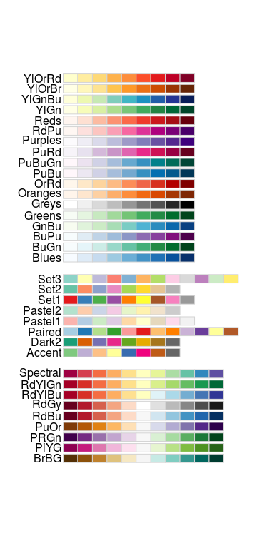
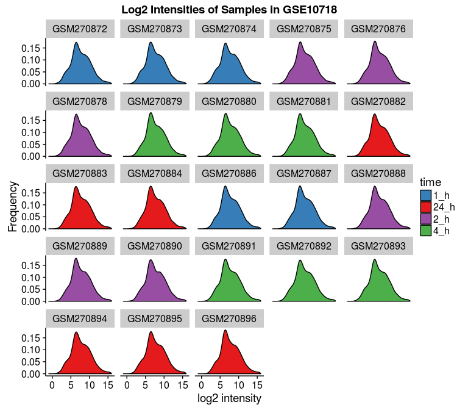

# Homework for STAT540
Sam Hinshaw  


Please view the HTML version of this document, not the GitHub rendering of the `.md` file for proper Table of Contents. 

# 0 Setup

```r
# library(BiocInstaller) # or source("https://bioconductor.org/biocLite.R")
suppressPackageStartupMessages({
	library(limma) # biocLite("limma")
	library(edgeR) # biocLite("edgeR")
	library(DESeq2) # biocLite("DESeq2")
	library(biomaRt)
	library(magrittr)
	library(devtools)
	library(broom)
	library(ggplot2)
	library(reshape2)
	library(readr)
	library(knitr)
	library(xtable)
	library(pander)
	library(tidyr)
	library(RColorBrewer)
	library(viridis)
	library(dplyr)
})
```

Let's check our R version & Packages are up-to-date
We want `R >= 3.2.3`, `limma >= 3.26.7`,  & `edgeR >= 3.12.0`

```r
sessioninfo <- devtools::session_info()
packages <- sessioninfo$packages
packages %>% 
	filter(package %in% c("limma", "edgeR"))
```

```
##   package * version       date       source
## 1   edgeR *  3.12.0 2015-12-17 Bioconductor
## 2   limma *  3.26.7 2016-01-30 Bioconductor
```

```r
sessioninfo$platform$version
```

```
## [1] "R version 3.2.3 (2015-12-10)"
```

Looks good, let's continue

# 1 Data Inspection

## 1.1 Download Data

For this, I am using a makefile to avoid downloading the datasets more than once. 
See [Makefile](./Makefile) in this directory. Contents pasted here:
```
all: homework

clean: 
	rm -rf SamHinshawHomework.md SamHinshawHomework.html data_fixed.txt design_fixed.txt

data: 
	curl -o data.txt.gz 'http://stat540-ubc.github.io/homework/assignment/homework_data/NHBE_transcriptome_data.txt.gz?raw=true'
	gunzip -kq data.txt.gz

design: 
	curl -o design.txt 'http://stat540-ubc.github.io/homework/assignment/homework_data/NHBE_design.txt?raw=true'

gitignore: data.txt.gz design.txt data.txt
	grep -q -F 'data.txt' ../.gitignore || echo 'data.txt' >> ../.gitignore
	grep -q -F 'data.txt.gz' ../.gitignore || echo 'data.txt.gz' >> ../.gitignore
	grep -q -F 'design.txt' ../.gitignore || echo 'design.txt' >> ../.gitignore
	grep -q -F 'design_fixed.txt' ../.gitignore || echo 'design_fixed.txt' >> ../.gitignore
	grep -q -F 'data_fixed.txt' ../.gitignore || echo 'data_fixed.txt' >> ../.gitignore

data_fixed: data.txt
	cp data.txt data_fixed.txt
	sed -i -e 's/^"GSE10718_Biomat_1"/"ProbeID"	"GSE10718_Biomat_1"/' data_fixed.txt
	
design_fixed: design.txt
	cp design.txt design_fixed.txt
	sed -i -e 's/^"ExternalID"/"InternalID"	"ExternalID"/' design_fixed.txt
	
homework:  SamHinshawHomework.Rmd gitignore data_fixed design_fixed
	Rscript -e "rmarkdown::render('SamHinshawHomework.Rmd')"
	
```

### Experimental Design

Before we do anything, let's see what's what in our experiment, [GSE10718](http://www.ncbi.nlm.nih.gov/geo/query/acc.cgi?acc=GSE10718)
<blockquote>
Gene expression patterns were assessed in normal human bronchial epithelial (NHBE) cells exposed to cigarette smoke (CS) from a typical "full flavor" American brand of cigarettes in order to develop a better understanding of the genomic impact of tobacco exposure, which can ultimately define biomarkers that discriminate tobacco-related effects and outcomes in a clinical setting. NHBE cells were treated with CS for 15 minutes and alterations to the transcriptome assessed at 1,2,4 and 24 hours post-CS-exposure using high-density oligonucleotide microarrays.
</blockquote>

### Import Data

```r
data <- read_delim("data.txt", delim = "\t")
```

```
## Warning: 22737 parsing failures.
## row col   expected     actual
##   1  -- 23 columns 24 columns
##   2  -- 23 columns 24 columns
##   3  -- 23 columns 24 columns
##   4  -- 23 columns 24 columns
##   5  -- 23 columns 24 columns
## ... ... .......... ..........
## .See problems(...) for more details.
```

Huh, thanks to `readr`, we're getting an error. Something is wrong with our column count. Let's head to the next step and figure out how to handle this error.  

### Inspect Data

```r
class(data) # First let's make sure this is expected. We should have a data.frame, specifically a tbl_df. 
```

```
## [1] "tbl_df"     "tbl"        "data.frame"
```

```r
glimpse(data)
```

```
## Observations: 22,737
## Variables: 23
## $ GSE10718_Biomat_1  (chr) "1294_at", "1316_at", "1320_at", "1431_at",...
## $ GSE10718_Biomat_10 (dbl) 7.900022, 6.126008, 6.822491, 6.633596, 6.9...
## $ GSE10718_Biomat_11 (dbl) 7.623666, 5.846865, 7.616309, 5.698143, 7.5...
## $ GSE10718_Biomat_12 (dbl) 8.224398, 6.299318, 7.217153, 6.221293, 7.2...
## $ GSE10718_Biomat_13 (dbl) 8.009710, 5.910947, 6.172960, 6.055411, 7.9...
## $ GSE10718_Biomat_14 (dbl) 7.607968, 6.623939, 7.201396, 6.885087, 7.8...
## $ GSE10718_Biomat_15 (dbl) 7.448574, 6.824437, 7.397821, 7.023587, 7.5...
## $ GSE10718_Biomat_16 (dbl) 7.414247, 6.884227, 6.782186, 6.591812, 7.2...
## $ GSE10718_Biomat_17 (dbl) 7.671862, 6.830394, 6.987745, 6.454693, 7.5...
## $ GSE10718_Biomat_19 (dbl) 7.892385, 6.453085, 5.845809, 6.176024, 7.2...
## $ GSE10718_Biomat_2  (dbl) 7.804841, 6.658476, 6.831755, 6.192702, 6.9...
## $ GSE10718_Biomat_20 (dbl) 7.721433, 6.569794, 6.674275, 6.741030, 7.0...
## $ GSE10718_Biomat_21 (dbl) 7.548707, 5.806634, 6.282316, 5.568127, 8.0...
## $ GSE10718_Biomat_22 (dbl) 6.343507, 7.064967, 7.234590, 5.768635, 7.6...
## $ GSE10718_Biomat_23 (dbl) 7.797584, 6.485319, 6.750336, 5.585600, 7.3...
## $ GSE10718_Biomat_24 (dbl) 7.951058, 7.084865, 7.111929, 7.135406, 7.8...
## $ GSE10718_Biomat_3  (dbl) 7.877641, 6.237747, 6.972026, 6.343507, 7.0...
## $ GSE10718_Biomat_4  (dbl) 7.510909, 6.384493, 6.979904, 6.727300, 7.0...
## $ GSE10718_Biomat_5  (dbl) 7.309565, 6.885804, 7.621911, 6.481674, 8.4...
## $ GSE10718_Biomat_6  (dbl) 8.004972, 7.100588, 7.294042, 5.722269, 7.7...
## $ GSE10718_Biomat_7  (dbl) 7.502813, 6.421699, 7.684150, 6.281308, 7.5...
## $ GSE10718_Biomat_8  (dbl) 7.500043, 6.269029, 7.116839, 6.625745, 8.1...
## $ GSE10718_Biomat_9  (dbl) 7.509491, 6.534320, 6.613354, 6.523722, 7.6...
```

It looks like we may have an error with our header, as we've got probe IDs labeled as a sample. Could this be an artifact of the compression? Let's try something else real quick. Also, now we know what dataset we're using! GSE10718.

```r
data_method2 <- gzfile("data.txt.gz") %>% read_delim(delim = "\t")
```

```
## Warning: 22737 parsing failures.
## row col   expected     actual
##   1  -- 23 columns 24 columns
##   2  -- 23 columns 24 columns
##   3  -- 23 columns 24 columns
##   4  -- 23 columns 24 columns
##   5  -- 23 columns 24 columns
## ... ... .......... ..........
## .See problems(...) for more details.
```

Nope, looks like it's just a problem with the source file. 

```r
rm(data_method2)
```

### Fix Import Errors

Well, since we're not supposed to edit our souce file, I've copied the file do `data_fixed.txt` and appended `"probeIDs	"` to the beginning of the first line with `sed`.  Now we should be ready to rock!

```r
data <- read_delim("data_fixed.txt", delim = "\t")
fitdata <- data
```

Sweet! No errors. Let's take a closer look.

```r
glimpse(data)
```

```
## Observations: 22,737
## Variables: 24
## $ ProbeID            (chr) "1294_at", "1316_at", "1320_at", "1431_at",...
## $ GSE10718_Biomat_1  (dbl) 7.900022, 6.126008, 6.822491, 6.633596, 6.9...
## $ GSE10718_Biomat_10 (dbl) 7.623666, 5.846865, 7.616309, 5.698143, 7.5...
## $ GSE10718_Biomat_11 (dbl) 8.224398, 6.299318, 7.217153, 6.221293, 7.2...
## $ GSE10718_Biomat_12 (dbl) 8.009710, 5.910947, 6.172960, 6.055411, 7.9...
## $ GSE10718_Biomat_13 (dbl) 7.607968, 6.623939, 7.201396, 6.885087, 7.8...
## $ GSE10718_Biomat_14 (dbl) 7.448574, 6.824437, 7.397821, 7.023587, 7.5...
## $ GSE10718_Biomat_15 (dbl) 7.414247, 6.884227, 6.782186, 6.591812, 7.2...
## $ GSE10718_Biomat_16 (dbl) 7.671862, 6.830394, 6.987745, 6.454693, 7.5...
## $ GSE10718_Biomat_17 (dbl) 7.892385, 6.453085, 5.845809, 6.176024, 7.2...
## $ GSE10718_Biomat_19 (dbl) 7.804841, 6.658476, 6.831755, 6.192702, 6.9...
## $ GSE10718_Biomat_2  (dbl) 7.721433, 6.569794, 6.674275, 6.741030, 7.0...
## $ GSE10718_Biomat_20 (dbl) 7.548707, 5.806634, 6.282316, 5.568127, 8.0...
## $ GSE10718_Biomat_21 (dbl) 6.343507, 7.064967, 7.234590, 5.768635, 7.6...
## $ GSE10718_Biomat_22 (dbl) 7.797584, 6.485319, 6.750336, 5.585600, 7.3...
## $ GSE10718_Biomat_23 (dbl) 7.951058, 7.084865, 7.111929, 7.135406, 7.8...
## $ GSE10718_Biomat_24 (dbl) 7.877641, 6.237747, 6.972026, 6.343507, 7.0...
## $ GSE10718_Biomat_3  (dbl) 7.510909, 6.384493, 6.979904, 6.727300, 7.0...
## $ GSE10718_Biomat_4  (dbl) 7.309565, 6.885804, 7.621911, 6.481674, 8.4...
## $ GSE10718_Biomat_5  (dbl) 8.004972, 7.100588, 7.294042, 5.722269, 7.7...
## $ GSE10718_Biomat_6  (dbl) 7.502813, 6.421699, 7.684150, 6.281308, 7.5...
## $ GSE10718_Biomat_7  (dbl) 7.500043, 6.269029, 7.116839, 6.625745, 8.1...
## $ GSE10718_Biomat_8  (dbl) 7.509491, 6.534320, 6.613354, 6.523722, 7.6...
## $ GSE10718_Biomat_9  (dbl) 7.735819, 6.888977, 6.708225, 7.063494, 7.4...
```

Looking good. These seem to be log2 transformed microarray intensity values.  How about we examine the metadata and then do a quick intensity plot. 

```r
design <- read_delim("design.txt", delim = "\t")
```

```
## Warning: 23 parsing failures.
## row col  expected    actual
##   1  -- 3 columns 4 columns
##   2  -- 3 columns 4 columns
##   3  -- 3 columns 4 columns
##   4  -- 3 columns 4 columns
##   5  -- 3 columns 4 columns
## ... ... ......... .........
## .See problems(...) for more details.
```

Ugh, same problem again? C'mon guys. Back to `sed`. 

```r
design <- read_delim("design_fixed.txt", delim = "\t")
glimpse(design)
```

```
## Observations: 23
## Variables: 4
## $ InternalID (chr) "GSE10718_Biomat_1", "GSE10718_Biomat_10", "GSE1071...
## $ ExternalID (chr) "GSM270883", "GSM270874", "GSM270873", "GSM270872",...
## $ Treatment  (chr) "control", "control", "control", "control", "contro...
## $ time       (chr) "24_h", "1_h", "1_h", "1_h", "4_h", "4_h", "4_h", "...
```

### Inspect Data

There we go! So we've got 23 samples. How many different treatment groups, and how many different timepoints?

```r
design %>% 
	group_by(Treatment) %>% 
	tally()
```

```
## Source: local data frame [2 x 2]
## 
##         Treatment     n
##             (chr) (int)
## 1 cigarette_smoke    11
## 2         control    12
```

```r
design %>% 
	group_by(time) %>% 
	tally()
```

```
## Source: local data frame [4 x 2]
## 
##    time     n
##   (chr) (int)
## 1   1_h     5
## 2  24_h     6
## 3   2_h     6
## 4   4_h     6
```

```r
design %>% 
	group_by(Treatment, time) %>% 
	tally()
```

```
## Source: local data frame [8 x 3]
## Groups: Treatment [?]
## 
##         Treatment  time     n
##             (chr) (chr) (int)
## 1 cigarette_smoke   1_h     2
## 2 cigarette_smoke  24_h     3
## 3 cigarette_smoke   2_h     3
## 4 cigarette_smoke   4_h     3
## 5         control   1_h     3
## 6         control  24_h     3
## 7         control   2_h     3
## 8         control   4_h     3
```

That's a pretty good summary of what's going on, I'd say. Now back to our data file. How many different genes do we have reported?

```r
nrow(data)
```

```
## [1] 22737
```

22,737 probes.  Do we know any microarrays that have exactly that many genes?  Fortunately, we don't need to wonder. This study, [GSE10718](http://www.ncbi.nlm.nih.gov/geo/query/acc.cgi?acc=GSE10718) used [GPL570](http://www.ncbi.nlm.nih.gov/geo/query/acc.cgi?acc=GPL570), the well known Affymetrix HG U133+ 2.0 Array. Later we can use biomaRt to convert our probeIDs to ensembl IDs (or another equivalent), given the platform information. 

## 1.2 Basic Data Manipulation
Before we continue, let's create a new column in our dataset that holds our time post-treatment as hours.


```r
design %<>% 
	mutate(hours = gsub("\\_h$","", time) %>% as.numeric())
glimpse(design)
```

```
## Observations: 23
## Variables: 5
## $ InternalID (chr) "GSE10718_Biomat_1", "GSE10718_Biomat_10", "GSE1071...
## $ ExternalID (chr) "GSM270883", "GSM270874", "GSM270873", "GSM270872",...
## $ Treatment  (chr) "control", "control", "control", "control", "contro...
## $ time       (chr) "24_h", "1_h", "1_h", "1_h", "4_h", "4_h", "4_h", "...
## $ hours      (dbl) 24, 1, 1, 1, 4, 4, 4, 1, 1, 2, 24, 2, 2, 4, 4, 4, 2...
```


## 1.3 Basic Graphing

However, for now we can just plot some intensity distributions. To help our plot colors out, we can convert our Treatment and time variables to factors. This is more for my own benefit (to see intensity distributions) than it is to follow the homework to the letter. Homework progress will continue below. 

```r
design$Treatment <- as.factor(design$Treatment)
design$time <- as.factor(design$time)
```

### Intensity Distributions

Let's get biomaRt out of the way so we can move on.  

```r
ensembl <- useMart("ensembl") # set up biomaRt to use the ensembl database
datasets <- listDatasets(ensembl) # store our datasets so we can see which to use
ensembl <- useDataset("hsapiens_gene_ensembl", mart = ensembl) # use the human data set!
filters <- listFilters(ensembl) # find what filters we can use and cross fingers that it's here
attributes <- listAttributes(ensembl) # ditto with the attributes
affy_probe_IDs <- getBM(attributes = c("ensembl_gene_id", "affy_hg_u133_plus_2"), filters = "affy_hg_u133_plus_2", values = data$ProbeID, mart = ensembl) # query the probeIDs
head(affy_probe_IDs)
```

```
##   ensembl_gene_id affy_hg_u133_plus_2
## 1 ENSG00000198888        1553551_s_at
## 2 ENSG00000210100        1553551_s_at
## 3 ENSG00000210112        1553551_s_at
## 4 ENSG00000198763        1553551_s_at
## 5 ENSG00000198804          1553569_at
## 6 ENSG00000198804        1553538_s_at
```

```r
colnames(affy_probe_IDs) <- c("ensembl_gene_id", "ProbeID")
data <- inner_join(data, affy_probe_IDs, by = "ProbeID")
glimpse(data)
```

```
## Observations: 21,323
## Variables: 25
## $ ProbeID            (chr) "1294_at", "1294_at", "1316_at", "1320_at",...
## $ GSE10718_Biomat_1  (dbl) 7.900022, 7.900022, 6.126008, 6.822491, 6.6...
## $ GSE10718_Biomat_10 (dbl) 7.623666, 7.623666, 5.846865, 7.616309, 5.6...
## $ GSE10718_Biomat_11 (dbl) 8.224398, 8.224398, 6.299318, 7.217153, 6.2...
## $ GSE10718_Biomat_12 (dbl) 8.009710, 8.009710, 5.910947, 6.172960, 6.0...
## $ GSE10718_Biomat_13 (dbl) 7.607968, 7.607968, 6.623939, 7.201396, 6.8...
## $ GSE10718_Biomat_14 (dbl) 7.448574, 7.448574, 6.824437, 7.397821, 7.0...
## $ GSE10718_Biomat_15 (dbl) 7.414247, 7.414247, 6.884227, 6.782186, 6.5...
## $ GSE10718_Biomat_16 (dbl) 7.671862, 7.671862, 6.830394, 6.987745, 6.4...
## $ GSE10718_Biomat_17 (dbl) 7.892385, 7.892385, 6.453085, 5.845809, 6.1...
## $ GSE10718_Biomat_19 (dbl) 7.804841, 7.804841, 6.658476, 6.831755, 6.1...
## $ GSE10718_Biomat_2  (dbl) 7.721433, 7.721433, 6.569794, 6.674275, 6.7...
## $ GSE10718_Biomat_20 (dbl) 7.548707, 7.548707, 5.806634, 6.282316, 5.5...
## $ GSE10718_Biomat_21 (dbl) 6.343507, 6.343507, 7.064967, 7.234590, 5.7...
## $ GSE10718_Biomat_22 (dbl) 7.797584, 7.797584, 6.485319, 6.750336, 5.5...
## $ GSE10718_Biomat_23 (dbl) 7.951058, 7.951058, 7.084865, 7.111929, 7.1...
## $ GSE10718_Biomat_24 (dbl) 7.877641, 7.877641, 6.237747, 6.972026, 6.3...
## $ GSE10718_Biomat_3  (dbl) 7.510909, 7.510909, 6.384493, 6.979904, 6.7...
## $ GSE10718_Biomat_4  (dbl) 7.309565, 7.309565, 6.885804, 7.621911, 6.4...
## $ GSE10718_Biomat_5  (dbl) 8.004972, 8.004972, 7.100588, 7.294042, 5.7...
## $ GSE10718_Biomat_6  (dbl) 7.502813, 7.502813, 6.421699, 7.684150, 6.2...
## $ GSE10718_Biomat_7  (dbl) 7.500043, 7.500043, 6.269029, 7.116839, 6.6...
## $ GSE10718_Biomat_8  (dbl) 7.509491, 7.509491, 6.534320, 6.613354, 6.5...
## $ GSE10718_Biomat_9  (dbl) 7.735819, 7.735819, 6.888977, 6.708225, 7.0...
## $ ensembl_gene_id    (chr) "ENSG00000263506", "ENSG00000182179", "ENSG...
```

```r
affy_probe_IDs_hgnc <- getBM(attributes = c("hgnc_symbol", "affy_hg_u133_plus_2"), filters = "affy_hg_u133_plus_2", values = data$ProbeID, mart = ensembl) # query the probeIDs
colnames(affy_probe_IDs_hgnc) <- c("hgnc_symbol", "ProbeID")
```
Now we can `gather()` our data for easy plotting, and even join our design data as well. 

```r
gathered_data <- data %>% 
	gather("InternalID", "intensity", 2:24)
glimpse(gathered_data)
```

```
## Observations: 490,429
## Variables: 4
## $ ProbeID         (chr) "1294_at", "1294_at", "1316_at", "1320_at", "1...
## $ ensembl_gene_id (chr) "ENSG00000263506", "ENSG00000182179", "ENSG000...
## $ InternalID      (chr) "GSE10718_Biomat_1", "GSE10718_Biomat_1", "GSE...
## $ intensity       (dbl) 7.900022, 7.900022, 6.126008, 6.822491, 6.6335...
```

```r
gathered_data <- inner_join(gathered_data, design, by = "InternalID")
glimpse(gathered_data)
```

```
## Observations: 490,429
## Variables: 8
## $ ProbeID         (chr) "1294_at", "1294_at", "1316_at", "1320_at", "1...
## $ ensembl_gene_id (chr) "ENSG00000263506", "ENSG00000182179", "ENSG000...
## $ InternalID      (chr) "GSE10718_Biomat_1", "GSE10718_Biomat_1", "GSE...
## $ intensity       (dbl) 7.900022, 7.900022, 6.126008, 6.822491, 6.6335...
## $ ExternalID      (chr) "GSM270883", "GSM270883", "GSM270883", "GSM270...
## $ Treatment       (fctr) control, control, control, control, control, ...
## $ time            (fctr) 24_h, 24_h, 24_h, 24_h, 24_h, 24_h, 24_h, 24_...
## $ hours           (dbl) 24, 24, 24, 24, 24, 24, 24, 24, 24, 24, 24, 24...
```

Before we plot, let's set up our color palette.

```r
display.brewer.all()
```



```r
timepoints <- brewer.pal(4, "Set1")
names(timepoints) <- unique(design$time)
treatments <- c("#7FC97F", "#FDC086")
names(treatments) <- unique(design$Treatment)
```

And now, the plot.  First with time-coding...

```r
p <- ggplot(gathered_data, aes(x = intensity))
p + geom_density(aes(fill = time)) + 
	scale_fill_manual(values = timepoints) + xlab("log2 intensity") + ylab("Frequency") + 
	facet_wrap( ~ InternalID, ncol = 5) + ggtitle("Log2 Intensities of Samples in GSE10718")
```



...and then with treatment coding.

```r
p <- ggplot(gathered_data, aes(x = intensity))
p + geom_density(aes(fill = Treatment)) + 
	scale_fill_manual(values = treatments) + xlab("log2 intensity") + ylab("Frequency") + 
	facet_wrap( ~ InternalID, ncol = 5) + ggtitle("Log2 Intensities of Samples in GSE10718")
```


### Single Probe Intensity

As per the homework, let's plot the gene expression data for a single probe. Let's pick one at pseudo-random!

```r
set.seed(20)
data[sample(nrow(data), 1), 1:6] %>% kable("markdown")
```


|ProbeID   | GSE10718_Biomat_1| GSE10718_Biomat_10| GSE10718_Biomat_11| GSE10718_Biomat_12| GSE10718_Biomat_13|
|:---------|-----------------:|------------------:|------------------:|------------------:|------------------:|
|231836_at |          8.371558|           7.766896|           8.000101|           8.441531|           8.507032|

```r
singleprobe <- gathered_data %>% 
	filter(ProbeID == "231836_at")
```


```r
ggplot(data = singleprobe, aes(y = intensity, x = ExternalID)) + 
	geom_bar(stat = "identity") +
	theme(axis.text.x = element_text(angle = 65, hjust = 1))
```


Okay, so we see we've got pretty similar intensities throughout the samples.  But let's group them anyways! First by treatment.

```r
ggplot(data = singleprobe, aes(y = intensity, x = Treatment)) + 
	geom_bar(stat = "identity", width = 0.5) +
	theme(axis.text.x = element_text(angle = 65, hjust = 1))
```


...then by time

```r
ggplot(data = singleprobe, aes(y = intensity, x = time)) + 
	geom_bar(stat = "identity", width = 0.5) +
	theme(axis.text.x = element_text(angle = 65, hjust = 1))
```


Ah-hah! That's rather interesting...
Let's do all permutations of combinations. 

```r
gathered_data %<>% mutate(perm = paste(as.character(Treatment), as.character(time), sep = "_"))
singleprobe <- gathered_data %>% 
	filter(ProbeID == "231836_at")
```

And now to plot...

```r
ggplot(data = singleprobe, aes(y = intensity, x = perm)) + 
	geom_bar(stat = "identity", width = 0.5) +
	theme(axis.text.x = element_text(angle = 65, hjust = 1))
```


Note that instead of creating new groups to chart, we could have simply color-coded the original bar chart. For example, using varying intensities of colors for time and complementary colors for the treatment. 

```r
smoke.colors <- brewer.pal(4, "Reds")
control.colors <- brewer.pal(4, "Blues")
names(smoke.colors) <- c("cigarette_smoke_1_h", "cigarette_smoke_2_h", "cigarette_smoke_4_h", "cigarette_smoke_24_h")
names(control.colors) <- c("control_1_h", "control_2_h", "control_4_h", "control_24_h")
perm_palette <- c(control.colors, smoke.colors)
```


```r
singleprobe %<>% 
    mutate(IDnum = gsub("^GSM","", ExternalID) %>% as.numeric())
singleprobe$perm <- as.factor(singleprobe$perm)
singleprobe %<>% 
    mutate(perm = reorder(perm, IDnum, max))
```


```r
ggplot(data = singleprobe, aes(y = intensity, x = ExternalID)) + 
	geom_bar(stat = "identity", aes(fill = perm)) +
	scale_fill_manual(values = perm_palette) + labs(fill = "Conditions") +
	theme(axis.text.x = element_text(angle = 65, hjust = 1))
```


# 2 Assessing Data Quality

Moving on, let's start looking at our data quality, not just visualizing it. 
## 2.1 Heatmaps


```r
datacor <- data %>% 
	dplyr::select(-ensembl_gene_id, -ProbeID) %>% 
	cor()
melted_corr <- melt(datacor) %>% tbl_df()
head(melted_corr)
```

```
## Source: local data frame [6 x 3]
## 
##                 Var1              Var2     value
##               (fctr)            (fctr)     (dbl)
## 1  GSE10718_Biomat_1 GSE10718_Biomat_1 1.0000000
## 2 GSE10718_Biomat_10 GSE10718_Biomat_1 0.9235724
## 3 GSE10718_Biomat_11 GSE10718_Biomat_1 0.9330836
## 4 GSE10718_Biomat_12 GSE10718_Biomat_1 0.9315279
## 5 GSE10718_Biomat_13 GSE10718_Biomat_1 0.9376926
## 6 GSE10718_Biomat_14 GSE10718_Biomat_1 0.9375481
```

Let's try reordering these factors with `arrange()` to reveal discrepancies. 

```r
design$qualitative <- NULL
design %<>% 
	mutate(qualitative = paste0(Treatment, "_", as.character(hours), "_", ExternalID))
colnames(melted_corr) <- c("InternalID", "Var2", "value")
design_for_corr <- design %>% 
	select(-ExternalID)
joined_corr <- melted_corr %>% 
	inner_join(design_for_corr, by = "InternalID")
```

```
## Warning in inner_join_impl(x, y, by$x, by$y, suffix$x, suffix$y): joining
## factor and character vector, coercing into character vector
```

```r
##
design_for_corr2 <- design_for_corr %>% 
	select(InternalID, qualitative, hours, Treatment)
colnames(design_for_corr2) <- c("Var2", "qualitative2", "hours2", "Treatment2")
joined_corr %<>% 
	inner_join(design_for_corr2, by = "Var2")
```

```
## Warning in inner_join_impl(x, y, by$x, by$y, suffix$x, suffix$y): joining
## factor and character vector, coercing into character vector
```

```r
## Rearrange & reorder by time & then treatment
by_time <- joined_corr %>% 
	arrange(-hours, Treatment)
by_time$factororder <- 1:nrow(by_time)
by_time %<>% 
	mutate(qualitative = reorder(qualitative, factororder, max))
by_time %<>% 
	arrange(hours2, Treatment2)
by_time$factororder2 <- 1:nrow(by_time)
by_time %<>% 
	mutate(qualitative2 = reorder(qualitative2, factororder2, max))
## Rearrange & reorder by treatment & then time
by_treatment <- joined_corr %>% 
	arrange(Treatment, -hours)
by_treatment$factororder <- 1:nrow(by_treatment)
by_treatment %<>% 
	mutate(qualitative = reorder(qualitative, factororder, max))
by_treatment %<>% 
	arrange(Treatment2, hours2)
by_treatment$factororder2 <- 1:nrow(by_time)
by_treatment %<>% 
	mutate(qualitative2 = reorder(qualitative2, factororder2, max))
```


```r
tilegradient <- brewer.pal(11, "Spectral")
```

Now to plot!

```r
ggplot(joined_corr, aes(x = qualitative2, y = qualitative, fill = value)) + 
	geom_tile() +
	theme(axis.text.x = element_text(angle = 65, hjust = 1)) +
	scale_fill_gradientn(colors = tilegradient)
```


```r
ggplot(by_time, aes(x = qualitative2, y = qualitative, fill = value)) + 
	geom_tile() +
	theme(axis.text.x = element_text(angle = 65, hjust = 1)) +
	scale_fill_gradientn(colors = tilegradient)
```


```r
ggplot(by_treatment, aes(x = qualitative2, y = qualitative, fill = value)) + 
	geom_tile() +
	theme(axis.text.x = element_text(angle = 65, hjust = 1)) +
	scale_fill_gradientn(colors = tilegradient)
```


## 2.2 Outliers

Okay. That's an absolutely horrendous amount of code just to reorder a damn heatmap. I'm never doing that again, I'll stick with my unordered heatmap, which told me what I needed to know. "GSM270874" or "GSE10718-Biomat-10" is an outlier. No significant batch effects noticeable. 


```r
outliers <- joined_corr %>% 
	filter(InternalID == "GSE10718_Biomat_10")
outliers %<>% 
	mutate(qualitative2 = reorder(qualitative2, value, max))
## Mean Correlation for this sample
outliers %>% 
	filter(Var2 != "GSE10718_Biomat_10") %>% 
	summarize(MeanCorr = mean(value))
```

```
## Source: local data frame [1 x 1]
## 
##    MeanCorr
##       (dbl)
## 1 0.9215407
```

Okay, looks like an outlier, but how can we be sure? What's the average correlation?

```r
joined_corr %>% 
	filter(value != 1.0) %>% 
	group_by(InternalID) %>% 
	summarize(MeanCorr = mean(value)) %>% 
	arrange(-MeanCorr) %>% 
	kable("markdown")
```


|InternalID         |  MeanCorr|
|:------------------|---------:|
|GSE10718_Biomat_15 | 0.9367632|
|GSE10718_Biomat_16 | 0.9365047|
|GSE10718_Biomat_17 | 0.9348710|
|GSE10718_Biomat_13 | 0.9346969|
|GSE10718_Biomat_14 | 0.9345540|
|GSE10718_Biomat_6  | 0.9331644|
|GSE10718_Biomat_19 | 0.9331202|
|GSE10718_Biomat_3  | 0.9328543|
|GSE10718_Biomat_1  | 0.9320065|
|GSE10718_Biomat_11 | 0.9312138|
|GSE10718_Biomat_8  | 0.9309811|
|GSE10718_Biomat_2  | 0.9302614|
|GSE10718_Biomat_7  | 0.9300924|
|GSE10718_Biomat_20 | 0.9295662|
|GSE10718_Biomat_12 | 0.9291928|
|GSE10718_Biomat_22 | 0.9283850|
|GSE10718_Biomat_9  | 0.9275301|
|GSE10718_Biomat_21 | 0.9258038|
|GSE10718_Biomat_24 | 0.9254918|
|GSE10718_Biomat_5  | 0.9253976|
|GSE10718_Biomat_4  | 0.9241465|
|GSE10718_Biomat_23 | 0.9239977|
|GSE10718_Biomat_10 | 0.9215407|

```r
## What about within groups?

joined_corr %>% 
	filter(value != 1.0) %>% 
	group_by(Treatment, hours) %>% 
	summarize(MeanCorr = mean(value)) %>% 
	arrange(-MeanCorr) %>% 
	kable("markdown")
```


|Treatment       | hours|  MeanCorr|
|:---------------|-----:|---------:|
|cigarette_smoke |     1| 0.9356879|
|control         |     4| 0.9353380|
|control         |    24| 0.9317074|
|control         |     2| 0.9295345|
|cigarette_smoke |     2| 0.9294967|
|cigarette_smoke |    24| 0.9275695|
|control         |     1| 0.9273158|
|cigarette_smoke |     4| 0.9259581|

Lastly, how does this outlier sample compare to specific treatments (This is a 1hr control sample). For this I'll filter out correlation with itself.

```r
outliers %>% 
	filter(Var2 != "GSE10718_Biomat_10") %>% 
	group_by(Treatment2, hours2) %>% 
	summarize(MeanCorr = mean(value)) %>% 
	arrange(-MeanCorr) %>% 
	kable("markdown")
```


|Treatment2      | hours2|  MeanCorr|
|:---------------|------:|---------:|
|control         |      1| 0.9274908|
|cigarette_smoke |      1| 0.9264554|
|control         |     24| 0.9255085|
|control         |      4| 0.9252802|
|control         |      2| 0.9236324|
|cigarette_smoke |      2| 0.9197050|
|cigarette_smoke |      4| 0.9148929|
|cigarette_smoke |     24| 0.9129820|

At last, something meaningful!! This sample correlates MOST those samples within its own group, but also highly with the 1hr cigarette smoke group.  

# 3 Differential Expression with Respect to Treatment

## 3.1 Linear Model

```r
row.names(fitdata) <- fitdata$ProbeID
fitdata$ProbeID <- NULL
# treat.and.hours <- factor(paste(design$Treatment,
# 					  design$hours, sep = "_"))
treatmentgroups <- design$Treatment
```


```r
# design.matrix <- model.matrix(~0+treat.and.hours)
# design.matrix <- model.matrix(~treat.and.hours)
design.matrix <- model.matrix(~0+Treatment, design)
colnames(design.matrix) <- c("CS", "Control")
contrast.matrix <- makeContrasts(CS-Control, levels = design.matrix)
## Let's make sure this looks right:
design.matrix %>% kable("markdown")
```


| CS| Control|
|--:|-------:|
|  0|       1|
|  0|       1|
|  0|       1|
|  0|       1|
|  0|       1|
|  0|       1|
|  0|       1|
|  1|       0|
|  1|       0|
|  1|       0|
|  0|       1|
|  1|       0|
|  1|       0|
|  1|       0|
|  1|       0|
|  1|       0|
|  0|       1|
|  1|       0|
|  1|       0|
|  1|       0|
|  0|       1|
|  0|       1|
|  0|       1|

```r
fit <- lmFit(fitdata, design.matrix)
fit <- contrasts.fit(fit, contrast.matrix)
efit <- eBayes(fit)
df <- topTable(efit, coef=1, adjust = "BH")
df %>% kable("markdown")
```


|            |     logFC|   AveExpr|        t| P.Value| adj.P.Val|        B|
|:-----------|---------:|---------:|--------:|-------:|---------:|--------:|
|200779_at   | 0.7613410| 13.983184| 8.577428|   0e+00| 0.0001751| 9.623149|
|202912_at   | 1.7199499| 12.764302| 8.161121|   0e+00| 0.0001751| 8.840436|
|214696_at   | 1.9074941| 11.730937| 8.155235|   0e+00| 0.0001751| 8.829176|
|223394_at   | 1.2644771| 10.909886| 8.147206|   0e+00| 0.0001751| 8.813808|
|223774_at   | 1.1696606|  9.529931| 8.080341|   0e+00| 0.0001751| 8.685431|
|209020_at   | 1.0223766| 10.677979| 7.939997|   1e-07| 0.0001751| 8.413709|
|202672_s_at | 3.5302487|  9.716310| 7.904577|   1e-07| 0.0001751| 8.344646|
|220468_at   | 2.4132680|  6.488711| 7.876047|   1e-07| 0.0001751| 8.288875|
|223982_s_at | 0.9256205| 10.907060| 7.729633|   1e-07| 0.0001933| 8.000666|
|226924_at   | 0.6366539|  9.588850| 7.726141|   1e-07| 0.0001933| 7.993752|

```r
results <- decideTests(efit, adjust.method = "BH", lfc = 2)
vennDiagram(results)
```


In this model, we have ignored time as a covariate, comparing samples against each other just based on treatment group.  In equation terms...
$$Y_g = X\alpha_g + \epsilon_g$$

Where:  
Y = our responses  
X = our design matrix:   


```r
design.matrix %>% kable("markdown")
```


| CS| Control|
|--:|-------:|
|  0|       1|
|  0|       1|
|  0|       1|
|  0|       1|
|  0|       1|
|  0|       1|
|  0|       1|
|  1|       0|
|  1|       0|
|  1|       0|
|  0|       1|
|  1|       0|
|  1|       0|
|  1|       0|
|  1|       0|
|  1|       0|
|  0|       1|
|  1|       0|
|  1|       0|
|  1|       0|
|  0|       1|
|  0|       1|
|  0|       1|

alpha = the parameters of our linear model  
epsilon = the error of our samples  

If that equation isn't formatting correctly, make sure you're viewing the HTML version, not the .md version github has formatted. 


## 3.2 Hits in Linear Model

Okay, so it looks like we've got about 36 interesting genes. 

First let's take a look at our hits and see how many results we've got with `p < 1e-3`. First we want to see without any adjustment, and then with the FDR adjustment.  

```r
topTable.test <- topTable(efit, adjust = "none", number = Inf, p.value = 1e-3)
# here, we should see that P.Value = adj.P.Val
head(topTable.test)
```

```
##              logFC   AveExpr        t      P.Value    adj.P.Val        B
## 200779_at 0.761341 13.983184 8.577428 1.419183e-08 1.419183e-08 9.623149
## 202912_at 1.719950 12.764302 8.161121 3.365296e-08 3.365296e-08 8.840436
## 214696_at 1.907494 11.730937 8.155234 3.407195e-08 3.407195e-08 8.829176
## 223394_at 1.264477 10.909886 8.147206 3.465212e-08 3.465212e-08 8.813808
## 223774_at 1.169661  9.529931 8.080341 3.989741e-08 3.989741e-08 8.685431
## 209020_at 1.022377 10.677979 7.939997 5.373691e-08 5.373691e-08 8.413709
```

```r
topTable.test$ProbeID <- row.names(topTable.test)
topTable.sig.fdr <- topTable(efit, adjust = "fdr", number = Inf, p.value = 0.05, sort.by = "p")
topTable.sig.fdr$ProbeID <- row.names(topTable.sig.fdr)
nrow(topTable.sig.fdr)
```

```
## [1] 1238
```

```r
head(topTable.sig.fdr)
```

```
##              logFC   AveExpr        t      P.Value    adj.P.Val        B
## 200779_at 0.761341 13.983184 8.577428 1.419183e-08 0.0001750755 9.623149
## 202912_at 1.719950 12.764302 8.161121 3.365296e-08 0.0001750755 8.840436
## 214696_at 1.907494 11.730937 8.155234 3.407195e-08 0.0001750755 8.829176
## 223394_at 1.264477 10.909886 8.147206 3.465212e-08 0.0001750755 8.813808
## 223774_at 1.169661  9.529931 8.080341 3.989741e-08 0.0001750755 8.685431
## 209020_at 1.022377 10.677979 7.939997 5.373691e-08 0.0001750755 8.413709
##             ProbeID
## 200779_at 200779_at
## 202912_at 202912_at
## 214696_at 214696_at
## 223394_at 223394_at
## 223774_at 223774_at
## 209020_at 209020_at
```

Looks good so far!! Shout out to Louie for explaining that I needed to set up my contrast matrix.  So we've got 805 genes significant (`p < 1e-3`) with no adjustment, but just 43 after FDR adjustment.  

>*Take the top 50 probes as your “hits” and create a heatmap of their expression levels. Sort the hits by p-values and the samples by treatment.*

Okay, so we've got 1238 hits, let's take the top 50 hits, and then we should go back to our data and filter by the probeIDs. 

```r
# gathered_data2 <- data %>% 
# 	gather("InternalID", "intensity", 2:24)
# glimpse(gathered_data2)
# gathered_data2 <- inner_join(gathered_data2, design, by = "InternalID")
# glimpse(gathered_data2)
gathered_data %<>% 
	mutate(qualitative = paste0(Treatment, "_", as.character(hours), "_", ExternalID))
topTable.sig.fdr.filtered <- topTable.sig.fdr %>% 
	head(n = 50) %>% tbl_df()
topTable.sig.fdr.filtered
```

```
## Source: local data frame [50 x 7]
## 
##        logFC   AveExpr        t      P.Value    adj.P.Val        B
##        (dbl)     (dbl)    (dbl)        (dbl)        (dbl)    (dbl)
## 1  0.7613410 13.983184 8.577428 1.419183e-08 0.0001750755 9.623149
## 2  1.7199499 12.764302 8.161121 3.365296e-08 0.0001750755 8.840436
## 3  1.9074941 11.730937 8.155234 3.407195e-08 0.0001750755 8.829176
## 4  1.2644771 10.909886 8.147206 3.465212e-08 0.0001750755 8.813808
## 5  1.1696606  9.529931 8.080341 3.989741e-08 0.0001750755 8.685431
## 6  1.0223766 10.677979 7.939997 5.373691e-08 0.0001750755 8.413709
## 7  3.5302487  9.716310 7.904577 5.795528e-08 0.0001750755 8.344646
## 8  2.4132680  6.488711 7.876047 6.160022e-08 0.0001750755 8.288875
## 9  0.9256205 10.907060 7.729633 8.438527e-08 0.0001933190 8.000666
## 10 0.6366539  9.588851 7.726141 8.502396e-08 0.0001933190 7.993752
## ..       ...       ...      ...          ...          ...      ...
## Variables not shown: ProbeID (chr).
```

```r
topHits <- gathered_data %>% 
	filter(ProbeID %in% topTable.sig.fdr.filtered$ProbeID)
nrow(topHits)
```

```
## [1] 1196
```

```r
topHits <- inner_join(topHits, topTable.sig.fdr.filtered, by = "ProbeID")
topHits <- left_join(topHits, affy_probe_IDs_hgnc, by = "ProbeID")

glimpse(topHits)
```

```
## Observations: 1,357
## Variables: 17
## $ ProbeID         (chr) "1554980_a_at", "200779_at", "200779_at", "200...
## $ ensembl_gene_id (chr) "ENSG00000162772", "ENSG00000128272", "ENSG000...
## $ InternalID      (chr) "GSE10718_Biomat_1", "GSE10718_Biomat_1", "GSE...
## $ intensity       (dbl) 6.225141, 13.810016, 13.810016, 13.810016, 13....
## $ ExternalID      (chr) "GSM270883", "GSM270883", "GSM270883", "GSM270...
## $ Treatment       (fctr) control, control, control, control, control, ...
## $ time            (fctr) 24_h, 24_h, 24_h, 24_h, 24_h, 24_h, 24_h, 24_...
## $ hours           (dbl) 24, 24, 24, 24, 24, 24, 24, 24, 24, 24, 24, 24...
## $ perm            (chr) "control_24_h", "control_24_h", "control_24_h"...
## $ qualitative     (chr) "control_24_GSM270883", "control_24_GSM270883"...
## $ logFC           (dbl) 2.3803868, 0.7613410, 0.7613410, 0.7613410, 0....
## $ AveExpr         (dbl) 8.666117, 13.983184, 13.983184, 13.983184, 13....
## $ t               (dbl) 6.552242, 8.577428, 8.577428, 8.577428, 8.5774...
## $ P.Value         (dbl) 1.175071e-06, 1.419183e-08, 1.419183e-08, 1.41...
## $ adj.P.Val       (dbl) 0.0007458854, 0.0001750755, 0.0001750755, 0.00...
## $ B               (dbl) 5.564050, 9.623149, 9.623149, 9.623149, 9.6231...
## $ hgnc_symbol     (chr) "ATF3", "ATF4P3", "ATF4", "ATF4P3", "ATF4", "E...
```

```r
topHits$qualitative %<>% as.factor()
topHits %<>% 
	arrange(Treatment)
topHits$treatment.factor <- 1:nrow(topHits)
topHits %<>% 
	mutate(qualitative = reorder(qualitative, treatment.factor, max))
topHits %<>% 
	mutate(hgnc_p.value = paste0(hgnc_symbol, "(", 
								 format(round(adj.P.Val, 4), scientific = TRUE), 
								 ")"))
topHits %<>% 
	arrange(adj.P.Val)
topHits$hgnc_p.value %<>% as.factor()
topHits %<>% 
	mutate(hgnc_p.value = reorder(hgnc_p.value, -adj.P.Val, max))
```


```r
heatmapcolors <- brewer.pal(9, "RdPu")
# heatmapcolorInterpolate <- colorRampPalette(heatmapcolors)
# heatmapcolorInterpolated <- heatmapcolorInterpolate(nrow(topHits))
ggplot(topHits, aes(x = qualitative, y = hgnc_p.value, fill = intensity)) + 
	geom_tile() +
	theme(axis.text.x = element_text(angle = 65, hjust = 1)) +
	scale_fill_viridis() + xlab("Sample") +
	ylab("Ensembl Gene ID")
```


>*What is the (estimated) false discovery rate of this “hits” list? How many of these hits do we expect to be false discoveries?*


For later...

```r
design.matrix.time <- model.matrix(~0+hours, design)
design.matrix.combined <- model.matrix(~0 + Treatment * hours, design)
```


********
This page was last updated on  Friday, March 11, 2016 at 09:36PM
