# Homework for STAT540
Sam Hinshaw  


Please view the HTML version of this document, not the GitHub rendering of the `.md` file for proper Table of Contents. 

# 0 Setup

```r
# library(BiocInstaller) # or source("https://bioconductor.org/biocLite.R")
suppressPackageStartupMessages({
	library(limma) # biocLite("limma")
	library(edgeR) # biocLite("edgeR")
	library(DESeq2) # biocLite("DESeq2")
	library(biomaRt)
	library(magrittr)
	library(devtools)
	# library(broom)
	library(ggplot2)
	library(reshape2)
	library(readr)
	library(knitr)
	library(ggbiplot) # devtools::install_github("vqv/ggbiplot")
	library(FactoMineR) # install.packages("FactoMineR", dependencies = TRUE)
	# library(xtable)
	# library(pander)
	library(tidyr)
	library(RColorBrewer)
	library(viridis)
	library(dplyr)
	library(cowplot)
})
```

Let's check our R version & Packages are up-to-date
We want `R >= 3.2.3`, `limma >= 3.26.7`,  & `edgeR >= 3.12.0`

```r
sessioninfo <- devtools::session_info()
packages <- sessioninfo$packages
packages %>% 
	filter(package %in% c("limma", "edgeR"))
```

```
##   package * version       date       source
## 1   edgeR *  3.12.0 2015-12-17 Bioconductor
## 2   limma *  3.26.7 2016-01-30 Bioconductor
```

```r
sessioninfo$platform$version
```

```
## [1] "R version 3.2.3 (2015-12-10)"
```

Looks good, let's continue

# 1 Data Inspection

## 1.1 Download Data

For this, I am using a makefile to avoid downloading the datasets more than once. 
See [Makefile](./Makefile) in this directory. Contents pasted here:
```
all: homework

clean: 
	rm -rf SamHinshawHomework.md SamHinshawHomework.html data_fixed.txt design_fixed.txt

data: 
	curl -o data.txt.gz 'http://stat540-ubc.github.io/homework/assignment/homework_data/NHBE_transcriptome_data.txt.gz?raw=true'
	gunzip -kq data.txt.gz

design: 
	curl -o design.txt 'http://stat540-ubc.github.io/homework/assignment/homework_data/NHBE_design.txt?raw=true'

gitignore: data.txt.gz design.txt data.txt
	grep -q -F 'data.txt' ../.gitignore || echo 'data.txt' >> ../.gitignore
	grep -q -F 'data.txt.gz' ../.gitignore || echo 'data.txt.gz' >> ../.gitignore
	grep -q -F 'design.txt' ../.gitignore || echo 'design.txt' >> ../.gitignore
	grep -q -F 'design_fixed.txt' ../.gitignore || echo 'design_fixed.txt' >> ../.gitignore
	grep -q -F 'data_fixed.txt' ../.gitignore || echo 'data_fixed.txt' >> ../.gitignore

data_fixed: data.txt
	cp data.txt data_fixed.txt
	sed -i -e 's/^"GSE10718_Biomat_1"/"ProbeID"	"GSE10718_Biomat_1"/' data_fixed.txt
	
design_fixed: design.txt
	cp design.txt design_fixed.txt
	sed -i -e 's/^"ExternalID"/"InternalID"	"ExternalID"/' design_fixed.txt
	
homework:  SamHinshawHomework.Rmd gitignore data_fixed design_fixed
	Rscript -e "rmarkdown::render('SamHinshawHomework.Rmd')"
	
```

### Experimental Design

Before we do anything, let's see what's what in our experiment, [GSE10718](http://www.ncbi.nlm.nih.gov/geo/query/acc.cgi?acc=GSE10718)
<blockquote>
Gene expression patterns were assessed in normal human bronchial epithelial (NHBE) cells exposed to cigarette smoke (CS) from a typical "full flavor" American brand of cigarettes in order to develop a better understanding of the genomic impact of tobacco exposure, which can ultimately define biomarkers that discriminate tobacco-related effects and outcomes in a clinical setting. NHBE cells were treated with CS for 15 minutes and alterations to the transcriptome assessed at 1,2,4 and 24 hours post-CS-exposure using high-density oligonucleotide microarrays.
</blockquote>

### Import Data

```r
data <- read_delim("data.txt", delim = "\t")
```

```
## Warning: 22737 parsing failures.
## row col   expected     actual
##   1  -- 23 columns 24 columns
##   2  -- 23 columns 24 columns
##   3  -- 23 columns 24 columns
##   4  -- 23 columns 24 columns
##   5  -- 23 columns 24 columns
## ... ... .......... ..........
## .See problems(...) for more details.
```

Huh, thanks to `readr`, we're getting an error. Something is wrong with our column count. Let's head to the next step and figure out how to handle this error.  

### Inspect Data

```r
class(data) # First let's make sure this is expected. We should have a data.frame, specifically a tbl_df. 
```

```
## [1] "tbl_df"     "tbl"        "data.frame"
```

```r
glimpse(data)
```

```
## Observations: 22,737
## Variables: 23
## $ GSE10718_Biomat_1  (chr) "1294_at", "1316_at", "1320_at", "1431_at",...
## $ GSE10718_Biomat_10 (dbl) 7.900022, 6.126008, 6.822491, 6.633596, 6.9...
## $ GSE10718_Biomat_11 (dbl) 7.623666, 5.846865, 7.616309, 5.698143, 7.5...
## $ GSE10718_Biomat_12 (dbl) 8.224398, 6.299318, 7.217153, 6.221293, 7.2...
## $ GSE10718_Biomat_13 (dbl) 8.009710, 5.910947, 6.172960, 6.055411, 7.9...
## $ GSE10718_Biomat_14 (dbl) 7.607968, 6.623939, 7.201396, 6.885087, 7.8...
## $ GSE10718_Biomat_15 (dbl) 7.448574, 6.824437, 7.397821, 7.023587, 7.5...
## $ GSE10718_Biomat_16 (dbl) 7.414247, 6.884227, 6.782186, 6.591812, 7.2...
## $ GSE10718_Biomat_17 (dbl) 7.671862, 6.830394, 6.987745, 6.454693, 7.5...
## $ GSE10718_Biomat_19 (dbl) 7.892385, 6.453085, 5.845809, 6.176024, 7.2...
## $ GSE10718_Biomat_2  (dbl) 7.804841, 6.658476, 6.831755, 6.192702, 6.9...
## $ GSE10718_Biomat_20 (dbl) 7.721433, 6.569794, 6.674275, 6.741030, 7.0...
## $ GSE10718_Biomat_21 (dbl) 7.548707, 5.806634, 6.282316, 5.568127, 8.0...
## $ GSE10718_Biomat_22 (dbl) 6.343507, 7.064967, 7.234590, 5.768635, 7.6...
## $ GSE10718_Biomat_23 (dbl) 7.797584, 6.485319, 6.750336, 5.585600, 7.3...
## $ GSE10718_Biomat_24 (dbl) 7.951058, 7.084865, 7.111929, 7.135406, 7.8...
## $ GSE10718_Biomat_3  (dbl) 7.877641, 6.237747, 6.972026, 6.343507, 7.0...
## $ GSE10718_Biomat_4  (dbl) 7.510909, 6.384493, 6.979904, 6.727300, 7.0...
## $ GSE10718_Biomat_5  (dbl) 7.309565, 6.885804, 7.621911, 6.481674, 8.4...
## $ GSE10718_Biomat_6  (dbl) 8.004972, 7.100588, 7.294042, 5.722269, 7.7...
## $ GSE10718_Biomat_7  (dbl) 7.502813, 6.421699, 7.684150, 6.281308, 7.5...
## $ GSE10718_Biomat_8  (dbl) 7.500043, 6.269029, 7.116839, 6.625745, 8.1...
## $ GSE10718_Biomat_9  (dbl) 7.509491, 6.534320, 6.613354, 6.523722, 7.6...
```

It looks like we may have an error with our header, as we've got probe IDs labeled as a sample. Could this be an artifact of the compression? Let's try something else real quick. Also, now we know what dataset we're using! GSE10718.

```r
data_method2 <- gzfile("data.txt.gz") %>% read_delim(delim = "\t")
```

```
## Warning: 22737 parsing failures.
## row col   expected     actual
##   1  -- 23 columns 24 columns
##   2  -- 23 columns 24 columns
##   3  -- 23 columns 24 columns
##   4  -- 23 columns 24 columns
##   5  -- 23 columns 24 columns
## ... ... .......... ..........
## .See problems(...) for more details.
```

Nope, looks like it's just a problem with the source file. 

```r
rm(data_method2)
```

### Fix Import Errors

Well, since we're not supposed to edit our souce file, I've copied the file do `data_fixed.txt` and appended `"probeIDs	"` to the beginning of the first line with `sed`.  Now we should be ready to rock!

```r
data <- read_delim("data_fixed.txt", delim = "\t")
fitdata <- data
```

Sweet! No errors. Let's take a closer look.

```r
glimpse(data)
```

```
## Observations: 22,737
## Variables: 24
## $ ProbeID            (chr) "1294_at", "1316_at", "1320_at", "1431_at",...
## $ GSE10718_Biomat_1  (dbl) 7.900022, 6.126008, 6.822491, 6.633596, 6.9...
## $ GSE10718_Biomat_10 (dbl) 7.623666, 5.846865, 7.616309, 5.698143, 7.5...
## $ GSE10718_Biomat_11 (dbl) 8.224398, 6.299318, 7.217153, 6.221293, 7.2...
## $ GSE10718_Biomat_12 (dbl) 8.009710, 5.910947, 6.172960, 6.055411, 7.9...
## $ GSE10718_Biomat_13 (dbl) 7.607968, 6.623939, 7.201396, 6.885087, 7.8...
## $ GSE10718_Biomat_14 (dbl) 7.448574, 6.824437, 7.397821, 7.023587, 7.5...
## $ GSE10718_Biomat_15 (dbl) 7.414247, 6.884227, 6.782186, 6.591812, 7.2...
## $ GSE10718_Biomat_16 (dbl) 7.671862, 6.830394, 6.987745, 6.454693, 7.5...
## $ GSE10718_Biomat_17 (dbl) 7.892385, 6.453085, 5.845809, 6.176024, 7.2...
## $ GSE10718_Biomat_19 (dbl) 7.804841, 6.658476, 6.831755, 6.192702, 6.9...
## $ GSE10718_Biomat_2  (dbl) 7.721433, 6.569794, 6.674275, 6.741030, 7.0...
## $ GSE10718_Biomat_20 (dbl) 7.548707, 5.806634, 6.282316, 5.568127, 8.0...
## $ GSE10718_Biomat_21 (dbl) 6.343507, 7.064967, 7.234590, 5.768635, 7.6...
## $ GSE10718_Biomat_22 (dbl) 7.797584, 6.485319, 6.750336, 5.585600, 7.3...
## $ GSE10718_Biomat_23 (dbl) 7.951058, 7.084865, 7.111929, 7.135406, 7.8...
## $ GSE10718_Biomat_24 (dbl) 7.877641, 6.237747, 6.972026, 6.343507, 7.0...
## $ GSE10718_Biomat_3  (dbl) 7.510909, 6.384493, 6.979904, 6.727300, 7.0...
## $ GSE10718_Biomat_4  (dbl) 7.309565, 6.885804, 7.621911, 6.481674, 8.4...
## $ GSE10718_Biomat_5  (dbl) 8.004972, 7.100588, 7.294042, 5.722269, 7.7...
## $ GSE10718_Biomat_6  (dbl) 7.502813, 6.421699, 7.684150, 6.281308, 7.5...
## $ GSE10718_Biomat_7  (dbl) 7.500043, 6.269029, 7.116839, 6.625745, 8.1...
## $ GSE10718_Biomat_8  (dbl) 7.509491, 6.534320, 6.613354, 6.523722, 7.6...
## $ GSE10718_Biomat_9  (dbl) 7.735819, 6.888977, 6.708225, 7.063494, 7.4...
```

Looking good. These seem to be log2 transformed microarray intensity values.  How about we examine the metadata and then do a quick intensity plot. 

```r
design <- read_delim("design.txt", delim = "\t")
```

```
## Warning: 23 parsing failures.
## row col  expected    actual
##   1  -- 3 columns 4 columns
##   2  -- 3 columns 4 columns
##   3  -- 3 columns 4 columns
##   4  -- 3 columns 4 columns
##   5  -- 3 columns 4 columns
## ... ... ......... .........
## .See problems(...) for more details.
```

Ugh, same problem again? C'mon guys. Back to `sed`. 

```r
design <- read_delim("design_fixed.txt", delim = "\t")
glimpse(design)
```

```
## Observations: 23
## Variables: 4
## $ InternalID (chr) "GSE10718_Biomat_1", "GSE10718_Biomat_10", "GSE1071...
## $ ExternalID (chr) "GSM270883", "GSM270874", "GSM270873", "GSM270872",...
## $ Treatment  (chr) "control", "control", "control", "control", "contro...
## $ time       (chr) "24_h", "1_h", "1_h", "1_h", "4_h", "4_h", "4_h", "...
```

### Inspect Data

There we go! So we've got 23 samples. How many different treatment groups, and how many different timepoints?

```r
design %>% 
	group_by(Treatment) %>% 
	tally()
```

```
## Source: local data frame [2 x 2]
## 
##         Treatment     n
##             (chr) (int)
## 1 cigarette_smoke    11
## 2         control    12
```

```r
design %>% 
	group_by(time) %>% 
	tally()
```

```
## Source: local data frame [4 x 2]
## 
##    time     n
##   (chr) (int)
## 1   1_h     5
## 2  24_h     6
## 3   2_h     6
## 4   4_h     6
```

```r
design %>% 
	group_by(Treatment, time) %>% 
	tally()
```

```
## Source: local data frame [8 x 3]
## Groups: Treatment [?]
## 
##         Treatment  time     n
##             (chr) (chr) (int)
## 1 cigarette_smoke   1_h     2
## 2 cigarette_smoke  24_h     3
## 3 cigarette_smoke   2_h     3
## 4 cigarette_smoke   4_h     3
## 5         control   1_h     3
## 6         control  24_h     3
## 7         control   2_h     3
## 8         control   4_h     3
```

That's a pretty good summary of what's going on, I'd say. Now back to our data file. How many different genes do we have reported?

```r
nrow(data)
```

```
## [1] 22737
```

22,737 probes.  Do we know any microarrays that have exactly that many genes?  Fortunately, we don't need to wonder. This study, [GSE10718](http://www.ncbi.nlm.nih.gov/geo/query/acc.cgi?acc=GSE10718) used [GPL570](http://www.ncbi.nlm.nih.gov/geo/query/acc.cgi?acc=GPL570), the well known Affymetrix HG U133+ 2.0 Array. Later we can use biomaRt to convert our probeIDs to ensembl IDs (or another equivalent), given the platform information. 

## 1.2 Basic Data Manipulation
Before we continue, let's create a new column in our dataset that holds our time post-treatment as hours.


```r
design %<>% 
	mutate(hours = gsub("\\_h$","", time) %>% as.numeric())
glimpse(design)
```

```
## Observations: 23
## Variables: 5
## $ InternalID (chr) "GSE10718_Biomat_1", "GSE10718_Biomat_10", "GSE1071...
## $ ExternalID (chr) "GSM270883", "GSM270874", "GSM270873", "GSM270872",...
## $ Treatment  (chr) "control", "control", "control", "control", "contro...
## $ time       (chr) "24_h", "1_h", "1_h", "1_h", "4_h", "4_h", "4_h", "...
## $ hours      (dbl) 24, 1, 1, 1, 4, 4, 4, 1, 1, 2, 24, 2, 2, 4, 4, 4, 2...
```


## 1.3 Basic Graphing

However, for now we can just plot some intensity distributions. To help our plot colors out, we can convert our Treatment and time variables to factors. This is more for my own benefit (to see intensity distributions) than it is to follow the homework to the letter. Homework progress will continue below. 

```r
design$Treatment <- as.factor(design$Treatment)
design$time <- as.factor(design$time)
```

### Intensity Distributions

Let's get biomaRt out of the way so we can move on.  

```r
ensembl <- useMart("ensembl") # set up biomaRt to use the ensembl database
datasets <- listDatasets(ensembl) # store our datasets so we can see which to use
ensembl <- useDataset("hsapiens_gene_ensembl", mart = ensembl) # use the human data set!
filters <- listFilters(ensembl) # find what filters we can use and cross fingers that it's here
attributes <- listAttributes(ensembl) # ditto with the attributes
affy_probe_IDs <- getBM(attributes = c("ensembl_gene_id", "affy_hg_u133_plus_2"), filters = "affy_hg_u133_plus_2", values = data$ProbeID, mart = ensembl) # query the probeIDs
head(affy_probe_IDs)
```

```
##   ensembl_gene_id affy_hg_u133_plus_2
## 1 ENSG00000198888        1553551_s_at
## 2 ENSG00000210100        1553551_s_at
## 3 ENSG00000210112        1553551_s_at
## 4 ENSG00000198763        1553551_s_at
## 5 ENSG00000198804          1553569_at
## 6 ENSG00000198804        1553538_s_at
```

```r
colnames(affy_probe_IDs) <- c("ensembl_gene_id", "ProbeID")
data <- inner_join(data, affy_probe_IDs, by = "ProbeID")
glimpse(data)
```

```
## Observations: 21,323
## Variables: 25
## $ ProbeID            (chr) "1294_at", "1294_at", "1316_at", "1320_at",...
## $ GSE10718_Biomat_1  (dbl) 7.900022, 7.900022, 6.126008, 6.822491, 6.6...
## $ GSE10718_Biomat_10 (dbl) 7.623666, 7.623666, 5.846865, 7.616309, 5.6...
## $ GSE10718_Biomat_11 (dbl) 8.224398, 8.224398, 6.299318, 7.217153, 6.2...
## $ GSE10718_Biomat_12 (dbl) 8.009710, 8.009710, 5.910947, 6.172960, 6.0...
## $ GSE10718_Biomat_13 (dbl) 7.607968, 7.607968, 6.623939, 7.201396, 6.8...
## $ GSE10718_Biomat_14 (dbl) 7.448574, 7.448574, 6.824437, 7.397821, 7.0...
## $ GSE10718_Biomat_15 (dbl) 7.414247, 7.414247, 6.884227, 6.782186, 6.5...
## $ GSE10718_Biomat_16 (dbl) 7.671862, 7.671862, 6.830394, 6.987745, 6.4...
## $ GSE10718_Biomat_17 (dbl) 7.892385, 7.892385, 6.453085, 5.845809, 6.1...
## $ GSE10718_Biomat_19 (dbl) 7.804841, 7.804841, 6.658476, 6.831755, 6.1...
## $ GSE10718_Biomat_2  (dbl) 7.721433, 7.721433, 6.569794, 6.674275, 6.7...
## $ GSE10718_Biomat_20 (dbl) 7.548707, 7.548707, 5.806634, 6.282316, 5.5...
## $ GSE10718_Biomat_21 (dbl) 6.343507, 6.343507, 7.064967, 7.234590, 5.7...
## $ GSE10718_Biomat_22 (dbl) 7.797584, 7.797584, 6.485319, 6.750336, 5.5...
## $ GSE10718_Biomat_23 (dbl) 7.951058, 7.951058, 7.084865, 7.111929, 7.1...
## $ GSE10718_Biomat_24 (dbl) 7.877641, 7.877641, 6.237747, 6.972026, 6.3...
## $ GSE10718_Biomat_3  (dbl) 7.510909, 7.510909, 6.384493, 6.979904, 6.7...
## $ GSE10718_Biomat_4  (dbl) 7.309565, 7.309565, 6.885804, 7.621911, 6.4...
## $ GSE10718_Biomat_5  (dbl) 8.004972, 8.004972, 7.100588, 7.294042, 5.7...
## $ GSE10718_Biomat_6  (dbl) 7.502813, 7.502813, 6.421699, 7.684150, 6.2...
## $ GSE10718_Biomat_7  (dbl) 7.500043, 7.500043, 6.269029, 7.116839, 6.6...
## $ GSE10718_Biomat_8  (dbl) 7.509491, 7.509491, 6.534320, 6.613354, 6.5...
## $ GSE10718_Biomat_9  (dbl) 7.735819, 7.735819, 6.888977, 6.708225, 7.0...
## $ ensembl_gene_id    (chr) "ENSG00000263506", "ENSG00000182179", "ENSG...
```

```r
affy_probe_IDs_hgnc <- getBM(attributes = c("hgnc_symbol", "affy_hg_u133_plus_2"), filters = "affy_hg_u133_plus_2", values = data$ProbeID, mart = ensembl) # query the probeIDs
colnames(affy_probe_IDs_hgnc) <- c("hgnc_symbol", "ProbeID")
```
Now we can `gather()` our data for easy plotting, and even join our design data as well. 

```r
gathered_data <- data %>% 
	gather("InternalID", "intensity", 2:24)
glimpse(gathered_data)
```

```
## Observations: 490,429
## Variables: 4
## $ ProbeID         (chr) "1294_at", "1294_at", "1316_at", "1320_at", "1...
## $ ensembl_gene_id (chr) "ENSG00000263506", "ENSG00000182179", "ENSG000...
## $ InternalID      (chr) "GSE10718_Biomat_1", "GSE10718_Biomat_1", "GSE...
## $ intensity       (dbl) 7.900022, 7.900022, 6.126008, 6.822491, 6.6335...
```

```r
gathered_data <- inner_join(gathered_data, design, by = "InternalID")
glimpse(gathered_data)
```

```
## Observations: 490,429
## Variables: 8
## $ ProbeID         (chr) "1294_at", "1294_at", "1316_at", "1320_at", "1...
## $ ensembl_gene_id (chr) "ENSG00000263506", "ENSG00000182179", "ENSG000...
## $ InternalID      (chr) "GSE10718_Biomat_1", "GSE10718_Biomat_1", "GSE...
## $ intensity       (dbl) 7.900022, 7.900022, 6.126008, 6.822491, 6.6335...
## $ ExternalID      (chr) "GSM270883", "GSM270883", "GSM270883", "GSM270...
## $ Treatment       (fctr) control, control, control, control, control, ...
## $ time            (fctr) 24_h, 24_h, 24_h, 24_h, 24_h, 24_h, 24_h, 24_...
## $ hours           (dbl) 24, 24, 24, 24, 24, 24, 24, 24, 24, 24, 24, 24...
```

Before we plot, let's set up our color palette.

```r
display.brewer.all()
```


```r
timepoints <- brewer.pal(4, "Set1")
names(timepoints) <- unique(design$time)
treatments <- c("#7FC97F", "#FDC086")
names(treatments) <- unique(design$Treatment)
```

And now, the plot.  First with time-coding...

```r
p <- ggplot(gathered_data, aes(x = intensity))
p + geom_density(aes(fill = time)) + 
	scale_fill_manual(values = timepoints) + xlab("log2 intensity") + ylab("Frequency") + 
	facet_wrap( ~ ExternalID, ncol = 5) + ggtitle("Log2 Intensities of Samples in GSE10718")
```


...and then with treatment coding.

```r
p <- ggplot(gathered_data, aes(x = intensity))
p + geom_density(aes(fill = Treatment)) + 
	scale_fill_manual(values = treatments) + xlab("log2 intensity") + ylab("Frequency") + 
	facet_wrap( ~ ExternalID, ncol = 5) + ggtitle("Log2 Intensities of Samples in GSE10718")
```

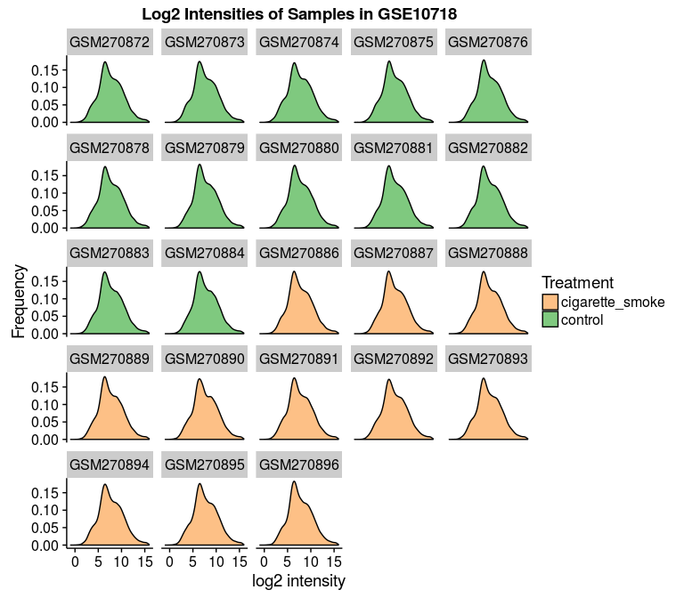

### Single Probe Intensity

As per the homework, let's plot the gene expression data for a single probe. Let's pick one at pseudo-random!

```r
set.seed(20)
data[sample(nrow(data), 1), 1:6] %>% kable("markdown")
```


|ProbeID   | GSE10718_Biomat_1| GSE10718_Biomat_10| GSE10718_Biomat_11| GSE10718_Biomat_12| GSE10718_Biomat_13|
|:---------|-----------------:|------------------:|------------------:|------------------:|------------------:|
|231836_at |          8.371558|           7.766896|           8.000101|           8.441531|           8.507032|

```r
singleprobe <- gathered_data %>% 
	filter(ProbeID == "231836_at")
```


```r
ggplot(data = singleprobe, aes(y = intensity, x = ExternalID)) + 
	geom_bar(stat = "identity") +
	theme(axis.text.x = element_text(angle = 65, hjust = 1))
```


Okay, so we see we've got pretty similar intensities throughout the samples.  But let's group them anyways! First by treatment.

```r
ggplot(data = singleprobe, aes(y = intensity, x = Treatment)) + 
	geom_bar(stat = "identity", width = 0.5)
```


...then by time

```r
ggplot(data = singleprobe, aes(y = intensity, x = time)) + 
	geom_bar(stat = "identity", width = 0.5)
```

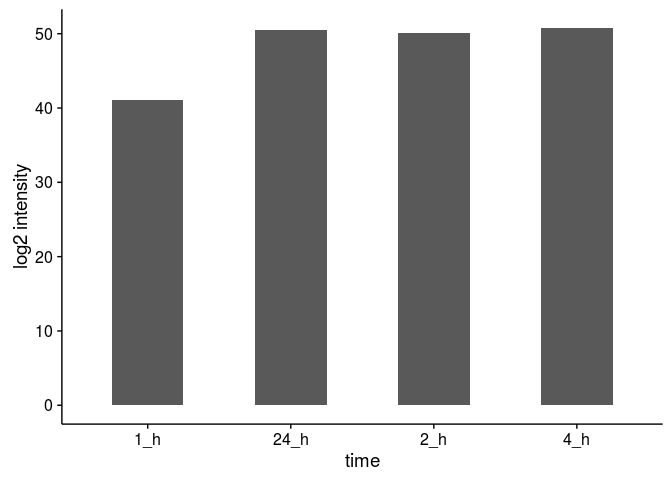

Ah-hah! That's rather interesting...
Let's do all permutations of combinations. 

```r
gathered_data %<>% mutate(perm = paste(as.character(Treatment), as.character(time), sep = "_"))
singleprobe <- gathered_data %>% 
	filter(ProbeID == "231836_at")
```

And now to plot...

```r
ggplot(data = singleprobe, aes(y = intensity, x = perm)) + 
	geom_bar(stat = "identity", width = 0.5) +
	theme(axis.text.x = element_text(angle = 65, hjust = 1))
```

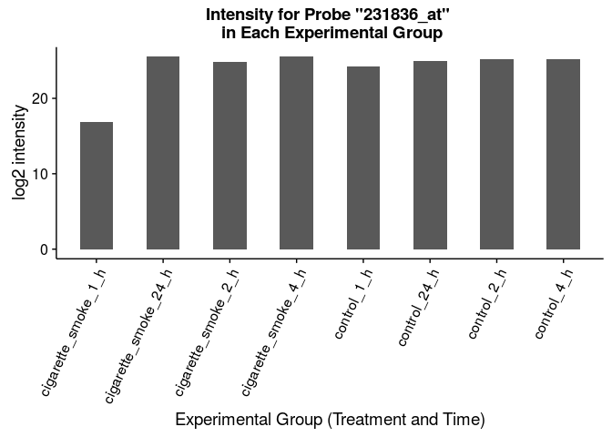

Note that instead of creating new groups to chart, we could have simply color-coded the original bar chart. For example, using varying intensities of colors for time and complementary colors for the treatment. 

```r
smoke.colors <- brewer.pal(4, "Reds")
control.colors <- brewer.pal(4, "Blues")
names(smoke.colors) <- c("cigarette_smoke_1_h", "cigarette_smoke_2_h", "cigarette_smoke_4_h", "cigarette_smoke_24_h")
names(control.colors) <- c("control_1_h", "control_2_h", "control_4_h", "control_24_h")
perm_palette <- c(control.colors, smoke.colors)
```


```r
singleprobe %<>% 
    mutate(IDnum = gsub("^GSM","", ExternalID) %>% as.numeric())
singleprobe$perm <- as.factor(singleprobe$perm)
singleprobe %<>% 
    mutate(perm = reorder(perm, IDnum, max))
```


```r
ggplot(data = singleprobe, aes(y = intensity, x = ExternalID)) + 
	geom_bar(stat = "identity", aes(fill = perm)) +
	scale_fill_manual(values = perm_palette) + labs(fill = "Conditions") +
	theme(axis.text.x = element_text(angle = 65, hjust = 1))
```

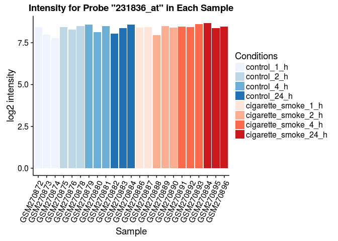


# 2 Assessing Data Quality

Moving on, let's start looking at our data quality, not just visualizing it. 

## 2.1 Heatmaps


```r
datacor <- data %>% 
	dplyr::select(-ensembl_gene_id, -ProbeID) %>% 
	cor()
melted_corr <- melt(datacor) %>% tbl_df()
head(melted_corr)
```

```
## Source: local data frame [6 x 3]
## 
##                 Var1              Var2     value
##               (fctr)            (fctr)     (dbl)
## 1  GSE10718_Biomat_1 GSE10718_Biomat_1 1.0000000
## 2 GSE10718_Biomat_10 GSE10718_Biomat_1 0.9235724
## 3 GSE10718_Biomat_11 GSE10718_Biomat_1 0.9330836
## 4 GSE10718_Biomat_12 GSE10718_Biomat_1 0.9315279
## 5 GSE10718_Biomat_13 GSE10718_Biomat_1 0.9376926
## 6 GSE10718_Biomat_14 GSE10718_Biomat_1 0.9375481
```

Let's try reordering these factors with `arrange()` to reveal discrepancies. 

```r
design$qualitative <- NULL
design %<>% 
	mutate(qualitative = paste0(Treatment, "_", as.character(hours), "_", ExternalID))
colnames(melted_corr) <- c("InternalID", "Var2", "value")
design_for_corr <- design %>% 
	select(-ExternalID)
joined_corr <- melted_corr %>% 
	inner_join(design_for_corr, by = "InternalID")
```

```
## Warning in inner_join_impl(x, y, by$x, by$y, suffix$x, suffix$y): joining
## factor and character vector, coercing into character vector
```

```r
##
design_for_corr2 <- design_for_corr %>% 
	select(InternalID, qualitative, hours, Treatment)
colnames(design_for_corr2) <- c("Var2", "qualitative2", "hours2", "Treatment2")
joined_corr %<>% 
	inner_join(design_for_corr2, by = "Var2")
```

```
## Warning in inner_join_impl(x, y, by$x, by$y, suffix$x, suffix$y): joining
## factor and character vector, coercing into character vector
```

```r
## Rearrange & reorder by time & then treatment
by_time <- joined_corr %>% 
	arrange(-hours, Treatment)
by_time$factororder <- 1:nrow(by_time)
by_time %<>% 
	mutate(qualitative = reorder(qualitative, factororder, max))
by_time %<>% 
	arrange(hours2, Treatment2)
by_time$factororder2 <- 1:nrow(by_time)
by_time %<>% 
	mutate(qualitative2 = reorder(qualitative2, factororder2, max))
## Rearrange & reorder by treatment & then time
by_treatment <- joined_corr %>% 
	arrange(Treatment, -hours)
by_treatment$factororder <- 1:nrow(by_treatment)
by_treatment %<>% 
	mutate(qualitative = reorder(qualitative, factororder, max))
by_treatment %<>% 
	arrange(Treatment2, hours2)
by_treatment$factororder2 <- 1:nrow(by_time)
by_treatment %<>% 
	mutate(qualitative2 = reorder(qualitative2, factororder2, max))
```


```r
tilegradient <- brewer.pal(11, "Spectral")
```

Now to plot!

```r
p <- ggplot(joined_corr, aes(x = qualitative2, y = qualitative, fill = value)) + 
	geom_tile() +
	theme(axis.text.x = element_text(angle = 65, hjust = 1)) +
	scale_fill_gradientn(colors = tilegradient)
p
```

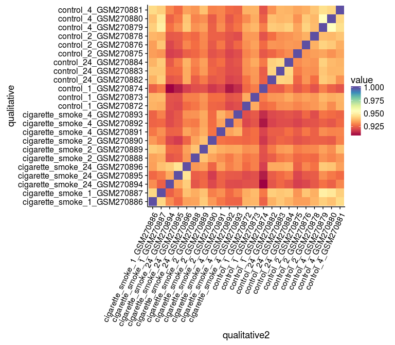

```r
save_plot("heatmap.svg", p, base_height = 7, base_aspect_ratio = 1.14)
ggplot(by_time, aes(x = qualitative2, y = qualitative, fill = value)) + 
	geom_tile() +
	theme(axis.text.x = element_text(angle = 65, hjust = 1)) +
	scale_fill_gradientn(colors = tilegradient)
```


```r
ggplot(by_treatment, aes(x = qualitative2, y = qualitative, fill = value)) + 
	geom_tile() +
	theme(axis.text.x = element_text(angle = 65, hjust = 1)) +
	scale_fill_gradientn(colors = tilegradient)
```

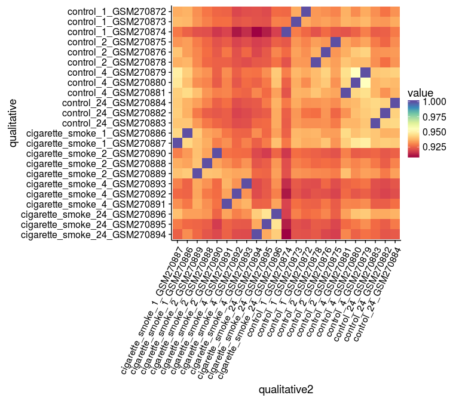

## 2.2 Outliers

Okay. That's an absolutely horrendous amount of code just to reorder a damn heatmap. I'm never doing that again, I'll stick with my unordered heatmap, which told me what I needed to know. "GSM270874" or "GSE10718-Biomat-10" is an outlier. No significant batch effects noticeable. 


```r
outliers <- joined_corr %>% 
	filter(InternalID == "GSE10718_Biomat_10")
outliers %<>% 
	mutate(qualitative2 = reorder(qualitative2, value, max))
## Mean Correlation for this sample
outliers %>% 
	filter(Var2 != "GSE10718_Biomat_10") %>% 
	summarize(MeanCorr = mean(value))
```

```
## Source: local data frame [1 x 1]
## 
##    MeanCorr
##       (dbl)
## 1 0.9215407
```

Okay, looks like an outlier, but how can we be sure? What's the average correlation?

```r
joined_corr %>% 
	filter(value != 1.0) %>% 
	group_by(InternalID) %>% 
	summarize(MeanCorr = mean(value)) %>% 
	arrange(-MeanCorr) %>% 
	kable("markdown")
```


|InternalID         |  MeanCorr|
|:------------------|---------:|
|GSE10718_Biomat_15 | 0.9367632|
|GSE10718_Biomat_16 | 0.9365047|
|GSE10718_Biomat_17 | 0.9348710|
|GSE10718_Biomat_13 | 0.9346969|
|GSE10718_Biomat_14 | 0.9345540|
|GSE10718_Biomat_6  | 0.9331644|
|GSE10718_Biomat_19 | 0.9331202|
|GSE10718_Biomat_3  | 0.9328543|
|GSE10718_Biomat_1  | 0.9320065|
|GSE10718_Biomat_11 | 0.9312138|
|GSE10718_Biomat_8  | 0.9309811|
|GSE10718_Biomat_2  | 0.9302614|
|GSE10718_Biomat_7  | 0.9300924|
|GSE10718_Biomat_20 | 0.9295662|
|GSE10718_Biomat_12 | 0.9291928|
|GSE10718_Biomat_22 | 0.9283850|
|GSE10718_Biomat_9  | 0.9275301|
|GSE10718_Biomat_21 | 0.9258038|
|GSE10718_Biomat_24 | 0.9254918|
|GSE10718_Biomat_5  | 0.9253976|
|GSE10718_Biomat_4  | 0.9241465|
|GSE10718_Biomat_23 | 0.9239977|
|GSE10718_Biomat_10 | 0.9215407|

```r
## What about within groups?

joined_corr %>% 
	filter(value != 1.0) %>% 
	group_by(Treatment, hours) %>% 
	summarize(MeanCorr = mean(value)) %>% 
	arrange(-MeanCorr) %>% 
	kable("markdown")
```


|Treatment       | hours|  MeanCorr|
|:---------------|-----:|---------:|
|cigarette_smoke |     1| 0.9356879|
|control         |     4| 0.9353380|
|control         |    24| 0.9317074|
|control         |     2| 0.9295345|
|cigarette_smoke |     2| 0.9294967|
|cigarette_smoke |    24| 0.9275695|
|control         |     1| 0.9273158|
|cigarette_smoke |     4| 0.9259581|

Lastly, how does this outlier sample compare to specific treatments (This is a 1hr control sample). For this I'll filter out correlation with itself.

```r
outliers %>% 
	filter(Var2 != "GSE10718_Biomat_10") %>% 
	group_by(Treatment2, hours2) %>% 
	summarize(MeanCorr = mean(value)) %>% 
	arrange(-MeanCorr) %>% 
	kable("markdown")
```


|Treatment2      | hours2|  MeanCorr|
|:---------------|------:|---------:|
|control         |      1| 0.9274908|
|cigarette_smoke |      1| 0.9264554|
|control         |     24| 0.9255085|
|control         |      4| 0.9252802|
|control         |      2| 0.9236324|
|cigarette_smoke |      2| 0.9197050|
|cigarette_smoke |      4| 0.9148929|
|cigarette_smoke |     24| 0.9129820|

At last, something meaningful!! This sample correlates MOST those samples within its own group, but also highly with the 1hr cigarette smoke group.  

# 3 Differential Expression with Respect to Treatment

## 3.1 Linear Model

```r
row.names(fitdata) <- fitdata$ProbeID
fitdata$ProbeID <- NULL
```


```r
# design.matrix <- model.matrix(~0+treat.and.hours)
# design.matrix <- model.matrix(~treat.and.hours)
design.matrix <- model.matrix(~0+Treatment, design)
colnames(design.matrix) <- c("CS", "Control")
contrast.matrix <- makeContrasts(CS-Control, levels = design.matrix)
## Let's make sure this looks right:
design.matrix %>% kable("markdown")
```


| CS| Control|
|--:|-------:|
|  0|       1|
|  0|       1|
|  0|       1|
|  0|       1|
|  0|       1|
|  0|       1|
|  0|       1|
|  1|       0|
|  1|       0|
|  1|       0|
|  0|       1|
|  1|       0|
|  1|       0|
|  1|       0|
|  1|       0|
|  1|       0|
|  0|       1|
|  1|       0|
|  1|       0|
|  1|       0|
|  0|       1|
|  0|       1|
|  0|       1|

```r
fit <- lmFit(fitdata, design.matrix)
fit <- contrasts.fit(fit, contrast.matrix)
efit <- eBayes(fit)
df <- topTable(efit)
df %>% kable("markdown")
```


|            |     logFC|   AveExpr|        t| P.Value| adj.P.Val|        B|
|:-----------|---------:|---------:|--------:|-------:|---------:|--------:|
|200779_at   | 0.7613410| 13.983184| 8.577428|   0e+00| 0.0001751| 9.623149|
|202912_at   | 1.7199499| 12.764302| 8.161121|   0e+00| 0.0001751| 8.840436|
|214696_at   | 1.9074941| 11.730937| 8.155235|   0e+00| 0.0001751| 8.829176|
|223394_at   | 1.2644771| 10.909886| 8.147206|   0e+00| 0.0001751| 8.813808|
|223774_at   | 1.1696606|  9.529931| 8.080341|   0e+00| 0.0001751| 8.685431|
|209020_at   | 1.0223766| 10.677979| 7.939997|   1e-07| 0.0001751| 8.413709|
|202672_s_at | 3.5302487|  9.716310| 7.904577|   1e-07| 0.0001751| 8.344646|
|220468_at   | 2.4132680|  6.488711| 7.876047|   1e-07| 0.0001751| 8.288875|
|223982_s_at | 0.9256205| 10.907060| 7.729633|   1e-07| 0.0001933| 8.000666|
|226924_at   | 0.6366539|  9.588850| 7.726141|   1e-07| 0.0001933| 7.993752|

```r
results <- decideTests(efit)
vennDiagram(results)
```


In this model, we have ignored time as a covariate, comparing samples against each other just based on treatment group.  In equation terms...
$$Y = X\alpha + \epsilon$$
<center> or </center>
$$Y = \alpha  CigaretteSmoke + \beta  Control + \epsilon$$

Where:  
Y = our responses  
X = our design matrix:   


```r
design.matrix %>% kable("markdown")
```


| CS| Control|
|--:|-------:|
|  0|       1|
|  0|       1|
|  0|       1|
|  0|       1|
|  0|       1|
|  0|       1|
|  0|       1|
|  1|       0|
|  1|       0|
|  1|       0|
|  0|       1|
|  1|       0|
|  1|       0|
|  1|       0|
|  1|       0|
|  1|       0|
|  0|       1|
|  1|       0|
|  1|       0|
|  1|       0|
|  0|       1|
|  0|       1|
|  0|       1|

alpha = the parameters of our linear model  
epsilon = the error of our samples  

If that equation isn't formatting correctly, make sure you're viewing the HTML version, not the .md version github has formatted. 


## 3.2 Hits in Linear Model

Okay, so it looks like we've got about 1238 interesting genes. 

First let's take a look at our hits and see how many results we've got with `p < 1e-3`. First we want to see without any adjustment, and then with the FDR adjustment.  

```r
tT.treatment <- topTable(efit, adjust = "none", number = Inf, p.value = 1e-3)
# here, we should see that P.Value = adj.P.Val
head(tT.treatment)
```

```
##              logFC   AveExpr        t      P.Value    adj.P.Val        B
## 200779_at 0.761341 13.983184 8.577428 1.419183e-08 1.419183e-08 9.623149
## 202912_at 1.719950 12.764302 8.161121 3.365296e-08 3.365296e-08 8.840436
## 214696_at 1.907494 11.730937 8.155234 3.407195e-08 3.407195e-08 8.829176
## 223394_at 1.264477 10.909886 8.147206 3.465212e-08 3.465212e-08 8.813808
## 223774_at 1.169661  9.529931 8.080341 3.989741e-08 3.989741e-08 8.685431
## 209020_at 1.022377 10.677979 7.939997 5.373691e-08 5.373691e-08 8.413709
```

```r
nrow(tT.treatment)
```

```
## [1] 805
```

```r
tT.treatment$ProbeID <- row.names(tT.treatment)
tT.treatment.sig.fdr <- topTable(efit, adjust = "fdr", number = Inf, p.value = 0.05, sort.by = "p")
tT.treatment.sig.fdr$ProbeID <- row.names(tT.treatment.sig.fdr)
nrow(tT.treatment.sig.fdr)
```

```
## [1] 1238
```

```r
head(tT.treatment.sig.fdr)
```

```
##              logFC   AveExpr        t      P.Value    adj.P.Val        B
## 200779_at 0.761341 13.983184 8.577428 1.419183e-08 0.0001750755 9.623149
## 202912_at 1.719950 12.764302 8.161121 3.365296e-08 0.0001750755 8.840436
## 214696_at 1.907494 11.730937 8.155234 3.407195e-08 0.0001750755 8.829176
## 223394_at 1.264477 10.909886 8.147206 3.465212e-08 0.0001750755 8.813808
## 223774_at 1.169661  9.529931 8.080341 3.989741e-08 0.0001750755 8.685431
## 209020_at 1.022377 10.677979 7.939997 5.373691e-08 0.0001750755 8.413709
##             ProbeID
## 200779_at 200779_at
## 202912_at 202912_at
## 214696_at 214696_at
## 223394_at 223394_at
## 223774_at 223774_at
## 209020_at 209020_at
```

Looks good so far!! Shout out to Louie for explaining that I needed to set up my contrast matrix.  
We've got 805 genes significant at p < 0.001 and 1238 significant genes at p < 0.05 after FDR correction.    Briefly, let's look at our p-value distribution, as recommended by Dr. Pavlidis.  


```r
p <- ggplot(tT.treatment.sig.fdr, aes(x = adj.P.Val))
p + geom_histogram(binwidth = 1e-3) + 
	scale_fill_manual(values = timepoints) + xlab("P-Values") + ylab("Frequency") + 
	ggtitle("P-Value Distribution of Significant Genes \n corrected with FDR = 0.05")
```


Looks pretty good!

>*Take the top 50 probes as your “hits” and create a heatmap of their expression levels. Sort the hits by p-values and the samples by treatment.*

Okay, so we've got 1238 hits, let's take the top 50 hits, and then we should go back to our data and filter by the probeIDs. 

```r
# gathered_data2 <- data %>% 
# 	gather("InternalID", "intensity", 2:24)
# glimpse(gathered_data2)
# gathered_data2 <- inner_join(gathered_data2, design, by = "InternalID")
# glimpse(gathered_data2)
gathered_data %<>% 
	mutate(qualitative = paste0(Treatment, "_", as.character(hours), "_", ExternalID))
tT.sig.fdr.filtered <- tT.treatment.sig.fdr %>% 
	head(n = 50) %>% tbl_df()
tT.sig.fdr.filtered
```

```
## Source: local data frame [50 x 7]
## 
##        logFC   AveExpr        t      P.Value    adj.P.Val        B
##        (dbl)     (dbl)    (dbl)        (dbl)        (dbl)    (dbl)
## 1  0.7613410 13.983184 8.577428 1.419183e-08 0.0001750755 9.623149
## 2  1.7199499 12.764302 8.161121 3.365296e-08 0.0001750755 8.840436
## 3  1.9074941 11.730937 8.155234 3.407195e-08 0.0001750755 8.829176
## 4  1.2644771 10.909886 8.147206 3.465212e-08 0.0001750755 8.813808
## 5  1.1696606  9.529931 8.080341 3.989741e-08 0.0001750755 8.685431
## 6  1.0223766 10.677979 7.939997 5.373691e-08 0.0001750755 8.413709
## 7  3.5302487  9.716310 7.904577 5.795528e-08 0.0001750755 8.344646
## 8  2.4132680  6.488711 7.876047 6.160022e-08 0.0001750755 8.288875
## 9  0.9256205 10.907060 7.729633 8.438527e-08 0.0001933190 8.000666
## 10 0.6366539  9.588851 7.726141 8.502396e-08 0.0001933190 7.993752
## ..       ...       ...      ...          ...          ...      ...
## Variables not shown: ProbeID (chr).
```

```r
topHits <- gathered_data %>% 
	filter(ProbeID %in% tT.sig.fdr.filtered$ProbeID)
nrow(topHits)
```

```
## [1] 1196
```

```r
topHits <- inner_join(topHits, tT.sig.fdr.filtered, by = "ProbeID")
topHits <- left_join(topHits, affy_probe_IDs_hgnc, by = "ProbeID")

glimpse(topHits)
```

```
## Observations: 1,357
## Variables: 17
## $ ProbeID         (chr) "1554980_a_at", "200779_at", "200779_at", "200...
## $ ensembl_gene_id (chr) "ENSG00000162772", "ENSG00000128272", "ENSG000...
## $ InternalID      (chr) "GSE10718_Biomat_1", "GSE10718_Biomat_1", "GSE...
## $ intensity       (dbl) 6.225141, 13.810016, 13.810016, 13.810016, 13....
## $ ExternalID      (chr) "GSM270883", "GSM270883", "GSM270883", "GSM270...
## $ Treatment       (fctr) control, control, control, control, control, ...
## $ time            (fctr) 24_h, 24_h, 24_h, 24_h, 24_h, 24_h, 24_h, 24_...
## $ hours           (dbl) 24, 24, 24, 24, 24, 24, 24, 24, 24, 24, 24, 24...
## $ perm            (chr) "control_24_h", "control_24_h", "control_24_h"...
## $ qualitative     (chr) "control_24_GSM270883", "control_24_GSM270883"...
## $ logFC           (dbl) 2.3803868, 0.7613410, 0.7613410, 0.7613410, 0....
## $ AveExpr         (dbl) 8.666117, 13.983184, 13.983184, 13.983184, 13....
## $ t               (dbl) 6.552242, 8.577428, 8.577428, 8.577428, 8.5774...
## $ P.Value         (dbl) 1.175071e-06, 1.419183e-08, 1.419183e-08, 1.41...
## $ adj.P.Val       (dbl) 0.0007458854, 0.0001750755, 0.0001750755, 0.00...
## $ B               (dbl) 5.564050, 9.623149, 9.623149, 9.623149, 9.6231...
## $ hgnc_symbol     (chr) "ATF3", "ATF4P3", "ATF4", "ATF4P3", "ATF4", "E...
```

```r
topHits$qualitative %<>% as.factor()
topHits %<>% 
	arrange(Treatment)
topHits$treatment.factor <- 1:nrow(topHits)
topHits %<>% 
	mutate(qualitative = reorder(qualitative, treatment.factor, max))
topHits %<>% 
	mutate(hgnc_p.value = paste0(hgnc_symbol, "(", 
								 format(round(adj.P.Val, 4), scientific = TRUE), 
								 ")"))
topHits %<>% 
	arrange(adj.P.Val)
topHits$hgnc_p.value %<>% as.factor()
topHits %<>% 
	mutate(hgnc_p.value = reorder(hgnc_p.value, -adj.P.Val, max))
```


```r
# heatmapcolors <- brewer.pal(9, "RdPu")
# heatmapcolorInterpolate <- colorRampPalette(heatmapcolors)
# heatmapcolorInterpolated <- heatmapcolorInterpolate(nrow(topHits))
ggplot(topHits, aes(x = qualitative, y = hgnc_p.value, fill = intensity)) + 
	geom_tile() +
	theme(axis.text.x = element_text(angle = 65, hjust = 1)) +
	scale_fill_viridis() + xlab("Sample") +
	ylab("HGNC Symbol (p-value)")
```

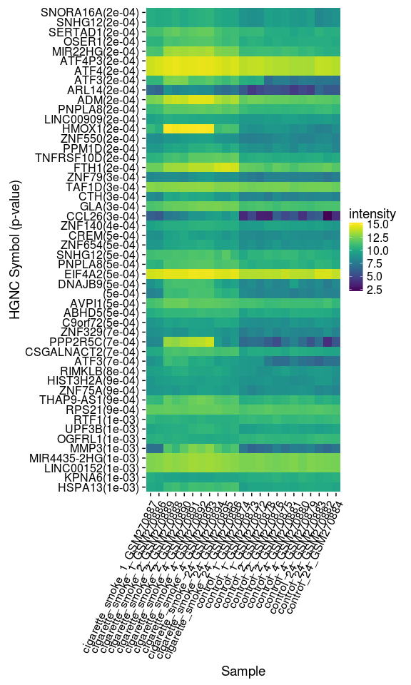

>*What is the (estimated) false discovery rate of this “hits” list? How many of these hits do we expect to be false discoveries?*

Because we've set the p.value of our `topTable` output to 0.05 with an FDR adjustment (`topTable(efit, adjust = "fdr", number = Inf, p.value = 0.05, sort.by = "p")`), we would expect our adjusted values to have an FDR of 0.05.  This means that in a list of 50 genes, we would expect to see 2.5 genes as false discoveries. 

# 4 Differential expression with respect to time

## 4.1 Linear model

Let's pick up where we left off before 3.1, this time setting time in our design matrix.  

```r
design.matrix.time <- model.matrix(~hours, design)
# colnames(design.matrix.time) <- c("intercept", "hours")
# contrast.matrix.time <- makeContrasts(hours-intercept, levels = design.matrix.time) # this step is unnecessary!
## Let's make sure this looks right:
design.matrix.time %>% kable("markdown")
```


| (Intercept)| hours|
|-----------:|-----:|
|           1|    24|
|           1|     1|
|           1|     1|
|           1|     1|
|           1|     4|
|           1|     4|
|           1|     4|
|           1|     1|
|           1|     1|
|           1|     2|
|           1|    24|
|           1|     2|
|           1|     2|
|           1|     4|
|           1|     4|
|           1|     4|
|           1|    24|
|           1|    24|
|           1|    24|
|           1|    24|
|           1|     2|
|           1|     2|
|           1|     2|

```r
fit.time <- lmFit(fitdata, design.matrix.time)
# fit <- contrasts.fit(fit, contrast.matrix.time) # this step is unnecessary!
efit.time <- eBayes(fit.time)
tT.time <- topTable(efit.time)
```

```
## Removing intercept from test coefficients
```

```r
tT.time %>% kable("markdown")
```


|            |      logFC|   AveExpr|          t| P.Value| adj.P.Val|        B|
|:-----------|----------:|---------:|----------:|-------:|---------:|--------:|
|202586_at   | -0.0432119|  9.045753| -11.559699|       0|  1.30e-06| 15.28331|
|203201_at   | -0.0424279| 10.057592| -10.121063|       0|  6.70e-06| 12.74567|
|227559_at   | -0.0550160|  8.182478|  -9.958972|       0|  6.70e-06| 12.44384|
|202769_at   |  0.0431789| 12.095002|   9.769108|       0|  6.70e-06| 12.08602|
|226775_at   | -0.0382855|  8.647286|  -9.734894|       0|  6.70e-06| 12.02105|
|213113_s_at | -0.0465079| 10.391574|  -9.412004|       0|  1.03e-05| 11.40035|
|202770_s_at |  0.0359188| 11.510308|   9.272069|       0|  1.16e-05| 11.12709|
|226226_at   |  0.0432314|  9.561381|   9.139895|       0|  1.32e-05| 10.86660|
|202887_s_at |  0.0419794| 13.601392|   8.972788|       0|  1.63e-05| 10.53391|
|200810_s_at | -0.0343603| 11.350772|  -8.828058|       0|  1.67e-05| 10.24274|

```r
results.time <- decideTests(efit.time)
vennDiagram(results.time)
```


Interesting so far, let's continue.

```r
tT.time <- topTable(efit.time, adjust = "none", number = Inf, p.value = 1e-3)
```

```
## Removing intercept from test coefficients
```

```r
# here, we should see that P.Value = adj.P.Val
head(tT.time)
```

```
##                   logFC   AveExpr          t      P.Value    adj.P.Val
## 202586_at   -0.04321190  9.045753 -11.559699 5.595299e-11 5.595299e-11
## 203201_at   -0.04242793 10.057592 -10.121063 7.109181e-10 7.109181e-10
## 227559_at   -0.05501598  8.182478  -9.958972 9.609875e-10 9.609875e-10
## 202769_at    0.04317888 12.095002   9.769107 1.373425e-09 1.373425e-09
## 226775_at   -0.03828553  8.647287  -9.734894 1.465398e-09 1.465398e-09
## 213113_s_at -0.04650788 10.391574  -9.412004 2.721027e-09 2.721027e-09
##                    B
## 202586_at   15.28331
## 203201_at   12.74567
## 227559_at   12.44384
## 202769_at   12.08602
## 226775_at   12.02105
## 213113_s_at 11.40035
```

```r
nrow(tT.time)
```

```
## [1] 958
```

```r
p <- ggplot(tT.time, aes(x = adj.P.Val))
p + geom_histogram(binwidth = 1e-3) + 
	scale_fill_manual(values = timepoints) + xlab("P-Values") + ylab("Frequency") + 
	ggtitle("P-Value Distribution of Significant Genes") + xlim(0, 0.05)
```


```r
## That's actually not so meaningful since we've filtered on all p-values under 0.001

# topTable.time$ProbeID <- row.names(topTable.time)
tT.time.sig.fdr <- topTable(efit.time, adjust = "fdr", number = Inf, p.value = 0.05)
```

```
## Removing intercept from test coefficients
```

```r
# topTable.time.sig.fdr$ProbeID <- row.names(topTable.time.sig.fdr)
nrow(tT.time.sig.fdr)
```

```
## [1] 1451
```

```r
head(tT.time.sig.fdr)
```

```
##                   logFC   AveExpr          t      P.Value    adj.P.Val
## 202586_at   -0.04321190  9.045753 -11.559699 5.595299e-11 1.272203e-06
## 203201_at   -0.04242793 10.057592 -10.121063 7.109181e-10 6.663751e-06
## 227559_at   -0.05501598  8.182478  -9.958972 9.609875e-10 6.663751e-06
## 202769_at    0.04317888 12.095002   9.769107 1.373425e-09 6.663751e-06
## 226775_at   -0.03828553  8.647287  -9.734894 1.465398e-09 6.663751e-06
## 213113_s_at -0.04650788 10.391574  -9.412004 2.721027e-09 1.031133e-05
##                    B
## 202586_at   15.28331
## 203201_at   12.74567
## 227559_at   12.44384
## 202769_at   12.08602
## 226775_at   12.02105
## 213113_s_at 11.40035
```

```r
tT.time.sig.fdr %>% arrange(-logFC) %>% head() # as you can see the effect sizes are very small
```

```
##        logFC  AveExpr        t      P.Value  adj.P.Val         B
## 1 0.10318640 3.819953 3.311150 0.0030893627 0.04910086 -2.511876
## 2 0.10163021 4.722681 4.046340 0.0005133879 0.01533890 -0.764223
## 3 0.09433305 5.049077 3.938927 0.0006692057 0.01840187 -1.024376
## 4 0.09273944 4.212195 3.815442 0.0009068465 0.02214712 -1.321874
## 5 0.09106298 5.211755 3.360182 0.0027462106 0.04561137 -2.398376
## 6 0.07960449 5.835676 3.884151 0.0007658706 0.02013133 -1.156568
```

```r
## so the slopes may be statistically different, but in practice, there's not much of a change. 
## this makes sense because we're not properly modelling the system
## Biologically speaking, we would expect to NOT see a difference in control over time
## but we WOULD expect to see a difference in CS over time
## and by not separating those two groups, we're losing power to detect a slope difference

p <- ggplot(tT.time.sig.fdr, aes(x = adj.P.Val))
p + geom_histogram(binwidth = 1e-3) + 
	scale_fill_manual(values = timepoints) + xlab("P-Values") + ylab("Frequency") + 
	ggtitle("P-Value Distribution of Significant Genes \n corrected with FDR = 0.05")
```

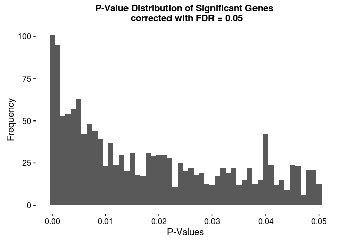

Alright, that's looking much better. We've got 958 hits with p-value under 0.001, and 1451 hits with FDR and p-value under 0.05.  

Let's go straight to question 5 and come back to this one.  

# 5 Differential expression analysis with a full model

## 5.1 Quantify the number of hits for treatment

```r
design %<>% 
	arrange(hours)
colnames(data)
```

```
##  [1] "ProbeID"            "GSE10718_Biomat_1"  "GSE10718_Biomat_10"
##  [4] "GSE10718_Biomat_11" "GSE10718_Biomat_12" "GSE10718_Biomat_13"
##  [7] "GSE10718_Biomat_14" "GSE10718_Biomat_15" "GSE10718_Biomat_16"
## [10] "GSE10718_Biomat_17" "GSE10718_Biomat_19" "GSE10718_Biomat_2" 
## [13] "GSE10718_Biomat_20" "GSE10718_Biomat_21" "GSE10718_Biomat_22"
## [16] "GSE10718_Biomat_23" "GSE10718_Biomat_24" "GSE10718_Biomat_3" 
## [19] "GSE10718_Biomat_4"  "GSE10718_Biomat_5"  "GSE10718_Biomat_6" 
## [22] "GSE10718_Biomat_7"  "GSE10718_Biomat_8"  "GSE10718_Biomat_9" 
## [25] "ensembl_gene_id"
```

```r
# design.matrix.combined <- model.matrix(~0 + (hours * Treatment), design) ## this isn't working!
design.matrix.combined <- data.frame(
	"cs.int.alpha" = c(1, 1, 1, 1, 1, 1, 1, 1, 1, 1, 1, 0, 0, 0, 0, 0, 0, 0, 0, 0, 0, 0, 0), 
	"cs.slope.beta" = c(1, 1, 2, 2, 2, 4, 4, 4, 24, 24, 24, 0, 0, 0, 0, 0, 0, 0, 0, 0, 0, 0, 0),
	"con.int.alpha" = c(0, 0, 0, 0, 0, 0, 0, 0, 0, 0, 0, 1, 1, 1, 1, 1, 1, 1, 1, 1, 1, 1, 1), 
	"con.slope.beta" = c(0, 0, 0, 0, 0, 0, 0, 0, 0, 0, 0, 1, 1, 1, 2, 2, 2, 4, 4, 4, 24, 24, 24)
	)
## Let's reorder fitdata to be safe we WANT
design %>% arrange(Treatment)
```

```
## Source: local data frame [23 x 6]
## 
##            InternalID ExternalID       Treatment   time hours
##                 (chr)      (chr)          (fctr) (fctr) (dbl)
## 1  GSE10718_Biomat_16  GSM270887 cigarette_smoke    1_h     1
## 2  GSE10718_Biomat_17  GSM270886 cigarette_smoke    1_h     1
## 3  GSE10718_Biomat_19  GSM270889 cigarette_smoke    2_h     2
## 4  GSE10718_Biomat_20  GSM270888 cigarette_smoke    2_h     2
## 5  GSE10718_Biomat_21  GSM270890 cigarette_smoke    2_h     2
## 6  GSE10718_Biomat_22  GSM270891 cigarette_smoke    4_h     4
## 7  GSE10718_Biomat_23  GSM270892 cigarette_smoke    4_h     4
## 8  GSE10718_Biomat_24  GSM270893 cigarette_smoke    4_h     4
## 9   GSE10718_Biomat_4  GSM270894 cigarette_smoke   24_h    24
## 10  GSE10718_Biomat_5  GSM270895 cigarette_smoke   24_h    24
## ..                ...        ...             ...    ...   ...
## Variables not shown: qualitative (chr).
```

```r
## Looks good
fitdata <- fitdata[c("GSE10718_Biomat_16", "GSE10718_Biomat_17", "GSE10718_Biomat_19",
					 "GSE10718_Biomat_20", "GSE10718_Biomat_21", "GSE10718_Biomat_22",
					 "GSE10718_Biomat_23", "GSE10718_Biomat_24", "GSE10718_Biomat_4", 
					 "GSE10718_Biomat_5", "GSE10718_Biomat_6", "GSE10718_Biomat_10", 
					 "GSE10718_Biomat_11", "GSE10718_Biomat_12", "GSE10718_Biomat_7", 
					 "GSE10718_Biomat_8", "GSE10718_Biomat_9", "GSE10718_Biomat_13", 
					 "GSE10718_Biomat_14", "GSE10718_Biomat_15", "GSE10718_Biomat_1", 
					 "GSE10718_Biomat_2", "GSE10718_Biomat_3")]
## Hopefully this works...
design.matrix.combined %>% kable("markdown")
```


| cs.int.alpha| cs.slope.beta| con.int.alpha| con.slope.beta|
|------------:|-------------:|-------------:|--------------:|
|            1|             1|             0|              0|
|            1|             1|             0|              0|
|            1|             2|             0|              0|
|            1|             2|             0|              0|
|            1|             2|             0|              0|
|            1|             4|             0|              0|
|            1|             4|             0|              0|
|            1|             4|             0|              0|
|            1|            24|             0|              0|
|            1|            24|             0|              0|
|            1|            24|             0|              0|
|            0|             0|             1|              1|
|            0|             0|             1|              1|
|            0|             0|             1|              1|
|            0|             0|             1|              2|
|            0|             0|             1|              2|
|            0|             0|             1|              2|
|            0|             0|             1|              4|
|            0|             0|             1|              4|
|            0|             0|             1|              4|
|            0|             0|             1|             24|
|            0|             0|             1|             24|
|            0|             0|             1|             24|

```r
# colnames(design.matrix.combined) <- c("cs", "control", "hours", "control.hours")
contrast.matrix.combined <- makeContrasts(cs.slope.beta-con.slope.beta,
										  # cs.slope.beta, con.slope.beta, 
										  cs.int.alpha-con.int.alpha,  
										  levels = design.matrix.combined)
# contrast.matrix.combined <- makeContrasts(control.hours-cs-hours+control, levels = design.matrix.combined)
## Let's make sure this looks right:
fit.combined <- lmFit(fitdata, design.matrix.combined)
fit.combined <- contrasts.fit(fit.combined, contrast.matrix.combined)
efit.combined <- eBayes(fit.combined)
tT.combined <- topTable(efit.combined)
tT.combined %>% kable("markdown")
```


|      | cs.slope.beta...con.slope.beta| cs.int.alpha...con.int.alpha|   AveExpr|         F| P.Value| adj.P.Val|
|:-----|------------------------------:|----------------------------:|---------:|---------:|-------:|---------:|
|3744  |                      0.1140710|                   -0.5947966| 12.717558| 132.87049|       0|   0.0e+00|
|7458  |                      0.0739408|                    0.1655167| 12.362832| 110.74610|       0|   1.0e-07|
|3518  |                     -0.0628738|                   -0.2206967| 11.804249|  83.69787|       0|   1.0e-06|
|9409  |                     -0.0592886|                   -0.0926291| 11.218826|  76.57433|       0|   1.5e-06|
|4984  |                     -0.0574848|                    0.1757714| 10.092374|  75.50078|       0|   1.5e-06|
|11888 |                     -0.0899071|                   -0.0593157|  9.748163|  73.60875|       0|   1.5e-06|
|4121  |                     -0.0886490|                    0.0805433| 10.820741|  73.32356|       0|   1.5e-06|
|4470  |                      0.0631151|                   -0.1662176|  9.928981|  71.41172|       0|   1.6e-06|
|14305 |                     -0.0623595|                    0.0168690| 11.251135|  69.55375|       0|   1.8e-06|
|12656 |                     -0.0641124|                    0.0635527| 12.296795|  68.71514|       0|   1.8e-06|

```r
results.combined <- decideTests(efit.combined)
vennDiagram(results.combined)
```


Doesn't look too bad, but I'm still struggling to figure out exactly what this is modelling. Let's push ahead and I'll come back to this.

>*For how many probes is treatment a significant factor at the unadjusted p-value 1e-3, and at FDR 0.05 level?*


```r
tT.combined <- topTable(efit.combined, adjust = "none", number = Inf, p.value = 1e-3)
# here, we should see that P.Value = adj.P.Val
head(tT.combined)
```

```
##       cs.slope.beta...con.slope.beta cs.int.alpha...con.int.alpha
## 3744                      0.11407096                  -0.59479660
## 7458                      0.07394082                   0.16551666
## 3518                     -0.06287376                  -0.22069666
## 9409                     -0.05928858                  -0.09262906
## 4984                     -0.05748477                   0.17577142
## 11888                    -0.08990708                  -0.05931571
##         AveExpr         F      P.Value    adj.P.Val
## 3744  12.717558 132.87049 1.805330e-12 1.805330e-12
## 7458  12.362832 110.74610 1.011035e-11 1.011035e-11
## 3518  11.804249  83.69787 1.355424e-10 1.355424e-10
## 9409  11.218826  76.57433 3.043654e-10 3.043654e-10
## 4984  10.092374  75.50078 3.458017e-10 3.458017e-10
## 11888  9.748163  73.60875 4.347421e-10 4.347421e-10
```

```r
nrow(tT.combined)
```

```
## [1] 1435
```

So 716 significant genes at p < 0.001


```r
tT.combined.sig.fdr <- topTable(efit.combined, adjust = "fdr", number = Inf, p.value = 0.05)
head(tT.combined.sig.fdr)
```

```
##       cs.slope.beta...con.slope.beta cs.int.alpha...con.int.alpha
## 3744                      0.11407096                  -0.59479660
## 7458                      0.07394082                   0.16551666
## 3518                     -0.06287376                  -0.22069666
## 9409                     -0.05928858                  -0.09262906
## 4984                     -0.05748477                   0.17577142
## 11888                    -0.08990708                  -0.05931571
##         AveExpr         F      P.Value    adj.P.Val
## 3744  12.717558 132.87049 1.805330e-12 4.104779e-08
## 7458  12.362832 110.74610 1.011035e-11 1.149396e-07
## 3518  11.804249  83.69787 1.355424e-10 1.027276e-06
## 9409  11.218826  76.57433 3.043654e-10 1.462328e-06
## 4984  10.092374  75.50078 3.458017e-10 1.462328e-06
## 11888  9.748163  73.60875 4.347421e-10 1.462328e-06
```

```r
nrow(tT.combined.sig.fdr)
```

```
## [1] 2585
```

And 1006 significant genes with FDR correction and p < 0.05.  

>*Is this number different from what you reported in 3.2? Why? Quantify the proportion of overlapping probes among your hits, when using the unadjusted p-value threshold of 1e-3.*

Here we have just 716 significantly different genes, down from 805 when just considering treatment.  Let's look at the overlap. We'll compare our toptables, `tT.treatment` and `tT.combined`.  

```r
tT.treatment %<>% tbl_df()
tT.combined$ProbeID <- row.names(tT.combined)
tT.combined %<>% tbl_df()
tT.combined$ProbeID %in% tT.treatment$ProbeID %>% # listing the smaller length list first just to be safe
	sum() # this treats TRUE as 1 and FALSE as 0
```

```
## [1] 0
```

Okay, we've got an overlap of 418 genes, I'd say that's expected.  

>*Plot the distributions of all the p-values for treatment when using both models, i.e., one from the model in Q3 and one from the full model in this question. Compare and comment on the similarity/differences in the shape of the distributions.*

Sweet, I've already done this! We can run them again though.  I'll plot the p-value distributions when using the FDR correction, as this will more accurately reflect real hits, but I'll make sure to not cap at p < 0.05 this time though.  

```r
tT.treatment.fdr <- topTable(efit, adjust = "fdr", number = Inf)

p <- ggplot(tT.treatment.fdr, aes(x = adj.P.Val))
p + geom_histogram(binwidth = 0.01) + 
	scale_fill_manual(values = timepoints) + xlab("P-Values") + ylab("Frequency") + 
	ggtitle("P-Value Distribution for Treatment Model")
```

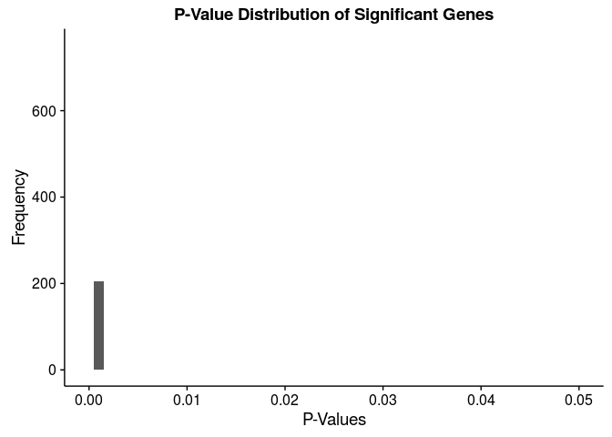

```r
tT.combined.fdr <- topTable(efit.combined, adjust = "fdr", number = Inf)

p <- ggplot(tT.combined.fdr, aes(x = adj.P.Val))
p + geom_histogram(binwidth = 0.01) + 
	scale_fill_manual(values = timepoints) + xlab("P-Values") + ylab("Frequency") + 
	ggtitle("P-Value Distribution for Combined Model")
```

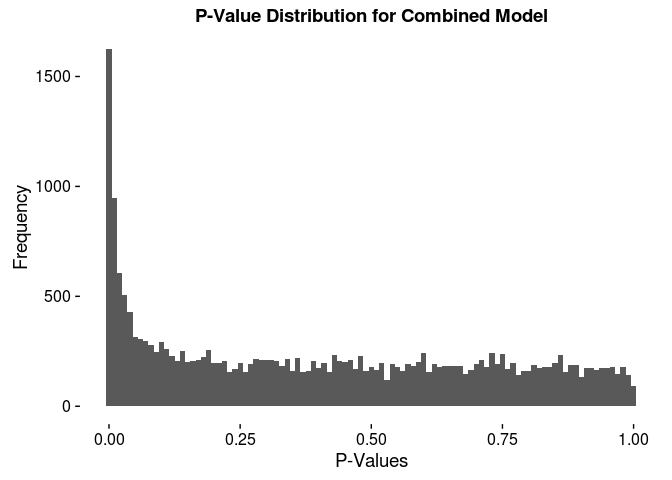

The p-value distributions look very similar when compared directly, but it seems as though we may have fewer significant hits when using our combined model.  That doesn't seem right, I would've expected to see a skew towards significance in the combined model, since we're more accurately separating our groups. Let's come back to this later.  

## 5.2 Test the null hypothesis

>*Explain in English what you are modeling with this interaction term (what does it represent?).*
>*For how many probes is the interaction effect significant at the unadjusted p-value 1e-3, and at FDR 0.05 level?*

## 5.3 Plot a few probes where the interaction does and does not matter 

# Microarray Analysis

## 6.0 Download Data

See Makefile again

## 6.1 Data loading and QC

```r
yeast <- read_delim("yeast.tsv", delim = "\t")
glimpse(yeast)
```

```
## Observations: 10,928
## Variables: 7
## $    (chr) "1769308_at", "1769309_at", "1769310_at", "1769311_at", "17...
## $ b1 (dbl) 11.1455060, 2.1643295, 1.4883001, 9.0061384, 6.9457152, 7.8...
## $ b2 (dbl) 6.795593, 3.177408, 1.427200, 9.461821, 6.895895, 6.600131,...
## $ b3 (dbl) 6.708003, 3.128950, 1.815698, 9.234618, 6.955463, 6.534413,...
## $ c1 (dbl) 10.945878, 2.498308, 1.462075, 8.972233, 6.851454, 7.770245...
## $ c2 (dbl) 6.698862, 3.047169, 2.079007, 9.276710, 6.900187, 6.564123,...
## $ c3 (dbl) 11.070725, 2.444188, 1.623036, 9.004997, 6.892854, 7.851777...
```

```r
yeast
```

```
## Source: local data frame [10,928 x 7]
## 
##                        b1       b2       b3        c1       c2        c3
##           (chr)     (dbl)    (dbl)    (dbl)     (dbl)    (dbl)     (dbl)
## 1    1769308_at 11.145506 6.795593 6.708003 10.945878 6.698862 11.070725
## 2    1769309_at  2.164329 3.177408 3.128950  2.498308 3.047169  2.444188
## 3    1769310_at  1.488300 1.427200 1.815698  1.462075 2.079007  1.623036
## 4    1769311_at  9.006138 9.461821 9.234618  8.972233 9.276710  9.004997
## 5    1769312_at  6.945715 6.895895 6.955463  6.851454 6.900187  6.892854
## 6    1769313_at  7.815192 6.600131 6.534413  7.770245 6.564123  7.851777
## 7    1769314_at  8.658098 8.788372 8.982260  8.572727 8.807559  8.657040
## 8    1769315_at  1.395614 1.451431 1.639303  1.352827 1.539506  1.337297
## 9  1769316_s_at  1.905238 1.918457 1.628470  1.724167 1.746585  1.518815
## 10   1769317_at  6.961356 7.418890 7.258103  7.071840 7.225361  6.871157
## ..          ...       ...      ...      ...       ...      ...       ...
```

```r
colnames(yeast)[1] <- "probeID"
gath.yeast <- yeast %>% gather("sample", "intensity", 2:7)
```

We've got 10,928 probes (rows) and 6 samples in what appears to be two groups (b & c).  The first column is our probe ID column.  

First off, let's plot some pairwise comparisons. 

```r
ggplot(yeast, aes(x = b1, y = b2)) + geom_point() + ggtitle("Pairwise sample-sample correlation")
```


```r
ggplot(yeast, aes(x = b1, y = b3)) + geom_point() + ggtitle("Pairwise sample-sample correlation")
```

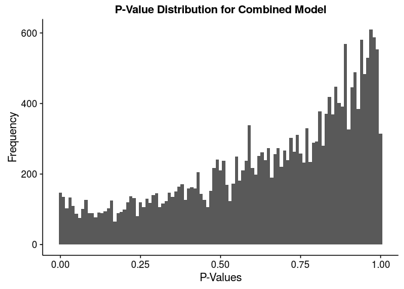

```r
ggplot(yeast, aes(x = b2, y = b3)) + geom_point() + ggtitle("Pairwise sample-sample correlation")
```

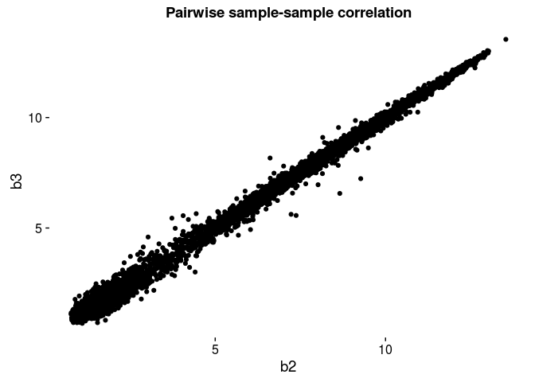

```r
ggplot(yeast, aes(x = c1, y = c2)) + geom_point() + ggtitle("Pairwise sample-sample correlation")
```


```r
ggplot(yeast, aes(x = c1, y = c3)) + geom_point() + ggtitle("Pairwise sample-sample correlation")
```


```r
ggplot(yeast, aes(x = c2, y = c3)) + geom_point() + ggtitle("Pairwise sample-sample correlation")
```


Well, so far we can see that b2 & b3 look to be in the same group.  Similarly, c1 and c3 seem to be in the same group. 

```r
ggplot(yeast, aes(x = b1, y = c1)) + geom_point() + ggtitle("Pairwise sample-sample correlation")
```


So do b1 & c1.  So it would see our first group is b1, c1, c3

```r
ggplot(yeast, aes(x = b1, y = c3)) + geom_point() + ggtitle("Pairwise sample-sample correlation")
```


Looks about right! That would leave b2, b3, and c2 correlated.  


```r
ggplot(yeast, aes(x = b2, y = b3)) + geom_point() + ggtitle("Pairwise sample-sample correlation")
```


```r
ggplot(yeast, aes(x = b2, y = c2)) + geom_point() + ggtitle("Pairwise sample-sample correlation")
```


```r
ggplot(yeast, aes(x = b3, y = c2)) + geom_point() + ggtitle("Pairwise sample-sample correlation")
```

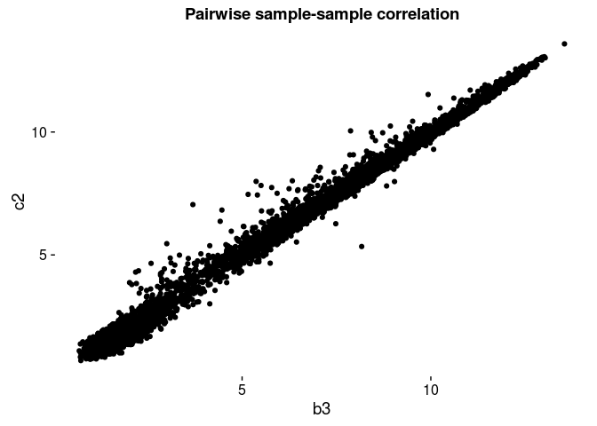

I bet we could've faceted that. 

```r
gath.yeast %<>% 
	mutate(group = gsub("[0-9]$", "", sample))
gath.yeast %<>% 
	mutate(group = gsub("^b$", "batch", group))
gath.yeast %<>% 
	mutate(group = gsub("^c$", "chemostat", group))
gath.yeast
```

```
## Source: local data frame [65,568 x 4]
## 
##         probeID sample intensity group
##           (chr)  (chr)     (dbl) (chr)
## 1    1769308_at     b1 11.145506 batch
## 2    1769309_at     b1  2.164329 batch
## 3    1769310_at     b1  1.488300 batch
## 4    1769311_at     b1  9.006138 batch
## 5    1769312_at     b1  6.945715 batch
## 6    1769313_at     b1  7.815192 batch
## 7    1769314_at     b1  8.658098 batch
## 8    1769315_at     b1  1.395614 batch
## 9  1769316_s_at     b1  1.905238 batch
## 10   1769317_at     b1  6.961356 batch
## ..          ...    ...       ...   ...
```

```r
tail(gath.yeast)
```

```
## Source: local data frame [6 x 4]
## 
##                 probeID sample intensity     group
##                   (chr)  (chr)     (dbl)     (chr)
## 1   RPTR-Sc-U89963-1_at     c3  1.039859 chemostat
## 2 RPTR-Sc-U89963-1_s_at     c3  1.419373 chemostat
## 3   RPTR-Sc-X03453-1_at     c3  1.100052 chemostat
## 4   RPTR-Sc-X58791-1_at     c3  1.387374 chemostat
## 5 RPTR-Sc-X58791-1_s_at     c3  1.068312 chemostat
## 6 RPTR-Sc-X58791-2_s_at     c3  2.508159 chemostat
```


```r
p <- ggplot(gath.yeast, aes(x = sample))
p + geom_density(aes(fill = intensity)) + 
	facet_wrap( ~ group) + ggtitle("Log2 Intensities of Samples")
```


Looks pretty good!

Let's compute the pearson distance between samples. 

```r
yeast.corr <- yeast %>% 
	select(-probeID) %>% 
	cor(method = "pearson") %>% 
	as.data.frame()
yeast.corr$correlate <- row.names(yeast.corr)
heatmapcolors <- brewer.pal(9, "Oranges")
yeast.corr %<>% gather("sample", "correlation", 1:6)
ggplot(yeast.corr, aes(x = sample, y = correlate, fill = correlation)) + 
	geom_tile() +
	scale_fill_gradientn(colors = heatmapcolors)
```


Okay, now let's rearrange based on what we decided from our pairwise sample-sample scatterplots and what looks like some obvious clustering in our first heatmap.

```r
yeast.corr %<>% 
	mutate(sample = factor(sample, levels = c("b1", "c1", "c3", "c2", "b3", "b2")))
yeast.corr %<>% 
	mutate(correlate = factor(correlate, levels = c("b1", "c1", "c3", "c2", "b3", "b2")))
ggplot(yeast.corr, aes(x = sample, y = correlate, fill = correlation)) + 
	geom_tile() +
	scale_fill_gradientn(colors = heatmapcolors)
```


This makes it seem rather apparent that b1, c1, and c3 are part of one group, and c2, b3, and b2 are part of another group.  Either that or there are some serious flaws with these microarrays.  

Let's plot a heatmap of the the top 100 genes, first unsorted.

```r
gath.yeast %>% 
	group_by(sample) %>% 
	do(head(., n = 100)) %>% 
	ggplot(aes(x = sample, y = probeID, fill = intensity)) + 
	geom_tile() +
	scale_fill_viridis() + xlab("Sample") +
	ylab("probeID")
```


And now with our samples sorted into what we believe to be the true groups.  

```r
gath.yeast$sample %<>% as.factor()
gath.yeast %<>% 
	mutate(sample = factor(sample, levels = c("b1", "c1", "c3", "c2", "b3", "b2")))
gath.yeast %>% 
	group_by(sample) %>% 
	do(head(., n = 100)) %>% 
	ggplot(aes(x = sample, y = probeID, fill = intensity)) + 
	geom_tile() +
	scale_fill_viridis() + xlab("Sample") +
	ylab("probeID")
```


Finally, how about PCA? We can use `FactoMineR::PCA` to get a simple plot, or use `stats::prcomp` for an object we can pipe into `ggplot2`.  

```r
noProbes.yeast <- yeast
row.names(noProbes.yeast) <- noProbes.yeast$probeID
noProbes.yeast$probeID <- NULL

fPCA <- FactoMineR::PCA(noProbes.yeast, scale.unit = FALSE)
```


```r
sPCA <- stats::prcomp(noProbes.yeast, scale. = FALSE)
(PCA.summary <- summary(sPCA)$importance %>% as.data.frame())
```

```
##                             PC1     PC2       PC3       PC4       PC5
## Standard deviation     8.296578 1.08287 0.1734449 0.1620865 0.1378681
## Proportion of Variance 0.982030 0.01673 0.0004300 0.0003700 0.0002700
## Cumulative Proportion  0.982030 0.99876 0.9991800 0.9995600 0.9998300
##                              PC6
## Standard deviation     0.1088992
## Proportion of Variance 0.0001700
## Cumulative Proportion  1.0000000
```

We can clearly see that b3, b2, and c2 should be grouped together (as previously)

For another quick plot, we can use `geom_point` with `geom_text`.  

```r
PCA.rotation <- sPCA$rotation %>% as.data.frame()
PC1.variance <- paste0("PC1, ", round(100*PCA.summary$PC1[2], 2), "% Variance")
PC2.variance <- paste0("PC2, ", round(100*PCA.summary$PC2[2], 2), "% Variance")
ggplot(PCA.rotation, aes(x = PC1, y = PC2, label = rownames(PCA.rotation))) +
	geom_point() + geom_text(nudge_y = 0.05) + xlab(PC1.variance) + ylab(PC2.variance)
```

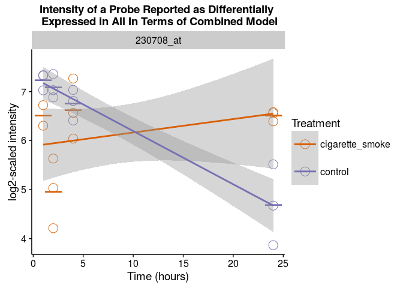

Note that we get a different looking distribution if we scale our values. Regardless, the clustering is obvious, and our principal components are the same.  

```r
sPCA.scaled <- stats::prcomp(noProbes.yeast, scale. = TRUE)
(PCA.scaled.summary <- summary(sPCA.scaled)$importance %>% as.data.frame())
```

```
##                            PC1       PC2        PC3        PC4        PC5
## Standard deviation     2.42737 0.3168461 0.05083209 0.04753665 0.04045052
## Proportion of Variance 0.98202 0.0167300 0.00043000 0.00038000 0.00027000
## Cumulative Proportion  0.98202 0.9987500 0.99918000 0.99956000 0.99983000
##                               PC6
## Standard deviation     0.03164637
## Proportion of Variance 0.00017000
## Cumulative Proportion  1.00000000
```

```r
PC1.scaled.variance <- paste0("PC1, ", round(100*PCA.scaled.summary$PC1[2], 2), "% Variance")
PC2.scaled.variance <- paste0("PC2, ", round(100*PCA.scaled.summary$PC2[2], 2), "% Variance")
PCA.rotation.scaled <- sPCA.scaled$rotation %>% as.data.frame()
ggplot(PCA.rotation.scaled, aes(x = PC1, y = PC2, label = rownames(PCA.rotation))) +
	geom_point() + geom_text(nudge_y = 0.05) + xlab(PC1.variance) + ylab(PC2.variance)
```


Finally, if we also wanted to plot our observations, we could use the `ggbiplot` package.  

```r
g <- ggbiplot(sPCA, obs.scale = 1, var.scale = 1,
			  alpha = 0.05, circle = TRUE)
g + scale_color_discrete(name = '') +
	theme(legend.direction = 'vertical', 
		  legend.position = 'right') +
	ggtitle("PCA Plot of Yeast Samples")
```


Given all of these plots, we can not satisfactorally conclude that samples b1 and c2 have accidentally been swapped. Let's fix that and continue!

## 6.2 Microarray DEA (2 points)


```r
yeast.fixed <- yeast
colnames(yeast.fixed)
```

```
## [1] "probeID" "b1"      "b2"      "b3"      "c1"      "c2"      "c3"
```

```r
colnames(yeast.fixed) <- c("probeID", "c2", "b2", "b3", "c1", "b1", "c3")
```

Here, I'll use biomaRt to get gene IDs and ensembl gene IDs.  We know from the homework that this experiment is using the Affymetrix Yeast Genome Array 2.0 platform, and we can do a quick check on GEO to confirm.  [GSE37599](http://www.ncbi.nlm.nih.gov/geo/query/acc.cgi?acc=GSE37599), and [GPL2529](http://www.ncbi.nlm.nih.gov/geo/query/acc.cgi?acc=GPL2529), Affymetrix Yeast Genome 2.0 Array.  Perfect!

```r
ensembl <- useMart("ensembl") # set up biomaRt to use the ensembl database
datasets <- listDatasets(ensembl) # store our datasets so we can see which to use
ensembl <- useDataset("scerevisiae_gene_ensembl", mart = ensembl) # use the human data set!
filters <- listFilters(ensembl) # find what filters we can use and cross fingers that it's here
attributes <- listAttributes(ensembl) # ditto with the attributes
yeast_probe_IDs <- getBM(attributes = c("external_gene_name", "ensembl_gene_id", "affy_yeast_2"), filters = "affy_yeast_2", values = yeast.fixed$probeID, mart = ensembl) # query the probeIDs
head(yeast_probe_IDs)
```

```
##   external_gene_name ensembl_gene_id affy_yeast_2
## 1             CUP1-2         YHR055C 1769803_s_at
## 2               SGV1         YPR161C   1775638_at
## 3               RTC1         YOL138C   1772806_at
## 4               SXM1         YDR395W   1771544_at
## 5               SYF2         YGR129W   1774505_at
## 6               RHO1         YPR165W   1771897_at
```

```r
colnames(yeast_probe_IDs)[3] <- "probeID"
yeast.fixed <- inner_join(yeast.fixed, yeast_probe_IDs, by = "probeID")
yeast.fixed
```

```
## Source: local data frame [6,259 x 9]
## 
##         probeID        c2       b2       b3        c1       b1        c3
##           (chr)     (dbl)    (dbl)    (dbl)     (dbl)    (dbl)     (dbl)
## 1    1769308_at 11.145506 6.795593 6.708003 10.945878 6.698862 11.070725
## 2    1769311_at  9.006138 9.461821 9.234618  8.972233 9.276710  9.004997
## 3    1769312_at  6.945715 6.895895 6.955463  6.851454 6.900187  6.892854
## 4    1769313_at  7.815192 6.600131 6.534413  7.770245 6.564123  7.851777
## 5    1769314_at  8.658098 8.788372 8.982260  8.572727 8.807559  8.657040
## 6    1769317_at  6.961356 7.418890 7.258103  7.071840 7.225361  6.871157
## 7    1769319_at  9.362238 9.174514 9.160608  9.413195 9.083989  9.305387
## 8    1769320_at  5.743091 5.583712 5.543573  5.666377 5.443741  5.882802
## 9    1769321_at  1.687596 1.936899 1.798421  1.818721 1.845609  1.466536
## 10 1769322_s_at  5.535851 6.893833 6.692221  5.420552 6.503181  5.397739
## ..          ...       ...      ...      ...       ...      ...       ...
## Variables not shown: external_gene_name (chr), ensembl_gene_id (chr)
```

Alrighty, now that we've got our gene IDs set up, let's bring in some qualitative data describing batch vs chemostat.  For this we'll need to gather our data first.  

```r
yeast.fg <- yeast.fixed %>% # for yeast, fixed & gathered
	gather("sample", "intensity", 2:7)
```

And then we can bring in qualitative data.  We can really just create our own data.frame for this.

```r
yeast.fg %<>% 
	mutate(group = gsub("[0-9]$", "", sample))
yeast.fg %<>% 
	mutate(group = gsub("^b$", "batch", group))
yeast.fg %<>% 
	mutate(group = gsub("^c$", "chemostat", group))
yeast.fg
```

```
## Source: local data frame [37,554 x 6]
## 
##         probeID external_gene_name ensembl_gene_id sample intensity
##           (chr)              (chr)           (chr)  (chr)     (dbl)
## 1    1769308_at               FOX2         YKR009C     c2 11.145506
## 2    1769311_at                            YDL157C     c2  9.006138
## 3    1769312_at               PCL6         YER059W     c2  6.945715
## 4    1769313_at               PKP2         YGL059W     c2  7.815192
## 5    1769314_at               PHO8         YDR481C     c2  8.658098
## 6    1769317_at               DAT1         YML113W     c2  6.961356
## 7    1769319_at               COA1         YIL157C     c2  9.362238
## 8    1769320_at                            YPR003C     c2  5.743091
## 9    1769321_at               AIF1         YNR074C     c2  1.687596
## 10 1769322_s_at                          YLR154C-H     c2  5.535851
## ..          ...                ...             ...    ...       ...
## Variables not shown: group (chr).
```

```r
tail(yeast.fg)
```

```
## Source: local data frame [6 x 6]
## 
##                   probeID external_gene_name ensembl_gene_id sample
##                     (chr)              (chr)           (chr)  (chr)
## 1        AFFX-YER148wM_at              SPT15         YER148W     c3
## 2        AFFX-YFL039C3_at               ACT1         YFL039C     c3
## 3        AFFX-YFL039C5_at               ACT1         YFL039C     c3
## 4        AFFX-YFL039CM_at               ACT1         YFL039C     c3
## 5 RPTR-Sc-AF298789-1_s_at               TRP1         YDR007W     c3
## 6   RPTR-Sc-K01486-1_s_at               GAL4         YPL248C     c3
## Variables not shown: intensity (dbl), group (chr).
```


```r
p <- ggplot(yeast.fg, aes(x = sample))
p + geom_density(aes(fill = intensity)) + 
	facet_wrap( ~ group) + ggtitle("Log2 Intensities of Samples")
```

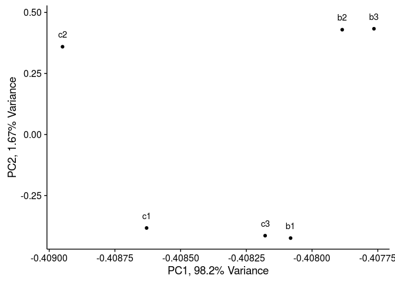


********
This page was last updated on  Sunday, March 13, 2016 at 10:23PM
