# Homework for STAT540
Sam Hinshaw  


Please view the HTML version of this document, not the GitHub rendering of the `.md` file for proper Table of Contents. 

# 0 Setup

```r
# library(BiocInstaller) # or source("https://bioconductor.org/biocLite.R")
suppressPackageStartupMessages({
	library(limma) # biocLite("limma")
	library(edgeR) # biocLite("edgeR")
	# library(DESeq2) # biocLite("DESeq2")
	# library(biomaRt)
	library(yeast2.db) # biocLite("yeast2.db")
	library(hgu133plus2.db) # biocLite("hgu133plus2.db")
	library(magrittr)
	library(devtools)
	library(ggplot2)
	library(reshape2)
	library(readr)
	library(knitr)
	library(ggbiplot) # devtools::install_github("vqv/ggbiplot")
	library(FactoMineR) # install.packages("FactoMineR", dependencies = TRUE)
	library(tidyr)
	library(RColorBrewer)
	library(viridis)
	library(VennDiagram)
	library(qvalue) #biocLite("qvalue")
	library(dplyr)
	library(cowplot)
	library(GGally)
})
```

Let's check our R version & Packages are up-to-date
We want `R >= 3.2.3`, `limma >= 3.26.7`,  & `edgeR >= 3.12.0`

```r
sessioninfo <- devtools::session_info()
packages <- sessioninfo$packages
packages %>% 
	dplyr::filter(package %in% c("limma", "edgeR"))
```

```
##   package * version       date       source
## 1   edgeR *  3.12.0 2016-03-12 Bioconductor
## 2   limma *  3.26.8 2016-03-12 Bioconductor
```

```r
sessioninfo$platform$version
```

```
## [1] "R version 3.2.4 (2016-03-10)"
```

Looks good, let's continue

# 1 Data Inspection

## 1.1 Download Data

For this, I am using a makefile to avoid downloading the datasets more than once. 
See [Makefile](./Makefile) in this directory. Contents pasted here:
```
all: homework

clean: 
	rm -rf SamHinshawHomework.md SamHinshawHomework.html data_fixed.txt design_fixed.txt

data: 
	curl -o data.txt.gz 'http://stat540-ubc.github.io/homework/assignment/homework_data/NHBE_transcriptome_data.txt.gz?raw=true'
	gunzip -kq data.txt.gz

design: 
	curl -o design.txt 'http://stat540-ubc.github.io/homework/assignment/homework_data/NHBE_design.txt?raw=true'

gitignore: data.txt.gz design.txt data.txt
	grep -q -F 'data.txt' ../.gitignore || echo 'data.txt' >> ../.gitignore
	grep -q -F 'data.txt.gz' ../.gitignore || echo 'data.txt.gz' >> ../.gitignore
	grep -q -F 'design.txt' ../.gitignore || echo 'design.txt' >> ../.gitignore
	grep -q -F 'design_fixed.txt' ../.gitignore || echo 'design_fixed.txt' >> ../.gitignore
	grep -q -F 'data_fixed.txt' ../.gitignore || echo 'data_fixed.txt' >> ../.gitignore

data_fixed: data.txt
	cp data.txt data_fixed.txt
	sed -i -e 's/^"GSE10718_Biomat_1"/"ProbeID"	"GSE10718_Biomat_1"/' data_fixed.txt
	
design_fixed: design.txt
	cp design.txt design_fixed.txt
	sed -i -e 's/^"ExternalID"/"InternalID"	"ExternalID"/' design_fixed.txt
	
homework:  SamHinshawHomework.Rmd gitignore data_fixed design_fixed
	Rscript -e "rmarkdown::render('SamHinshawHomework.Rmd')"
	
```

### Experimental Design

Before we do anything, let's see what's what in our experiment, [GSE10718](http://www.ncbi.nlm.nih.gov/geo/query/acc.cgi?acc=GSE10718)
<blockquote>
Gene expression patterns were assessed in normal human bronchial epithelial (NHBE) cells exposed to cigarette smoke (CS) from a typical "full flavor" American brand of cigarettes in order to develop a better understanding of the genomic impact of tobacco exposure, which can ultimately define biomarkers that discriminate tobacco-related effects and outcomes in a clinical setting. NHBE cells were treated with CS for 15 minutes and alterations to the transcriptome assessed at 1,2,4 and 24 hours post-CS-exposure using high-density oligonucleotide microarrays.
</blockquote>

### Import Data

```r
data <- readr::read_delim("data.txt", delim = "\t")
```

```
## Warning: 22737 parsing failures.
## row col   expected     actual
##   1  -- 23 columns 24 columns
##   2  -- 23 columns 24 columns
##   3  -- 23 columns 24 columns
##   4  -- 23 columns 24 columns
##   5  -- 23 columns 24 columns
## ... ... .......... ..........
## .See problems(...) for more details.
```

Huh, thanks to `readr`, we're getting an error. Something is wrong with our column count. Let's head to the next step and figure out how to handle this error.  

### Inspect Data

```r
class(data) # First let's make sure this is expected. We should have a data.frame, specifically a tbl_df. 
```

```
## [1] "tbl_df"     "tbl"        "data.frame"
```

```r
glimpse(data)
```

```
## Observations: 22,737
## Variables: 23
## $ GSE10718_Biomat_1  (chr) "1294_at", "1316_at", "1320_at", "1431_at",...
## $ GSE10718_Biomat_10 (dbl) 7.900022, 6.126008, 6.822491, 6.633596, 6.9...
## $ GSE10718_Biomat_11 (dbl) 7.623666, 5.846865, 7.616309, 5.698143, 7.5...
## $ GSE10718_Biomat_12 (dbl) 8.224398, 6.299318, 7.217153, 6.221293, 7.2...
## $ GSE10718_Biomat_13 (dbl) 8.009710, 5.910947, 6.172960, 6.055411, 7.9...
## $ GSE10718_Biomat_14 (dbl) 7.607968, 6.623939, 7.201396, 6.885087, 7.8...
## $ GSE10718_Biomat_15 (dbl) 7.448574, 6.824437, 7.397821, 7.023587, 7.5...
## $ GSE10718_Biomat_16 (dbl) 7.414247, 6.884227, 6.782186, 6.591812, 7.2...
## $ GSE10718_Biomat_17 (dbl) 7.671862, 6.830394, 6.987745, 6.454693, 7.5...
## $ GSE10718_Biomat_19 (dbl) 7.892385, 6.453085, 5.845809, 6.176024, 7.2...
## $ GSE10718_Biomat_2  (dbl) 7.804841, 6.658476, 6.831755, 6.192702, 6.9...
## $ GSE10718_Biomat_20 (dbl) 7.721433, 6.569794, 6.674275, 6.741030, 7.0...
## $ GSE10718_Biomat_21 (dbl) 7.548707, 5.806634, 6.282316, 5.568127, 8.0...
## $ GSE10718_Biomat_22 (dbl) 6.343507, 7.064967, 7.234590, 5.768635, 7.6...
## $ GSE10718_Biomat_23 (dbl) 7.797584, 6.485319, 6.750336, 5.585600, 7.3...
## $ GSE10718_Biomat_24 (dbl) 7.951058, 7.084865, 7.111929, 7.135406, 7.8...
## $ GSE10718_Biomat_3  (dbl) 7.877641, 6.237747, 6.972026, 6.343507, 7.0...
## $ GSE10718_Biomat_4  (dbl) 7.510909, 6.384493, 6.979904, 6.727300, 7.0...
## $ GSE10718_Biomat_5  (dbl) 7.309565, 6.885804, 7.621911, 6.481674, 8.4...
## $ GSE10718_Biomat_6  (dbl) 8.004972, 7.100588, 7.294042, 5.722269, 7.7...
## $ GSE10718_Biomat_7  (dbl) 7.502813, 6.421699, 7.684150, 6.281308, 7.5...
## $ GSE10718_Biomat_8  (dbl) 7.500043, 6.269029, 7.116839, 6.625745, 8.1...
## $ GSE10718_Biomat_9  (dbl) 7.509491, 6.534320, 6.613354, 6.523722, 7.6...
```

It looks like we may have an error with our header, as we've got probe IDs labeled as a sample. Could this be an artifact of the compression? Let's try something else real quick. Also, now we know what dataset we're using! GSE10718.

```r
data_method2 <- gzfile("data.txt.gz") %>% readr::read_delim(delim = "\t")
```

```
## Warning: 22737 parsing failures.
## row col   expected     actual
##   1  -- 23 columns 24 columns
##   2  -- 23 columns 24 columns
##   3  -- 23 columns 24 columns
##   4  -- 23 columns 24 columns
##   5  -- 23 columns 24 columns
## ... ... .......... ..........
## .See problems(...) for more details.
```

Nope, looks like it's just a problem with the source file. 

```r
rm(data_method2)
```

### Fix Import Errors

Well, since we're not supposed to edit our souce file, I've copied the file do `data_fixed.txt` and appended `"probeIDs	"` to the beginning of the first line with `sed`.  Now we should be ready to rock!

```r
data <- readr::read_delim("data_fixed.txt", delim = "\t")
```

Sweet! No errors. Let's take a closer look.

```r
glimpse(data)
```

```
## Observations: 22,737
## Variables: 24
## $ ProbeID            (chr) "1294_at", "1316_at", "1320_at", "1431_at",...
## $ GSE10718_Biomat_1  (dbl) 7.900022, 6.126008, 6.822491, 6.633596, 6.9...
## $ GSE10718_Biomat_10 (dbl) 7.623666, 5.846865, 7.616309, 5.698143, 7.5...
## $ GSE10718_Biomat_11 (dbl) 8.224398, 6.299318, 7.217153, 6.221293, 7.2...
## $ GSE10718_Biomat_12 (dbl) 8.009710, 5.910947, 6.172960, 6.055411, 7.9...
## $ GSE10718_Biomat_13 (dbl) 7.607968, 6.623939, 7.201396, 6.885087, 7.8...
## $ GSE10718_Biomat_14 (dbl) 7.448574, 6.824437, 7.397821, 7.023587, 7.5...
## $ GSE10718_Biomat_15 (dbl) 7.414247, 6.884227, 6.782186, 6.591812, 7.2...
## $ GSE10718_Biomat_16 (dbl) 7.671862, 6.830394, 6.987745, 6.454693, 7.5...
## $ GSE10718_Biomat_17 (dbl) 7.892385, 6.453085, 5.845809, 6.176024, 7.2...
## $ GSE10718_Biomat_19 (dbl) 7.804841, 6.658476, 6.831755, 6.192702, 6.9...
## $ GSE10718_Biomat_2  (dbl) 7.721433, 6.569794, 6.674275, 6.741030, 7.0...
## $ GSE10718_Biomat_20 (dbl) 7.548707, 5.806634, 6.282316, 5.568127, 8.0...
## $ GSE10718_Biomat_21 (dbl) 6.343507, 7.064967, 7.234590, 5.768635, 7.6...
## $ GSE10718_Biomat_22 (dbl) 7.797584, 6.485319, 6.750336, 5.585600, 7.3...
## $ GSE10718_Biomat_23 (dbl) 7.951058, 7.084865, 7.111929, 7.135406, 7.8...
## $ GSE10718_Biomat_24 (dbl) 7.877641, 6.237747, 6.972026, 6.343507, 7.0...
## $ GSE10718_Biomat_3  (dbl) 7.510909, 6.384493, 6.979904, 6.727300, 7.0...
## $ GSE10718_Biomat_4  (dbl) 7.309565, 6.885804, 7.621911, 6.481674, 8.4...
## $ GSE10718_Biomat_5  (dbl) 8.004972, 7.100588, 7.294042, 5.722269, 7.7...
## $ GSE10718_Biomat_6  (dbl) 7.502813, 6.421699, 7.684150, 6.281308, 7.5...
## $ GSE10718_Biomat_7  (dbl) 7.500043, 6.269029, 7.116839, 6.625745, 8.1...
## $ GSE10718_Biomat_8  (dbl) 7.509491, 6.534320, 6.613354, 6.523722, 7.6...
## $ GSE10718_Biomat_9  (dbl) 7.735819, 6.888977, 6.708225, 7.063494, 7.4...
```

Looking good. These seem to be log2 transformed microarray intensity values.  How about we examine the metadata and then do a quick intensity plot. 

```r
design <- read_delim("design.txt", delim = "\t")
```

```
## Warning: 23 parsing failures.
## row col  expected    actual
##   1  -- 3 columns 4 columns
##   2  -- 3 columns 4 columns
##   3  -- 3 columns 4 columns
##   4  -- 3 columns 4 columns
##   5  -- 3 columns 4 columns
## ... ... ......... .........
## .See problems(...) for more details.
```

Ugh, same problem again? C'mon guys. Back to `sed`. 

```r
design <- readr::read_delim("design_fixed.txt", delim = "\t")
glimpse(design)
```

```
## Observations: 23
## Variables: 4
## $ InternalID (chr) "GSE10718_Biomat_1", "GSE10718_Biomat_10", "GSE1071...
## $ ExternalID (chr) "GSM270883", "GSM270874", "GSM270873", "GSM270872",...
## $ Treatment  (chr) "control", "control", "control", "control", "contro...
## $ time       (chr) "24_h", "1_h", "1_h", "1_h", "4_h", "4_h", "4_h", "...
```

### Inspect Data

There we go! So we've got 23 samples. How many different treatment groups, and how many different timepoints?

```r
design %>% 
	group_by(Treatment) %>% 
	tally()
```

```
## Source: local data frame [2 x 2]
## 
##         Treatment     n
##             (chr) (int)
## 1 cigarette_smoke    11
## 2         control    12
```

```r
design %>% 
	group_by(time) %>% 
	tally()
```

```
## Source: local data frame [4 x 2]
## 
##    time     n
##   (chr) (int)
## 1   1_h     5
## 2  24_h     6
## 3   2_h     6
## 4   4_h     6
```

```r
design %>% 
	group_by(Treatment, time) %>% 
	tally()
```

```
## Source: local data frame [8 x 3]
## Groups: Treatment [?]
## 
##         Treatment  time     n
##             (chr) (chr) (int)
## 1 cigarette_smoke   1_h     2
## 2 cigarette_smoke  24_h     3
## 3 cigarette_smoke   2_h     3
## 4 cigarette_smoke   4_h     3
## 5         control   1_h     3
## 6         control  24_h     3
## 7         control   2_h     3
## 8         control   4_h     3
```

That's a pretty good summary of what's going on, I'd say. Now back to our data file. How many different genes do we have reported?

```r
nrow(data)
```

```
## [1] 22737
```

22,737 probes.  Do we know any microarrays that have exactly that many genes?  Fortunately, we don't need to wonder. This study, [GSE10718](http://www.ncbi.nlm.nih.gov/geo/query/acc.cgi?acc=GSE10718) used [GPL570](http://www.ncbi.nlm.nih.gov/geo/query/acc.cgi?acc=GPL570), the well known Affymetrix HG U133+ 2.0 Array. Later we can use biomaRt to convert our probeIDs to ensembl IDs (or another equivalent), given the platform information. 

## 1.2 Basic Data Manipulation
Before we continue, let's create a new column in our dataset that holds our time post-treatment as hours.


```r
design %<>% 
	mutate(hours = gsub("\\_h$","", time) %>% as.numeric())
glimpse(design)
```

```
## Observations: 23
## Variables: 5
## $ InternalID (chr) "GSE10718_Biomat_1", "GSE10718_Biomat_10", "GSE1071...
## $ ExternalID (chr) "GSM270883", "GSM270874", "GSM270873", "GSM270872",...
## $ Treatment  (chr) "control", "control", "control", "control", "contro...
## $ time       (chr) "24_h", "1_h", "1_h", "1_h", "4_h", "4_h", "4_h", "...
## $ hours      (dbl) 24, 1, 1, 1, 4, 4, 4, 1, 1, 2, 24, 2, 2, 4, 4, 4, 2...
```


## 1.3 Basic Graphing

However, for now we can just plot some intensity distributions. To help our plot colors out, we can convert our Treatment and time variables to factors. This is more for my own benefit (to see intensity distributions) than it is to follow the homework to the letter. Homework progress will continue below. 

```r
design$Treatment <- as.factor(design$Treatment)
design$time <- as.factor(design$time)
```

### Intensity Distributions

Let's get biomaRt out of the way so we can move on.  

```r
# ensembl <- useMart("ensembl") # set up biomaRt to use the ensembl database
# datasets <- listDatasets(ensembl) # store our datasets so we can see which to use
# ensembl <- useDataset("hsapiens_gene_ensembl", mart = ensembl) # use the human data set!
# filters <- listFilters(ensembl) # find what filters we can use and cross fingers that it's here
# attributes <- listAttributes(ensembl) # ditto with the attributes
# affy_probe_IDs <- getBM(attributes = c("ensembl_gene_id", "affy_hg_u133_plus_2"), 
# 						filters = "affy_hg_u133_plus_2", 
# 						values = data$ProbeID, 
# 						mart = ensembl, 
# 						uniqueRows = TRUE
# 						) # query the probeIDs
# head(affy_probe_IDs)
# colnames(affy_probe_IDs) <- c("ensembl_gene_id", "ProbeID")
# merged.data <- merge(data, affy_probe_IDs, by = base::intersect(affy_probe_IDs$ProbeID, data$ProbeID), 
# 					 all.y = TRUE, all.x = FALSE, 
# 					 by.x = by, by.y = by)
# 
# joined_probeIDs <- data$ProbeID
# rownames(data) <- data$ProbeID
# glimpse(data)
# 
# affy_probe_IDs_hgnc <- getBM(attributes = c("hgnc_symbol", "affy_hg_u133_plus_2"), 
# 							 filters = "affy_hg_u133_plus_2", 
# 							 values = data$ProbeID, 
# 							 uniqueRows = TRUE,
# 							 mart = ensembl
# 							 ) # query the probeIDs
# colnames(affy_probe_IDs_hgnc) <- c("hgnc_symbol", "ProbeID")
```


```r
# affy.gene.sybmols <- mget(data$ProbeID, hgu133plus2SYMBOL)
# # affy.gene.ensembl <- mget(data$ProbeID, hgu133plus2ENSEMBL)
# length(unique(affy.gene.sybmols))
# length(affy.gene.sybmols)
# 
# probe.symbols <- data.frame(
# 	"ProbeID" = names(affy.gene.sybmols),
# 	"geneSymbol" = unlist(affy.gene.sybmols), 
# 	stringsAsFactors = FALSE
# ) %>% tbl_df()
# 
# probe.symbols %<>% 
# 	dplyr::filter(!is.na(geneSymbol))

# 
# probe.geneID <- data.frame(
# 	"ProbeID" = names(affy.gene.ensembl),
# 	"geneID" = unlist(affy.gene.ensembl), 
# 	stringsAsFactors = FALSE
# ) %>% tbl_df()
# 
# probe.geneID %<>% 
# 	dplyr::filter(!is.na(geneID))
# 
# probes.symbols.IDs <- inner_join(probe.symbols, probe.geneID, by = "probeID")

# data <- right_join(data, probe.symbols, by = "ProbeID")
# data.merged <- inner_join(data.merged, probe.geneID, by = "ProbeID")
```

Now we can `gather()` our data for easy plotting, and even join our design data as well. 

```r
gathered_data <- data %>% 
	gather("InternalID", "intensity", 2:24)
glimpse(gathered_data)
```

```
## Observations: 522,951
## Variables: 3
## $ ProbeID    (chr) "1294_at", "1316_at", "1320_at", "1431_at", "1438_a...
## $ InternalID (chr) "GSE10718_Biomat_1", "GSE10718_Biomat_1", "GSE10718...
## $ intensity  (dbl) 7.900022, 6.126008, 6.822491, 6.633596, 6.948795, 9...
```

```r
gathered_data <- inner_join(gathered_data, design, by = "InternalID")
glimpse(gathered_data)
```

```
## Observations: 522,951
## Variables: 7
## $ ProbeID    (chr) "1294_at", "1316_at", "1320_at", "1431_at", "1438_a...
## $ InternalID (chr) "GSE10718_Biomat_1", "GSE10718_Biomat_1", "GSE10718...
## $ intensity  (dbl) 7.900022, 6.126008, 6.822491, 6.633596, 6.948795, 9...
## $ ExternalID (chr) "GSM270883", "GSM270883", "GSM270883", "GSM270883",...
## $ Treatment  (fctr) control, control, control, control, control, contr...
## $ time       (fctr) 24_h, 24_h, 24_h, 24_h, 24_h, 24_h, 24_h, 24_h, 24...
## $ hours      (dbl) 24, 24, 24, 24, 24, 24, 24, 24, 24, 24, 24, 24, 24,...
```

Before we plot, let's set up our color palette.

```r
display.brewer.all()
```


```r
timepoints <- brewer.pal(4, "Set1")
names(timepoints) <- unique(design$time)
treatments <- c("#7FC97F", "#FDC086")
names(treatments) <- unique(design$Treatment)
```

And now, the plot.  First with time-coding...

```r
p <- ggplot(gathered_data, aes(x = intensity))
p + geom_density(aes(fill = time)) + 
	scale_fill_manual(values = timepoints) + xlab("log2 intensity") + ylab("Frequency") + 
	facet_wrap( ~ ExternalID, ncol = 5) + ggtitle("Log2 Intensities of Samples in GSE10718")
```


...and then with treatment coding.

```r
p <- ggplot(gathered_data, aes(x = intensity))
p + geom_density(aes(fill = Treatment)) + 
	scale_fill_manual(values = treatments) + xlab("log2 intensity") + ylab("Frequency") + 
	facet_wrap( ~ ExternalID, ncol = 5) + ggtitle("Log2 Intensities of Samples in GSE10718")
```


### Single Probe Intensity

As per the homework, let's plot the gene expression data for a single probe. Let's pick one at pseudo-random!

```r
set.seed(20)
data[sample(nrow(data), 1), 1:6] %>% kable("markdown")
```


|ProbeID   | GSE10718_Biomat_1| GSE10718_Biomat_10| GSE10718_Biomat_11| GSE10718_Biomat_12| GSE10718_Biomat_13|
|:---------|-----------------:|------------------:|------------------:|------------------:|------------------:|
|239627_at |          6.165542|           5.744486|           3.910992|           4.188052|           5.761274|

```r
singleprobe <- gathered_data %>% 
	dplyr::filter(ProbeID == "231836_at")
```


```r
ggplot(data = singleprobe, aes(y = intensity, x = ExternalID)) + 
	geom_bar(stat = "identity") +
	theme(axis.text.x = element_text(angle = 65, hjust = 1))
```

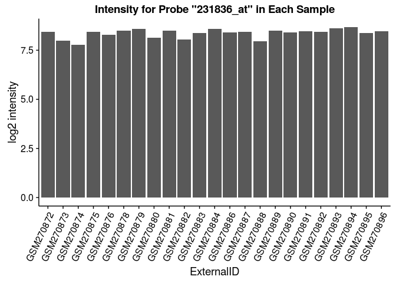

Okay, so we see we've got pretty similar intensities throughout the samples.  But let's group them anyways! First by treatment.

```r
ggplot(data = singleprobe, aes(y = intensity, x = Treatment)) + 
	geom_bar(stat = "identity", width = 0.5)
```

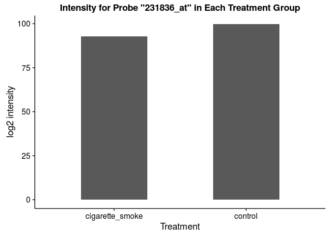

...then by time

```r
ggplot(data = singleprobe, aes(y = intensity, x = time)) + 
	geom_bar(stat = "identity", width = 0.5)
```


Ah-hah! That's rather interesting...
Let's do all permutations of combinations. 

```r
gathered_data %<>% mutate(perm = paste(as.character(Treatment), as.character(time), sep = "_"))
singleprobe <- gathered_data %>% 
	dplyr::filter(ProbeID == "231836_at")
```

And now to plot...

```r
ggplot(data = singleprobe, aes(y = intensity, x = perm)) + 
	geom_bar(stat = "identity", width = 0.5) +
	theme(axis.text.x = element_text(angle = 65, hjust = 1))
```


Note that instead of creating new groups to chart, we could have simply color-coded the original bar chart. For example, using varying intensities of colors for time and complementary colors for the treatment. 

```r
smoke.colors <- brewer.pal(4, "Reds")
control.colors <- brewer.pal(4, "Blues")
names(smoke.colors) <- c("cigarette_smoke_1_h", "cigarette_smoke_2_h", "cigarette_smoke_4_h", "cigarette_smoke_24_h")
names(control.colors) <- c("control_1_h", "control_2_h", "control_4_h", "control_24_h")
perm_palette <- c(control.colors, smoke.colors)
```


```r
singleprobe %<>% 
    mutate(IDnum = gsub("^GSM","", ExternalID) %>% as.numeric())
singleprobe$perm <- as.factor(singleprobe$perm)
singleprobe %<>% 
    mutate(perm = reorder(perm, IDnum, max))
```


```r
ggplot(data = singleprobe, aes(y = intensity, x = ExternalID)) + 
	geom_bar(stat = "identity", aes(fill = perm)) +
	scale_fill_manual(values = perm_palette) + labs(fill = "Conditions") +
	theme(axis.text.x = element_text(angle = 65, hjust = 1))
```


# 2 Assessing Data Quality

Moving on, let's start looking at our data quality, not just visualizing it. 

## 2.1 Heatmaps


```r
datacor <- data %>% 
	dplyr::select(-ProbeID) %>% 
	cor()
melted_corr <- melt(datacor) %>% tbl_df()
head(melted_corr)
```

```
## Source: local data frame [6 x 3]
## 
##                 Var1              Var2     value
##               (fctr)            (fctr)     (dbl)
## 1  GSE10718_Biomat_1 GSE10718_Biomat_1 1.0000000
## 2 GSE10718_Biomat_10 GSE10718_Biomat_1 0.8997255
## 3 GSE10718_Biomat_11 GSE10718_Biomat_1 0.9115114
## 4 GSE10718_Biomat_12 GSE10718_Biomat_1 0.9120055
## 5 GSE10718_Biomat_13 GSE10718_Biomat_1 0.9183307
## 6 GSE10718_Biomat_14 GSE10718_Biomat_1 0.9177586
```

Let's try reordering these factors with `arrange()` to reveal discrepancies. 

```r
design$qualitative <- NULL
design %<>% 
	mutate(qualitative = paste0(Treatment, "_", as.character(hours), "_", ExternalID))
colnames(melted_corr) <- c("InternalID", "Var2", "value")
design_for_corr <- design %>% 
	dplyr::select(-ExternalID)
joined_corr <- melted_corr %>% 
	inner_join(design_for_corr, by = "InternalID")
```

```
## Warning in inner_join_impl(x, y, by$x, by$y): joining factor and character
## vector, coercing into character vector
```

```r
##
design_for_corr2 <- design_for_corr %>% 
	dplyr::select(InternalID, qualitative, hours, Treatment)
colnames(design_for_corr2) <- c("Var2", "qualitative2", "hours2", "Treatment2")
joined_corr %<>% 
	inner_join(design_for_corr2, by = "Var2")
```

```
## Warning in inner_join_impl(x, y, by$x, by$y): joining factor and character
## vector, coercing into character vector
```

```r
## Rearrange & reorder by time & then treatment
by_time <- joined_corr %>% 
	arrange(-hours, Treatment)
by_time$factororder <- 1:nrow(by_time)
by_time %<>% 
	mutate(qualitative = reorder(qualitative, factororder, max))
by_time %<>% 
	arrange(hours2, Treatment2)
by_time$factororder2 <- 1:nrow(by_time)
by_time %<>% 
	mutate(qualitative2 = reorder(qualitative2, factororder2, max))
## Rearrange & reorder by treatment & then time
by_treatment <- joined_corr %>% 
	arrange(Treatment, -hours)
by_treatment$factororder <- 1:nrow(by_treatment)
by_treatment %<>% 
	mutate(qualitative = reorder(qualitative, factororder, max))
by_treatment %<>% 
	arrange(Treatment2, hours2)
by_treatment$factororder2 <- 1:nrow(by_time)
by_treatment %<>% 
	mutate(qualitative2 = reorder(qualitative2, factororder2, max))
```


```r
tilegradient <- brewer.pal(11, "Spectral")
```

Now to plot!

```r
p <- ggplot(joined_corr, aes(x = qualitative2, y = qualitative, fill = value)) + 
	geom_tile() +
	theme(axis.text.x = element_text(angle = 65, hjust = 1)) +
	scale_fill_gradientn(colors = tilegradient)
p
```


```r
save_plot("heatmap.svg", p, base_height = 7, base_aspect_ratio = 1.14)
ggplot(by_time, aes(x = qualitative2, y = qualitative, fill = value)) + 
	geom_tile() +
	theme(axis.text.x = element_text(angle = 65, hjust = 1)) +
	scale_fill_gradientn(colors = tilegradient)
```


```r
ggplot(by_treatment, aes(x = qualitative2, y = qualitative, fill = value)) + 
	geom_tile() +
	theme(axis.text.x = element_text(angle = 65, hjust = 1)) +
	scale_fill_gradientn(colors = tilegradient)
```

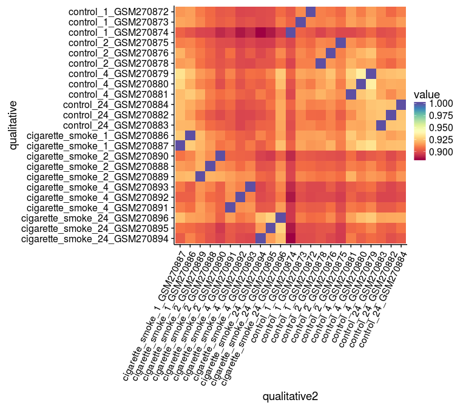

## 2.2 Outliers

Okay. That's an absolutely horrendous amount of code just to reorder a damn heatmap. I'm never doing that again, I'll stick with my unordered heatmap, which told me what I needed to know. "GSM270874" or "GSE10718-Biomat-10" is an outlier. No significant batch effects noticeable. 


```r
outliers <- joined_corr %>% 
	dplyr::filter(InternalID == "GSE10718_Biomat_10")
outliers %<>% 
	mutate(qualitative2 = reorder(qualitative2, value, max))
## Mean Correlation for this sample
outliers %>% 
	dplyr::filter(Var2 != "GSE10718_Biomat_10") %>% 
	summarize(MeanCorr = mean(value))
```

```
## Source: local data frame [1 x 1]
## 
##    MeanCorr
##       (dbl)
## 1 0.8976647
```

Okay, looks like an outlier, but how can we be sure? What's the average correlation?

```r
joined_corr %>% 
	dplyr::filter(value != 1.0) %>% 
	group_by(InternalID) %>% 
	summarize(MeanCorr = mean(value)) %>% 
	arrange(-MeanCorr) %>% 
	kable("markdown")
```


|InternalID         |  MeanCorr|
|:------------------|---------:|
|GSE10718_Biomat_15 | 0.9173906|
|GSE10718_Biomat_16 | 0.9165708|
|GSE10718_Biomat_17 | 0.9148903|
|GSE10718_Biomat_13 | 0.9145962|
|GSE10718_Biomat_6  | 0.9143724|
|GSE10718_Biomat_14 | 0.9139143|
|GSE10718_Biomat_19 | 0.9128870|
|GSE10718_Biomat_3  | 0.9128683|
|GSE10718_Biomat_1  | 0.9116194|
|GSE10718_Biomat_8  | 0.9099998|
|GSE10718_Biomat_2  | 0.9097330|
|GSE10718_Biomat_11 | 0.9094215|
|GSE10718_Biomat_7  | 0.9084779|
|GSE10718_Biomat_20 | 0.9083407|
|GSE10718_Biomat_12 | 0.9076176|
|GSE10718_Biomat_22 | 0.9070942|
|GSE10718_Biomat_9  | 0.9051258|
|GSE10718_Biomat_5  | 0.9043402|
|GSE10718_Biomat_24 | 0.9039464|
|GSE10718_Biomat_21 | 0.9036567|
|GSE10718_Biomat_4  | 0.9028298|
|GSE10718_Biomat_23 | 0.9022724|
|GSE10718_Biomat_10 | 0.8976647|

```r
## What about within groups?

joined_corr %>% 
	dplyr::filter(value != 1.0) %>% 
	group_by(Treatment, hours) %>% 
	summarize(MeanCorr = mean(value)) %>% 
	arrange(-MeanCorr) %>% 
	kable("markdown")
```


|Treatment       | hours|  MeanCorr|
|:---------------|-----:|---------:|
|cigarette_smoke |     1| 0.9157305|
|cigarette_smoke |     2| 0.9082948|
|cigarette_smoke |    24| 0.9071808|
|cigarette_smoke |     4| 0.9044377|
|control         |     4| 0.9153004|
|control         |    24| 0.9114069|
|control         |     2| 0.9078678|
|control         |     1| 0.9049013|

Lastly, how does this outlier sample compare to specific treatments (This is a 1hr control sample). For this I'll filter out correlation with itself.

```r
outliers %>% 
	dplyr::filter(Var2 != "GSE10718_Biomat_10") %>% 
	group_by(Treatment2, hours2) %>% 
	summarize(MeanCorr = mean(value)) %>% 
	arrange(-MeanCorr) %>% 
	kable("markdown")
```


|Treatment2      | hours2|  MeanCorr|
|:---------------|------:|---------:|
|cigarette_smoke |      1| 0.9031898|
|cigarette_smoke |      2| 0.8953648|
|cigarette_smoke |      4| 0.8910155|
|cigarette_smoke |     24| 0.8889794|
|control         |      1| 0.9036029|
|control         |     24| 0.9020827|
|control         |      4| 0.9017017|
|control         |      2| 0.8992022|

At last, something meaningful!! This sample correlates MOST those samples within its own group, but also highly with the 1hr cigarette smoke group.  

Quantitatively, it would help to look at mean standard deviation.  

# 3 Differential Expression with Respect to Treatment

## 3.1 Linear Model

```r
rownames(data) <- data$ProbeID
fitdata <- data %>% 
	dplyr::select(-ProbeID)
```


```r
# design.matrix <- model.matrix(~0+treat.and.hours)
# design.matrix <- model.matrix(~treat.and.hours)
design.matrix <- model.matrix(~0+Treatment, design)
colnames(design.matrix) <- c("CS", "Control")
contrast.matrix <- makeContrasts(CS-Control, levels = design.matrix)
## Let's make sure this looks right:
design.matrix %>% kable("markdown")
```


| CS| Control|
|--:|-------:|
|  0|       1|
|  0|       1|
|  0|       1|
|  0|       1|
|  0|       1|
|  0|       1|
|  0|       1|
|  1|       0|
|  1|       0|
|  1|       0|
|  0|       1|
|  1|       0|
|  1|       0|
|  1|       0|
|  1|       0|
|  1|       0|
|  0|       1|
|  1|       0|
|  1|       0|
|  1|       0|
|  0|       1|
|  0|       1|
|  0|       1|

```r
fit <- lmFit(fitdata, design.matrix)
fit <- contrasts.fit(fit, contrast.matrix)
efit <- eBayes(fit)
df <- topTable(efit)
df %>% kable("markdown")
```


|            |     logFC|   AveExpr|        t| P.Value| adj.P.Val|        B|
|:-----------|---------:|---------:|--------:|-------:|---------:|--------:|
|200779_at   | 0.7613410| 13.983184| 8.577428|   0e+00| 0.0001751| 9.623149|
|202912_at   | 1.7199499| 12.764302| 8.161121|   0e+00| 0.0001751| 8.840436|
|214696_at   | 1.9074941| 11.730937| 8.155235|   0e+00| 0.0001751| 8.829176|
|223394_at   | 1.2644771| 10.909886| 8.147206|   0e+00| 0.0001751| 8.813808|
|223774_at   | 1.1696606|  9.529931| 8.080341|   0e+00| 0.0001751| 8.685431|
|209020_at   | 1.0223766| 10.677979| 7.939997|   1e-07| 0.0001751| 8.413709|
|202672_s_at | 3.5302487|  9.716310| 7.904577|   1e-07| 0.0001751| 8.344646|
|220468_at   | 2.4132680|  6.488711| 7.876047|   1e-07| 0.0001751| 8.288875|
|223982_s_at | 0.9256205| 10.907060| 7.729633|   1e-07| 0.0001933| 8.000666|
|226924_at   | 0.6366539|  9.588850| 7.726141|   1e-07| 0.0001933| 7.993752|

```r
results <- decideTests(efit)
vennDiagram(results)
```


In this model, we have ignored time as a covariate, comparing samples against each other just based on treatment group.  In equation terms...
$$Y = X\alpha + \epsilon$$
<center> or </center>
$$Y = \alpha  CigaretteSmoke + \beta  Control + \epsilon$$

Where:  
Y = our responses  
X = our design matrix:   


```r
design.matrix %>% kable("markdown")
```


| CS| Control|
|--:|-------:|
|  0|       1|
|  0|       1|
|  0|       1|
|  0|       1|
|  0|       1|
|  0|       1|
|  0|       1|
|  1|       0|
|  1|       0|
|  1|       0|
|  0|       1|
|  1|       0|
|  1|       0|
|  1|       0|
|  1|       0|
|  1|       0|
|  0|       1|
|  1|       0|
|  1|       0|
|  1|       0|
|  0|       1|
|  0|       1|
|  0|       1|

alpha = the parameters of our linear model  
epsilon = the error of our samples  

If that equation isn't formatting correctly, make sure you're viewing the HTML version, not the .md version github has formatted. 


## 3.2 Hits in Linear Model

Okay, so it looks like we've got about 1238 interesting genes. 

First let's take a look at our hits and see how many results we've got with `p < 1e-3`. First we want to see without any adjustment, and then with the FDR adjustment.  

```r
tT.treatment <- topTable(efit, adjust = "none", number = Inf, p.value = 1e-3)
# here, we should see that P.Value = adj.P.Val
head(tT.treatment)
```

```
##              logFC   AveExpr        t      P.Value    adj.P.Val        B
## 200779_at 0.761341 13.983184 8.577428 1.419183e-08 1.419183e-08 9.623149
## 202912_at 1.719950 12.764302 8.161121 3.365296e-08 3.365296e-08 8.840436
## 214696_at 1.907494 11.730937 8.155234 3.407195e-08 3.407195e-08 8.829176
## 223394_at 1.264477 10.909886 8.147206 3.465212e-08 3.465212e-08 8.813808
## 223774_at 1.169661  9.529931 8.080341 3.989741e-08 3.989741e-08 8.685431
## 209020_at 1.022377 10.677979 7.939997 5.373691e-08 5.373691e-08 8.413709
```

```r
nrow(tT.treatment)
```

```
## [1] 805
```

```r
tT.treatment$ProbeID <- rownames(tT.treatment)
tT.treatment.sig.fdr <- topTable(efit, adjust = "fdr", number = Inf, 
								 p.value = 0.05, sort.by = "p")
## What is my FDR?
head(tT.treatment.sig.fdr$adj.P.Val, n = 50) %>% sum()
```

```
## [1] 0.02547832
```

```r
tT.treatment.sig.fdr$ProbeID <- rownames(tT.treatment.sig.fdr)
nrow(tT.treatment.sig.fdr)
```

```
## [1] 1238
```

```r
head(tT.treatment.sig.fdr)
```

```
##              logFC   AveExpr        t      P.Value    adj.P.Val        B
## 200779_at 0.761341 13.983184 8.577428 1.419183e-08 0.0001750755 9.623149
## 202912_at 1.719950 12.764302 8.161121 3.365296e-08 0.0001750755 8.840436
## 214696_at 1.907494 11.730937 8.155234 3.407195e-08 0.0001750755 8.829176
## 223394_at 1.264477 10.909886 8.147206 3.465212e-08 0.0001750755 8.813808
## 223774_at 1.169661  9.529931 8.080341 3.989741e-08 0.0001750755 8.685431
## 209020_at 1.022377 10.677979 7.939997 5.373691e-08 0.0001750755 8.413709
##             ProbeID
## 200779_at 200779_at
## 202912_at 202912_at
## 214696_at 214696_at
## 223394_at 223394_at
## 223774_at 223774_at
## 209020_at 209020_at
```

Looks good so far!! Shout out to Louie for explaining that I needed to set up my contrast matrix.  
We've got 805 genes significant at p < 0.001 and 1238 significant genes at p < 0.05 after FDR correction.    Briefly, let's look at our p-value distribution, as recommended by Dr. Pavlidis.  


```r
p <- ggplot(tT.treatment.sig.fdr, aes(x = adj.P.Val))
p + geom_histogram(binwidth = 1e-3) + 
	scale_fill_manual(values = timepoints) + xlab("P-Values") + ylab("Frequency") + 
	ggtitle("P-Value Distribution of Significant Genes \n corrected with FDR = 0.05")
```


Looks pretty good!

>*Take the top 50 probes as your “hits” and create a heatmap of their expression levels. Sort the hits by p-values and the samples by treatment.*

Okay, so we've got 1238 hits, let's take the top 50 hits, and then we should go back to our data and filter by the probeIDs. 

```r
# gathered_data2 <- data %>% 
# 	gather("InternalID", "intensity", 2:24)
# glimpse(gathered_data2)
# gathered_data2 <- inner_join(gathered_data2, design, by = "InternalID")
# glimpse(gathered_data2)
gathered_data %<>% 
	mutate(qualitative = paste0(Treatment, "_", as.character(hours), "_", ExternalID))
tT.sig.fdr.filtered <- tT.treatment.sig.fdr %>% 
	head(n = 50) %>% tbl_df()
tT.sig.fdr.filtered
```

```
## Source: local data frame [50 x 7]
## 
##        logFC   AveExpr        t      P.Value    adj.P.Val        B
##        (dbl)     (dbl)    (dbl)        (dbl)        (dbl)    (dbl)
## 1  0.7613410 13.983184 8.577428 1.419183e-08 0.0001750755 9.623149
## 2  1.7199499 12.764302 8.161121 3.365296e-08 0.0001750755 8.840436
## 3  1.9074941 11.730937 8.155234 3.407195e-08 0.0001750755 8.829176
## 4  1.2644771 10.909886 8.147206 3.465212e-08 0.0001750755 8.813808
## 5  1.1696606  9.529931 8.080341 3.989741e-08 0.0001750755 8.685431
## 6  1.0223766 10.677979 7.939997 5.373691e-08 0.0001750755 8.413709
## 7  3.5302487  9.716310 7.904577 5.795528e-08 0.0001750755 8.344646
## 8  2.4132680  6.488711 7.876047 6.160022e-08 0.0001750755 8.288875
## 9  0.9256205 10.907060 7.729633 8.438527e-08 0.0001933190 8.000666
## 10 0.6366539  9.588851 7.726141 8.502396e-08 0.0001933190 7.993752
## ..       ...       ...      ...          ...          ...      ...
## Variables not shown: ProbeID (chr)
```

```r
topHits <- gathered_data %>% 
	dplyr::filter(ProbeID %in% tT.sig.fdr.filtered$ProbeID)
nrow(topHits)
```

```
## [1] 1150
```

```r
topHits <- inner_join(topHits, tT.sig.fdr.filtered, by = "ProbeID")
# topHits <- semi_join(topHits, affy_probe_IDs_hgnc, by = "ProbeID")

glimpse(topHits)
```

```
## Observations: 1,150
## Variables: 15
## $ ProbeID     (chr) "1554980_a_at", "200779_at", "200912_s_at", "20255...
## $ InternalID  (chr) "GSE10718_Biomat_1", "GSE10718_Biomat_1", "GSE1071...
## $ intensity   (dbl) 6.225141, 13.810016, 14.197855, 9.963768, 7.177220...
## $ ExternalID  (chr) "GSM270883", "GSM270883", "GSM270883", "GSM270883"...
## $ Treatment   (fctr) control, control, control, control, control, cont...
## $ time        (fctr) 24_h, 24_h, 24_h, 24_h, 24_h, 24_h, 24_h, 24_h, 2...
## $ hours       (dbl) 24, 24, 24, 24, 24, 24, 24, 24, 24, 24, 24, 24, 24...
## $ perm        (chr) "control_24_h", "control_24_h", "control_24_h", "c...
## $ qualitative (chr) "control_24_GSM270883", "control_24_GSM270883", "c...
## $ logFC       (dbl) 2.3803868, 0.7613410, 0.7077989, 0.9793909, 3.5302...
## $ AveExpr     (dbl) 8.666117, 13.983184, 14.071987, 10.334328, 9.71631...
## $ t           (dbl) 6.552242, 8.577428, 6.879587, 6.254908, 7.904577, ...
## $ P.Value     (dbl) 1.175071e-06, 1.419183e-08, 5.549249e-07, 2.349475...
## $ adj.P.Val   (dbl) 0.0007458854, 0.0001750755, 0.0005027487, 0.001035...
## $ B           (dbl) 5.564050, 9.623149, 6.262223, 4.916915, 8.344646, ...
```

```r
topHits$qualitative %<>% as.factor()
topHits %<>% 
	arrange(Treatment, hours)
topHits$treatment.factor <- 1:nrow(topHits)
topHits %<>% 
	mutate(qualitative = reorder(qualitative, treatment.factor, max))
topHits %<>% 
	mutate(hgnc_p.value = paste0(ProbeID, "(", 
								 format(round(adj.P.Val, 4), scientific = TRUE), 
								 ")"))
topHits %<>% 
	arrange(adj.P.Val)
topHits$hgnc_p.value %<>% as.factor()
topHits %<>% 
	mutate(hgnc_p.value = reorder(hgnc_p.value, -adj.P.Val, max))
```


```r
# heatmapcolors <- brewer.pal(9, "RdPu")
# heatmapcolorInterpolate <- colorRampPalette(heatmapcolors)
# heatmapcolorInterpolated <- heatmapcolorInterpolate(nrow(topHits))
ggplot(topHits, aes(x = qualitative, y = hgnc_p.value, fill = intensity)) + 
	geom_tile() +
	theme(axis.text.x = element_text(angle = 65, hjust = 1)) +
	scale_fill_viridis() + xlab("Sample") +
	ylab("Gene Symbol (p-value)")
```


Let's also sort just on time

```r
topHits %<>% 
	arrange(hours, Treatment)
topHits$treatment.factor <- 1:nrow(topHits)
topHits %<>% 
	mutate(qualitative = reorder(qualitative, treatment.factor, max))
ggplot(topHits, aes(x = qualitative, y = hgnc_p.value, fill = intensity)) + 
	geom_tile() +
	theme(axis.text.x = element_text(angle = 65, hjust = 1)) +
	scale_fill_viridis() + xlab("Sample") +
	ylab("Gene Symbol (p-value)")
```


>*What is the (estimated) false discovery rate of this “hits” list? How many of these hits do we expect to be false discoveries?*

Because we've set the p.value of our `topTable` output to 0.05 with an FDR adjustment (`topTable(efit, adjust = "fdr", number = Inf, p.value = 0.05, sort.by = "p")`), we would expect our adjusted values to have an FDR of 0.05.  This means that in a list of 50 genes, we would expect to see 2.5 genes as false discoveries. 

# 4 Differential expression with respect to time

## 4.1 Linear model

Let's pick up where we left off before 3.1, this time setting time in our design matrix.  

```r
design.matrix.time <- model.matrix(~hours, design)
# colnames(design.matrix.time) <- c("intercept", "hours")
# contrast.matrix.time <- makeContrasts(hours-intercept, levels = design.matrix.time) # this step is unnecessary!
## Let's make sure this looks right:
design.matrix.time %>% kable("markdown")
```


| (Intercept)| hours|
|-----------:|-----:|
|           1|    24|
|           1|     1|
|           1|     1|
|           1|     1|
|           1|     4|
|           1|     4|
|           1|     4|
|           1|     1|
|           1|     1|
|           1|     2|
|           1|    24|
|           1|     2|
|           1|     2|
|           1|     4|
|           1|     4|
|           1|     4|
|           1|    24|
|           1|    24|
|           1|    24|
|           1|    24|
|           1|     2|
|           1|     2|
|           1|     2|

```r
fit.time <- lmFit(fitdata, design.matrix.time)
# fit <- contrasts.fit(fit, contrast.matrix.time) # this step is unnecessary!
efit.time <- eBayes(fit.time)
tT.time <- topTable(efit.time)
```

```
## Removing intercept from test coefficients
```

```r
tT.time %>% kable("markdown")
```


|            |      logFC|   AveExpr|          t| P.Value| adj.P.Val|        B|
|:-----------|----------:|---------:|----------:|-------:|---------:|--------:|
|202586_at   | -0.0432119|  9.045753| -11.559699|       0|  1.30e-06| 15.28331|
|203201_at   | -0.0424279| 10.057592| -10.121063|       0|  6.70e-06| 12.74567|
|227559_at   | -0.0550160|  8.182478|  -9.958972|       0|  6.70e-06| 12.44384|
|202769_at   |  0.0431789| 12.095002|   9.769108|       0|  6.70e-06| 12.08602|
|226775_at   | -0.0382855|  8.647286|  -9.734894|       0|  6.70e-06| 12.02105|
|213113_s_at | -0.0465079| 10.391574|  -9.412004|       0|  1.03e-05| 11.40035|
|202770_s_at |  0.0359188| 11.510308|   9.272069|       0|  1.16e-05| 11.12709|
|226226_at   |  0.0432314|  9.561381|   9.139895|       0|  1.32e-05| 10.86660|
|202887_s_at |  0.0419794| 13.601392|   8.972788|       0|  1.63e-05| 10.53391|
|200810_s_at | -0.0343603| 11.350772|  -8.828058|       0|  1.67e-05| 10.24274|

```r
results.time <- decideTests(efit.time)
vennDiagram(results.time)
```

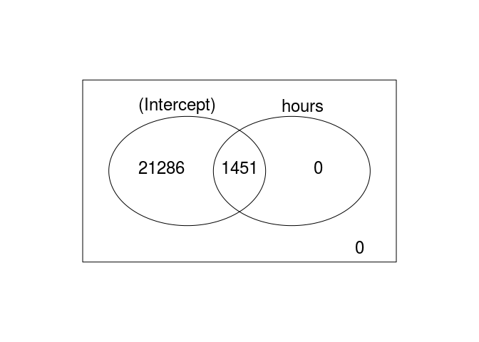

Interesting so far, let's continue.

```r
tT.time <- topTable(efit.time, adjust = "none", number = Inf, p.value = 1e-3)
```

```
## Removing intercept from test coefficients
```

```r
# here, we should see that P.Value = adj.P.Val
head(tT.time)
```

```
##                   logFC   AveExpr          t      P.Value    adj.P.Val
## 202586_at   -0.04321190  9.045753 -11.559699 5.595299e-11 5.595299e-11
## 203201_at   -0.04242793 10.057592 -10.121063 7.109181e-10 7.109181e-10
## 227559_at   -0.05501598  8.182478  -9.958972 9.609875e-10 9.609875e-10
## 202769_at    0.04317888 12.095002   9.769107 1.373425e-09 1.373425e-09
## 226775_at   -0.03828553  8.647287  -9.734894 1.465398e-09 1.465398e-09
## 213113_s_at -0.04650788 10.391574  -9.412004 2.721027e-09 2.721027e-09
##                    B
## 202586_at   15.28331
## 203201_at   12.74567
## 227559_at   12.44384
## 202769_at   12.08602
## 226775_at   12.02105
## 213113_s_at 11.40035
```

```r
nrow(tT.time)
```

```
## [1] 958
```

```r
p <- ggplot(tT.time, aes(x = adj.P.Val))
p + geom_histogram(binwidth = 1e-3) + 
	scale_fill_manual(values = timepoints) + xlab("P-Values") + ylab("Frequency") + 
	ggtitle("P-Value Distribution of Significant Genes") + xlim(0, 0.05)
```

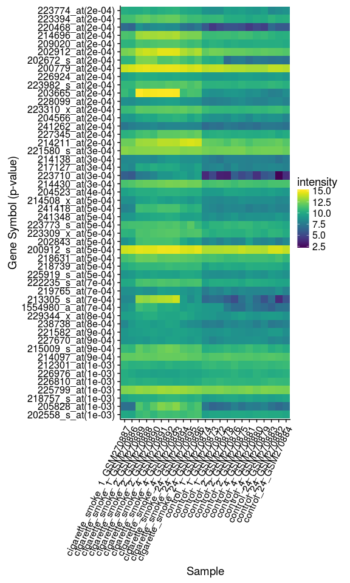

```r
## That's actually not so meaningful since we've filtered on all p-values under 0.001

# topTable.time$ProbeID <- rownames(topTable.time)
tT.time.sig.fdr <- topTable(efit.time, adjust = "fdr", number = Inf, p.value = 0.05)
```

```
## Removing intercept from test coefficients
```

```r
# topTable.time.sig.fdr$ProbeID <- rownames(topTable.time.sig.fdr)
nrow(tT.time.sig.fdr)
```

```
## [1] 1451
```

```r
head(tT.time.sig.fdr)
```

```
##                   logFC   AveExpr          t      P.Value    adj.P.Val
## 202586_at   -0.04321190  9.045753 -11.559699 5.595299e-11 1.272203e-06
## 203201_at   -0.04242793 10.057592 -10.121063 7.109181e-10 6.663751e-06
## 227559_at   -0.05501598  8.182478  -9.958972 9.609875e-10 6.663751e-06
## 202769_at    0.04317888 12.095002   9.769107 1.373425e-09 6.663751e-06
## 226775_at   -0.03828553  8.647287  -9.734894 1.465398e-09 6.663751e-06
## 213113_s_at -0.04650788 10.391574  -9.412004 2.721027e-09 1.031133e-05
##                    B
## 202586_at   15.28331
## 203201_at   12.74567
## 227559_at   12.44384
## 202769_at   12.08602
## 226775_at   12.02105
## 213113_s_at 11.40035
```

```r
tT.time.sig.fdr %>% arrange(-logFC) %>% head() # as you can see the effect sizes are very small
```

```
##        logFC  AveExpr        t      P.Value  adj.P.Val         B
## 1 0.10318640 3.819953 3.311150 0.0030893627 0.04910086 -2.511876
## 2 0.10163021 4.722681 4.046340 0.0005133879 0.01533890 -0.764223
## 3 0.09433305 5.049077 3.938927 0.0006692057 0.01840187 -1.024376
## 4 0.09273944 4.212195 3.815442 0.0009068465 0.02214712 -1.321874
## 5 0.09106298 5.211755 3.360182 0.0027462106 0.04561137 -2.398376
## 6 0.07960449 5.835676 3.884151 0.0007658706 0.02013133 -1.156568
```

```r
## so the slopes may be statistically different, but in practice, there's not much of a change. 
## this makes sense because we're not properly modelling the system
## Biologically speaking, we would expect to NOT see a difference in control over time
## but we WOULD expect to see a difference in CS over time
## and by not separating those two groups, we're losing power to detect a slope difference

p <- ggplot(tT.time.sig.fdr, aes(x = adj.P.Val))
p + geom_histogram(binwidth = 1e-3) + 
	scale_fill_manual(values = timepoints) + xlab("P-Values") + ylab("Frequency") + 
	ggtitle("P-Value Distribution of Significant Genes \n corrected with FDR = 0.05")
```


Alright, that's looking much better. We've got 958 hits with p-value under 0.001, and 1451 hits with FDR and p-value under 0.05.  

Let's go straight to question 5 and come back to this one.  

# 5 Differential expression analysis with a full model

## 5.1 Quantify the number of hits for treatment

```r
design %<>% 
	arrange(hours)
colnames(data)
```

```
##  [1] "ProbeID"            "GSE10718_Biomat_1"  "GSE10718_Biomat_10"
##  [4] "GSE10718_Biomat_11" "GSE10718_Biomat_12" "GSE10718_Biomat_13"
##  [7] "GSE10718_Biomat_14" "GSE10718_Biomat_15" "GSE10718_Biomat_16"
## [10] "GSE10718_Biomat_17" "GSE10718_Biomat_19" "GSE10718_Biomat_2" 
## [13] "GSE10718_Biomat_20" "GSE10718_Biomat_21" "GSE10718_Biomat_22"
## [16] "GSE10718_Biomat_23" "GSE10718_Biomat_24" "GSE10718_Biomat_3" 
## [19] "GSE10718_Biomat_4"  "GSE10718_Biomat_5"  "GSE10718_Biomat_6" 
## [22] "GSE10718_Biomat_7"  "GSE10718_Biomat_8"  "GSE10718_Biomat_9"
```

```r
# design.matrix.combined <- model.matrix(~0 + hours * Treatment, design) ## this isn't working!
design.matrix.combined <- data.frame(
	row.names = c("GSE10718_Biomat_16", "GSE10718_Biomat_17", "GSE10718_Biomat_19",
					 "GSE10718_Biomat_20", "GSE10718_Biomat_21", "GSE10718_Biomat_22",
					 "GSE10718_Biomat_23", "GSE10718_Biomat_24", "GSE10718_Biomat_4", 
					 "GSE10718_Biomat_5", "GSE10718_Biomat_6", "GSE10718_Biomat_10", 
					 "GSE10718_Biomat_11", "GSE10718_Biomat_12", "GSE10718_Biomat_7", 
					 "GSE10718_Biomat_8", "GSE10718_Biomat_9", "GSE10718_Biomat_13", 
					 "GSE10718_Biomat_14", "GSE10718_Biomat_15", "GSE10718_Biomat_1", 
					 "GSE10718_Biomat_2", "GSE10718_Biomat_3"),
	"int.alpha.cs" = c(1, 1, 1, 1, 1, 1, 1, 1, 1, 1, 1, 0, 0, 0, 0, 0, 0, 0, 0, 0, 0, 0, 0), 
	"slope.beta.cs" = c(1, 1, 2, 2, 2, 4, 4, 4, 24, 24, 24, 0, 0, 0, 0, 0, 0, 0, 0, 0, 0, 0, 0),
	"int.alpha.con" = c(0, 0, 0, 0, 0, 0, 0, 0, 0, 0, 0, 1, 1, 1, 1, 1, 1, 1, 1, 1, 1, 1, 1), 
	"slope.beta.con" = c(0, 0, 0, 0, 0, 0, 0, 0, 0, 0, 0, 1, 1, 1, 2, 2, 2, 4, 4, 4, 24, 24, 24)
	)
## Let's reorder fitdata to be safe we WANT
design %>% arrange(Treatment, hours)
```

```
## Source: local data frame [23 x 6]
## 
##            InternalID ExternalID       Treatment   time hours
##                 (chr)      (chr)          (fctr) (fctr) (dbl)
## 1  GSE10718_Biomat_16  GSM270887 cigarette_smoke    1_h     1
## 2  GSE10718_Biomat_17  GSM270886 cigarette_smoke    1_h     1
## 3  GSE10718_Biomat_19  GSM270889 cigarette_smoke    2_h     2
## 4  GSE10718_Biomat_20  GSM270888 cigarette_smoke    2_h     2
## 5  GSE10718_Biomat_21  GSM270890 cigarette_smoke    2_h     2
## 6  GSE10718_Biomat_22  GSM270891 cigarette_smoke    4_h     4
## 7  GSE10718_Biomat_23  GSM270892 cigarette_smoke    4_h     4
## 8  GSE10718_Biomat_24  GSM270893 cigarette_smoke    4_h     4
## 9   GSE10718_Biomat_4  GSM270894 cigarette_smoke   24_h    24
## 10  GSE10718_Biomat_5  GSM270895 cigarette_smoke   24_h    24
## ..                ...        ...             ...    ...   ...
## Variables not shown: qualitative (chr)
```

```r
## Looks good
fitdata <- fitdata[c("GSE10718_Biomat_16", "GSE10718_Biomat_17", "GSE10718_Biomat_19",
					 "GSE10718_Biomat_20", "GSE10718_Biomat_21", "GSE10718_Biomat_22",
					 "GSE10718_Biomat_23", "GSE10718_Biomat_24", "GSE10718_Biomat_4", 
					 "GSE10718_Biomat_5", "GSE10718_Biomat_6", "GSE10718_Biomat_10", 
					 "GSE10718_Biomat_11", "GSE10718_Biomat_12", "GSE10718_Biomat_7", 
					 "GSE10718_Biomat_8", "GSE10718_Biomat_9", "GSE10718_Biomat_13", 
					 "GSE10718_Biomat_14", "GSE10718_Biomat_15", "GSE10718_Biomat_1", 
					 "GSE10718_Biomat_2", "GSE10718_Biomat_3")]

## Let's make sure we've got our rownames as well
rownames(fitdata) <- data$ProbeID

## Hopefully this works...
design.matrix.combined %>% kable("markdown")
```


|                   | int.alpha.cs| slope.beta.cs| int.alpha.con| slope.beta.con|
|:------------------|------------:|-------------:|-------------:|--------------:|
|GSE10718_Biomat_16 |            1|             1|             0|              0|
|GSE10718_Biomat_17 |            1|             1|             0|              0|
|GSE10718_Biomat_19 |            1|             2|             0|              0|
|GSE10718_Biomat_20 |            1|             2|             0|              0|
|GSE10718_Biomat_21 |            1|             2|             0|              0|
|GSE10718_Biomat_22 |            1|             4|             0|              0|
|GSE10718_Biomat_23 |            1|             4|             0|              0|
|GSE10718_Biomat_24 |            1|             4|             0|              0|
|GSE10718_Biomat_4  |            1|            24|             0|              0|
|GSE10718_Biomat_5  |            1|            24|             0|              0|
|GSE10718_Biomat_6  |            1|            24|             0|              0|
|GSE10718_Biomat_10 |            0|             0|             1|              1|
|GSE10718_Biomat_11 |            0|             0|             1|              1|
|GSE10718_Biomat_12 |            0|             0|             1|              1|
|GSE10718_Biomat_7  |            0|             0|             1|              2|
|GSE10718_Biomat_8  |            0|             0|             1|              2|
|GSE10718_Biomat_9  |            0|             0|             1|              2|
|GSE10718_Biomat_13 |            0|             0|             1|              4|
|GSE10718_Biomat_14 |            0|             0|             1|              4|
|GSE10718_Biomat_15 |            0|             0|             1|              4|
|GSE10718_Biomat_1  |            0|             0|             1|             24|
|GSE10718_Biomat_2  |            0|             0|             1|             24|
|GSE10718_Biomat_3  |            0|             0|             1|             24|

```r
# colnames(design.matrix.combined) <- c("cs", "control", "hours", "control.hours")
contrast.matrix.combined <- makeContrasts("combined" = slope.beta.cs-slope.beta.con, # combined effect
										  "time" = slope.beta.con, # Time effect alone
										  "treatment" = int.alpha.cs-int.alpha.con, # treatment effect alone
										  levels = design.matrix.combined)

# contrast.matrix.combined <- makeContrasts(control.hours-cs-hours+control, levels = design.matrix.combined)

## Let's make sure this looks right:
fit.combined <- lmFit(fitdata, design.matrix.combined)
fit.combined <- contrasts.fit(fit.combined, contrast.matrix.combined)
efit.combined <- eBayes(fit.combined)
tT.combined <- topTable(efit.combined)
tT.combined %>% head() %>% kable("markdown")
```


|            |   combined|       time|  treatment|  AveExpr|         F| P.Value| adj.P.Val|
|:-----------|----------:|----------:|----------:|--------:|---------:|-------:|---------:|
|214290_s_at |  0.0739408|  0.0201602|  0.1655167| 12.36283| 156.55408|       0|         0|
|202870_s_at | -0.0628738| -0.0264743| -0.2206967| 11.80425| 133.84586|       0|         0|
|208955_at   | -0.0574848| -0.0106430|  0.1757714| 10.09237| 123.82646|       0|         0|
|203108_at   |  0.1140710| -0.0336863| -0.5947966| 12.71756| 101.30302|       0|         0|
|218542_at   | -0.0592886| -0.0068828| -0.0926291| 11.21883|  90.07826|       0|         0|
|212281_s_at | -0.0478785| -0.0200716|  0.1316914| 10.96036|  86.82289|       0|         0|

```r
results.combined <- decideTests(efit.combined)
vennDiagram(results.combined)
```


Woohoo! Now I've effectively modeled all 3 biological scenarios.


>*For how many probes is treatment a significant factor at the unadjusted p-value 1e-3, and at FDR 0.05 level?*


```r
tT.combined <- topTable(efit.combined, coef = 3, adjust = "none", number = Inf, p.value = 1e-3)
# here, we should see that P.Value = adj.P.Val
head(tT.combined)
```

```
##                   logFC   AveExpr         t      P.Value    adj.P.Val
## 200912_s_at   0.9042074 14.071987  8.377100 4.665235e-08 4.665235e-08
## 220468_at     3.0272368  6.488711  8.349103 4.923043e-08 4.923043e-08
## 1555411_a_at  1.5822496 10.243140  8.287320 5.545521e-08 5.545521e-08
## 220046_s_at   1.5740991 10.598902  8.055196 8.713100e-08 8.713100e-08
## 219998_at    -0.7787192  9.276269 -8.007462 9.569961e-08 9.569961e-08
## 223394_at     1.4579813 10.909886  7.716098 1.707786e-07 1.707786e-07
##                     B
## 200912_s_at  8.478163
## 220468_at    8.430397
## 1555411_a_at 8.324553
## 220046_s_at  7.921528
## 219998_at    7.837597
## 223394_at    7.317458
```

```r
nrow(tT.combined)
```

```
## [1] 621
```

So 621 significant genes at p < 0.001 when looking at combined effect.


```r
tT.combined.sig.fdr <- topTable(efit.combined, coef = 3, adjust = "fdr", number = Inf, p.value = 0.05)
head(tT.combined.sig.fdr)
```

```
##                   logFC   AveExpr         t      P.Value    adj.P.Val
## 200912_s_at   0.9042074 14.071987  8.377100 4.665235e-08 0.0004202951
## 220468_at     3.0272368  6.488711  8.349103 4.923043e-08 0.0004202951
## 1555411_a_at  1.5822496 10.243140  8.287320 5.545521e-08 0.0004202951
## 220046_s_at   1.5740991 10.598902  8.055196 8.713100e-08 0.0004351844
## 219998_at    -0.7787192  9.276269 -8.007462 9.569961e-08 0.0004351844
## 223394_at     1.4579813 10.909886  7.716098 1.707786e-07 0.0006471653
##                     B
## 200912_s_at  8.478163
## 220468_at    8.430397
## 1555411_a_at 8.324553
## 220046_s_at  7.921528
## 219998_at    7.837597
## 223394_at    7.317458
```

```r
nrow(tT.combined.sig.fdr)
```

```
## [1] 768
```

And 768 significant genes with FDR correction and p < 0.05.  

Now how about with the combined model?


>*Is this number different from what you reported in 3.2? Why? Quantify the proportion of overlapping probes among your hits, when using the unadjusted p-value threshold of 1e-3.*

Here we have just 573 significantly different genes, down from 805 when just considering treatment (when NOT using FDR correction).  Let's look at the overlap. We'll compare our toptables, `tT.treatment` and `tT.combined`.  

```r
tT.treatment %<>% tbl_df()
tT.combined$ProbeID <- rownames(tT.combined)
tT.combined %<>% tbl_df()
intersect(tT.combined$ProbeID, tT.treatment$ProbeID) %>% length()
```

```
## [1] 328
```

Okay, we've got an overlap of 328 genes, I'd say that's a decent overlap.  

>*Plot the distributions of all the p-values for treatment when using both models, i.e., one from the model in Q3 and one from the full model in this question. Compare and comment on the similarity/differences in the shape of the distributions.*

Sweet, I've already done this! We can run them again though.  I'll plot the p-value distributions when using the FDR correction, as this will more accurately reflect real hits, but I'll make sure to not cap at p < 0.05 this time though.  

```r
tT.treatment.fdr <- topTable(efit, adjust = "fdr", number = Inf)

p <- ggplot(tT.treatment.fdr, aes(x = adj.P.Val))
p + geom_histogram(binwidth = 0.01) + 
	scale_fill_manual(values = timepoints) + xlab("P-Values") + ylab("Frequency") + 
	ggtitle("P-Value Distribution for Treatment Model")
```


```r
tT.combined.fdr <- topTable(efit.combined, coef = 1, adjust = "fdr", number = Inf)

p <- ggplot(tT.combined.fdr, aes(x = adj.P.Val))
p + geom_histogram(binwidth = 0.01) + 
	scale_fill_manual(values = timepoints) + xlab("P-Values") + ylab("Frequency") + 
	ggtitle("P-Value Distribution for Combined Model")
```


The p-value distributions look very similar when compared directly, but it seems as though we may have fewer significant hits when using our combined model.  That doesn't seem right, I would've expected to see a skew towards significance in the combined model, since we're more accurately separating our groups. Let's come back to this later.  

## 5.2 Test the null hypothesis

>*Explain in English what you are modeling with this interaction term (what does it represent?).*
>*For how many probes is the interaction effect significant at the unadjusted p-value 1e-3, and at FDR 0.05 level?*


```r
tT.combined <- topTable(efit.combined, coef = 1, adjust = "none", number = Inf, p.value = 1e-3)
# here, we should see that P.Value = adj.P.Val
head(tT.combined)
```

```
##                   logFC   AveExpr         t      P.Value    adj.P.Val
## 203108_at    0.11407096 12.717558  15.62029 7.330143e-13 7.330143e-13
## 208955_at   -0.05748477 10.092374 -10.88237 5.614508e-10 5.614508e-10
## 225160_x_at  0.09283685 10.118466  10.83328 6.079864e-10 6.079864e-10
## 204148_s_at  0.06311515  9.928981  10.38754 1.267943e-09 1.267943e-09
## 214290_s_at  0.07394082 12.362832  10.11488 2.009574e-09 2.009574e-09
## 225864_at    0.08089615 11.269709  10.06428 2.190960e-09 2.190960e-09
##                    B
## 203108_at   18.74367
## 208955_at   12.88580
## 225160_x_at 12.81248
## 204148_s_at 12.13288
## 214290_s_at 11.70463
## 225864_at   11.62406
```

```r
nrow(tT.combined)
```

```
## [1] 573
```

So 573 significant genes at p < 0.001 when looking at combined effect.


```r
tT.combined.sig.fdr <- topTable(efit.combined, coef = 1, adjust = "fdr", number = Inf, p.value = 0.05)
head(tT.combined.sig.fdr)
```

```
##                   logFC   AveExpr         t      P.Value    adj.P.Val
## 203108_at    0.11407096 12.717558  15.62029 7.330143e-13 1.666655e-08
## 208955_at   -0.05748477 10.092374 -10.88237 5.614508e-10 4.607929e-06
## 225160_x_at  0.09283685 10.118466  10.83328 6.079864e-10 4.607929e-06
## 204148_s_at  0.06311515  9.928981  10.38754 1.267943e-09 7.207303e-06
## 214290_s_at  0.07394082 12.362832  10.11488 2.009574e-09 8.302642e-06
## 225864_at    0.08089615 11.269709  10.06428 2.190960e-09 8.302642e-06
##                    B
## 203108_at   18.74367
## 208955_at   12.88580
## 225160_x_at 12.81248
## 204148_s_at 12.13288
## 214290_s_at 11.70463
## 225864_at   11.62406
```

```r
nrow(tT.combined.sig.fdr)
```

```
## [1] 664
```

And 664 significant genes with FDR correction and p < 0.05.  

>*Null hypothesis: there’s no significant interaction between time and treatment.*

With this interaction terms, we are modeling both the slope and intercept of both treatment and control groups.  Then, we can model all three scenarios:  
1. Treatment: Intercept of CS (int.alpha.cs) different than Intercept of Control (int.alpha.con)?  
2. Time: Is the Slope of Control (slope.beta.con) different from zero?  
3. Treatment & Time: Is the Slope of CS (slope.beta.cs) different from Slope of Control (slope.beta.con)?  


## 5.3 Plot a few probes where the interaction does and does not matter 


# Microarray Analysis

## 6.0 Download Data

See Makefile again

## 6.1 Data loading and QC

```r
yeast <- readr::read_delim("yeast.tsv", delim = "\t")
glimpse(yeast)
```

```
## Observations: 10,928
## Variables: 7
## $    (chr) "1769308_at", "1769309_at", "1769310_at", "1769311_at", "17...
## $ b1 (dbl) 11.1455060, 2.1643295, 1.4883001, 9.0061384, 6.9457152, 7.8...
## $ b2 (dbl) 6.795593, 3.177408, 1.427200, 9.461821, 6.895895, 6.600131,...
## $ b3 (dbl) 6.708003, 3.128950, 1.815698, 9.234618, 6.955463, 6.534413,...
## $ c1 (dbl) 10.945878, 2.498308, 1.462075, 8.972233, 6.851454, 7.770245...
## $ c2 (dbl) 6.698862, 3.047169, 2.079007, 9.276710, 6.900187, 6.564123,...
## $ c3 (dbl) 11.070725, 2.444188, 1.623036, 9.004997, 6.892854, 7.851777...
```

```r
yeast
```

```
## Source: local data frame [10,928 x 7]
## 
##                        b1       b2       b3        c1       c2        c3
##           (chr)     (dbl)    (dbl)    (dbl)     (dbl)    (dbl)     (dbl)
## 1    1769308_at 11.145506 6.795593 6.708003 10.945878 6.698862 11.070725
## 2    1769309_at  2.164329 3.177408 3.128950  2.498308 3.047169  2.444188
## 3    1769310_at  1.488300 1.427200 1.815698  1.462075 2.079007  1.623036
## 4    1769311_at  9.006138 9.461821 9.234618  8.972233 9.276710  9.004997
## 5    1769312_at  6.945715 6.895895 6.955463  6.851454 6.900187  6.892854
## 6    1769313_at  7.815192 6.600131 6.534413  7.770245 6.564123  7.851777
## 7    1769314_at  8.658098 8.788372 8.982260  8.572727 8.807559  8.657040
## 8    1769315_at  1.395614 1.451431 1.639303  1.352827 1.539506  1.337297
## 9  1769316_s_at  1.905238 1.918457 1.628470  1.724167 1.746585  1.518815
## 10   1769317_at  6.961356 7.418890 7.258103  7.071840 7.225361  6.871157
## ..          ...       ...      ...      ...       ...      ...       ...
```

```r
colnames(yeast)[1] <- "probeID"
gath.yeast <- yeast %>% gather("sample", "intensity", 2:7)
```

We've got 10,928 probes (rows) and 6 samples in what appears to be two groups (b & c).  The first column is our probe ID column.  

First off, let's plot some pairwise comparisons.

```r
yeast %>% dplyr::select(-probeID) %>% 
	ggpairs(aes(alpha = 0.4)) + theme(
		axis.text.x = element_blank(),
		axis.text.y = element_blank(),
		axis.ticks = element_blank()
	)
```


Beautiful! I'm glad I found the `ggpairs()` function, that's made my life a lot easier.  
We can see easily now, that we've got correlation between two groups:  
- c1, b1, c3  
- c2, b2, b3  

Perhaps we could presmue to group these

| Chemostat? | Batch? |
|------------|--------|
| c1         | **c2** |
| **b1**     | b2     |
| c3         | b3     |

Now let's add in our groups.  I tried to create a phenotype data frame and join, but it kept crashing my computer, so I'm just going to use some regex magic to create our treatment group column.  

```r
gath.yeast %<>% 
	mutate(group = gsub("[0-9]$", "", sample))
gath.yeast %<>% 
	mutate(group = gsub("^b$", "batch", group))
gath.yeast %<>% 
	mutate(group = gsub("^c$", "chemostat", group))
gath.yeast
```

```
## Source: local data frame [65,568 x 4]
## 
##         probeID sample intensity group
##           (chr)  (chr)     (dbl) (chr)
## 1    1769308_at     b1 11.145506 batch
## 2    1769309_at     b1  2.164329 batch
## 3    1769310_at     b1  1.488300 batch
## 4    1769311_at     b1  9.006138 batch
## 5    1769312_at     b1  6.945715 batch
## 6    1769313_at     b1  7.815192 batch
## 7    1769314_at     b1  8.658098 batch
## 8    1769315_at     b1  1.395614 batch
## 9  1769316_s_at     b1  1.905238 batch
## 10   1769317_at     b1  6.961356 batch
## ..          ...    ...       ...   ...
```

```r
tail(gath.yeast)
```

```
## Source: local data frame [6 x 4]
## 
##                 probeID sample intensity     group
##                   (chr)  (chr)     (dbl)     (chr)
## 1   RPTR-Sc-U89963-1_at     c3  1.039859 chemostat
## 2 RPTR-Sc-U89963-1_s_at     c3  1.419373 chemostat
## 3   RPTR-Sc-X03453-1_at     c3  1.100052 chemostat
## 4   RPTR-Sc-X58791-1_at     c3  1.387374 chemostat
## 5 RPTR-Sc-X58791-1_s_at     c3  1.068312 chemostat
## 6 RPTR-Sc-X58791-2_s_at     c3  2.508159 chemostat
```

Looks pretty good!

Let's compute the pearson distance between samples. 

```r
yeast.corr <- yeast %>% 
	dplyr::select(-probeID) %>% 
	cor(method = "pearson") %>% 
	as.data.frame()
yeast.corr$correlate <- rownames(yeast.corr)
heatmapcolors <- brewer.pal(9, "Oranges")
yeast.corr %<>% gather("sample", "correlation", 1:6)
ggplot(yeast.corr, aes(x = sample, y = correlate, fill = correlation)) + 
	geom_tile() +
	scale_fill_gradientn(colors = heatmapcolors)
```


Okay, now let's rearrange based on what we decided from our pairwise sample-sample scatterplots and what looks like some obvious clustering in our first heatmap.

```r
yeast.corr %<>% 
	mutate(sample = factor(sample, levels = c("b1", "c1", "c3", "c2", "b3", "b2")))
yeast.corr %<>% 
	mutate(correlate = factor(correlate, levels = c("b1", "c1", "c3", "c2", "b3", "b2")))
ggplot(yeast.corr, aes(x = sample, y = correlate, fill = correlation)) + 
	geom_tile() +
	scale_fill_gradientn(colors = heatmapcolors)
```


This makes it seem rather apparent that b1, c1, and c3 are part of one group, and c2, b3, and b2 are part of another group.  Either that or there are some serious flaws with these microarrays.  

Let's plot a heatmap of the the top 100 genes, first unsorted.

```r
gath.yeast %>% 
	group_by(sample) %>% 
	do(head(., n = 100)) %>% 
	ggplot(aes(x = sample, y = probeID, fill = intensity)) + 
	geom_tile() +
	scale_fill_viridis() + xlab("Sample") +
	ylab("probeID")
```


And now with our samples sorted into what we believe to be the true groups.  

```r
gath.yeast$sample %<>% as.factor()
gath.yeast %<>% 
	mutate(sample = factor(sample, levels = c("b1", "c1", "c3", "c2", "b3", "b2")))
gath.yeast %>% 
	group_by(sample) %>% 
	do(head(., n = 100)) %>% 
	ggplot(aes(x = sample, y = probeID, fill = intensity)) + 
	geom_tile() +
	scale_fill_viridis() + xlab("Sample") +
	ylab("probeID")
```


Finally, how about PCA? We can use `FactoMineR::PCA` to get a simple plot, or use `stats::prcomp` for an object we can pipe into `ggplot2`.  

```r
noProbes.yeast <- yeast
rownames(noProbes.yeast) <- noProbes.yeast$probeID
noProbes.yeast$probeID <- NULL

fPCA <- FactoMineR::PCA(noProbes.yeast, scale.unit = FALSE)
```


```r
sPCA <- stats::prcomp(noProbes.yeast, scale. = FALSE)
(PCA.summary <- summary(sPCA)$importance %>% as.data.frame())
```

```
##                             PC1     PC2       PC3       PC4       PC5
## Standard deviation     8.296578 1.08287 0.1734449 0.1620865 0.1378681
## Proportion of Variance 0.982030 0.01673 0.0004300 0.0003700 0.0002700
## Cumulative Proportion  0.982030 0.99876 0.9991800 0.9995600 0.9998300
##                              PC6
## Standard deviation     0.1088992
## Proportion of Variance 0.0001700
## Cumulative Proportion  1.0000000
```

We can clearly see that b3, b2, and c2 should be grouped together (as previously)

For another quick plot, we can use `geom_point` with `geom_text`.  

```r
PCA.rotation <- sPCA$rotation %>% as.data.frame()
PC1.variance <- paste0("PC1, ", round(100*PCA.summary$PC1[2], 2), "% Variance")
PC2.variance <- paste0("PC2, ", round(100*PCA.summary$PC2[2], 2), "% Variance")
ggplot(PCA.rotation, aes(x = PC1, y = PC2, label = rownames(PCA.rotation))) +
	geom_point() + geom_text(nudge_y = 0.05) + xlab(PC1.variance) + ylab(PC2.variance)
```


Note that we get a different looking distribution if we scale our values. Regardless, the clustering is obvious, and our principal components are the same.  

```r
sPCA.scaled <- stats::prcomp(noProbes.yeast, scale. = TRUE)
(PCA.scaled.summary <- summary(sPCA.scaled)$importance %>% as.data.frame())
```

```
##                            PC1       PC2        PC3        PC4        PC5
## Standard deviation     2.42737 0.3168461 0.05083209 0.04753665 0.04045052
## Proportion of Variance 0.98202 0.0167300 0.00043000 0.00038000 0.00027000
## Cumulative Proportion  0.98202 0.9987500 0.99918000 0.99956000 0.99983000
##                               PC6
## Standard deviation     0.03164637
## Proportion of Variance 0.00017000
## Cumulative Proportion  1.00000000
```

```r
PC1.scaled.variance <- paste0("PC1, ", round(100*PCA.scaled.summary$PC1[2], 2), "% Variance")
PC2.scaled.variance <- paste0("PC2, ", round(100*PCA.scaled.summary$PC2[2], 2), "% Variance")
PCA.rotation.scaled <- sPCA.scaled$rotation %>% as.data.frame()
ggplot(PCA.rotation.scaled, aes(x = PC1, y = PC2, label = rownames(PCA.rotation))) +
	geom_point() + geom_text(nudge_y = 0.05) + xlab(PC1.variance) + ylab(PC2.variance)
```

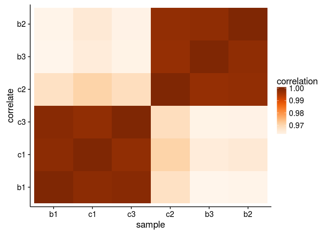

Finally, if we also wanted to plot our observations, we could use the `ggbiplot` package.  

```r
g <- ggbiplot(sPCA, obs.scale = 1, var.scale = 1,
			  alpha = 0.05, circle = TRUE)
g + scale_color_discrete(name = '') +
	theme(legend.direction = 'vertical', 
		  legend.position = 'right') +
	ggtitle("PCA Plot of Yeast Samples")
```


Given all of these plots, we can now satisfactorally conclude that samples b1 and c2 have accidentally been swapped. Let's fix that and continue!

## 6.2 Microarray DEA (2 points)


```r
yeast.fixed <- yeast
colnames(yeast.fixed)
```

```
## [1] "probeID" "b1"      "b2"      "b3"      "c1"      "c2"      "c3"
```

```r
colnames(yeast.fixed) <- c("probeID", "c2", "b2", "b3", "c1", "b1", "c3")
yeast.fixed <- yeast.fixed[
	c("probeID",
	  "b1", "b2", "b3", "c1", "c2", "c3")
] 
```

Alrighty, now that we've got our gene IDs set up, let's bring in some qualitative data describing batch vs chemostat.  For this we'll need to gather our data first.  

```r
rownames(yeast.fixed) <- yeast.fixed$probeID
yeast.fg <- yeast.fixed %>% # for yeast, fixed & gathered
	gather("sample", "intensity", c(b1, b2, b3, c1, c2, c3))
```

And then we can bring in qualitative data.  We can really just create our own data.frame for this.

```r
yeast.fg %<>% 
	mutate(group = gsub("[0-9]$", "", sample))
yeast.fg %<>% 
	mutate(group = gsub("^b$", "batch", group))
yeast.fg %<>% 
	mutate(group = gsub("^c$", "chemostat", group))
yeast.fg
```

```
## Source: local data frame [65,568 x 4]
## 
##         probeID sample intensity group
##           (chr)  (chr)     (dbl) (chr)
## 1    1769308_at     b1  6.698862 batch
## 2    1769309_at     b1  3.047169 batch
## 3    1769310_at     b1  2.079007 batch
## 4    1769311_at     b1  9.276710 batch
## 5    1769312_at     b1  6.900187 batch
## 6    1769313_at     b1  6.564123 batch
## 7    1769314_at     b1  8.807559 batch
## 8    1769315_at     b1  1.539506 batch
## 9  1769316_s_at     b1  1.746585 batch
## 10   1769317_at     b1  7.225361 batch
## ..          ...    ...       ...   ...
```

```r
tail(yeast.fg)
```

```
## Source: local data frame [6 x 4]
## 
##                 probeID sample intensity     group
##                   (chr)  (chr)     (dbl)     (chr)
## 1   RPTR-Sc-U89963-1_at     c3  1.039859 chemostat
## 2 RPTR-Sc-U89963-1_s_at     c3  1.419373 chemostat
## 3   RPTR-Sc-X03453-1_at     c3  1.100052 chemostat
## 4   RPTR-Sc-X58791-1_at     c3  1.387374 chemostat
## 5 RPTR-Sc-X58791-1_s_at     c3  1.068312 chemostat
## 6 RPTR-Sc-X58791-2_s_at     c3  2.508159 chemostat
```

One last thing before we start with limma, we'll have to create a phenotype data.frame to construct our design matrix. 

```r
yeast.design <- data.frame(
	row.names = c("b1", "b2", "b3", "c1", "c2", "c3"),
	"sample" = c("b1", "b2", "b3", "c1", "c2", "c3"), 
	"group"  = c("batch", "batch", "batch", "chemostat", "chemostat", "chemostat")
) %>% tbl_df()
```


Alright, now on to our differential expression analysis (DEA) with limma.  

```r
design.matrix.yeast <- model.matrix(~0+group, yeast.design)
colnames(design.matrix.yeast) <- c("Batch", "Chemostat")
contrast.matrix.yeast <- makeContrasts(Batch-Chemostat, levels = design.matrix.yeast)
## Let's make sure this looks right:
design.matrix.yeast %>% kable("markdown")
```


| Batch| Chemostat|
|-----:|---------:|
|     1|         0|
|     1|         0|
|     1|         0|
|     0|         1|
|     0|         1|
|     0|         1|

```r
fit.yeast <- yeast.fixed %>% 
	dplyr::select(-probeID) %>% 
	lmFit(design.matrix.yeast)
fit.yeast <- contrasts.fit(fit.yeast, contrast.matrix.yeast)
efit.yeast <- eBayes(fit.yeast)
tT.yeast <- topTable(efit.yeast, adjust.method="BH", number = Inf) # I know BH is default, but it's still good to specify
#tT.yeast <- topTable(efit.yeast, adjust.method="fdr", number = Inf, p.value = 1e-5) # I know BH is default, but it's still good to specify
## It is not specified to have a cutoff here, so I'm leaving it without a cutoff for now, but still with FDR (aka "BH") correction

tT.yeast %>% head() %>% kable("markdown")
```


|           |      logFC|  AveExpr|          t| P.Value| adj.P.Val|        B|
|:----------|----------:|--------:|----------:|-------:|---------:|--------:|
|1772391_at | -10.111470| 7.043828| -108.92958|       0|         0| 20.96284|
|1774122_at |  -8.473827| 6.852455|  -89.86550|       0|         0| 20.05204|
|1774070_at |  -8.990866| 8.378757|  -80.69881|       0|         0| 19.47328|
|1776153_at |  -7.304449| 5.427876|  -72.70264|       0|         0| 18.86696|
|1774072_at |  -8.577513| 6.886731|  -71.30964|       0|         0| 18.74990|
|1776304_at |  -8.081401| 6.729502|  -69.09726|       0|         0| 18.55620|

```r
results.yeast <- decideTests(efit.yeast)
vennDiagram(results.yeast)
```


Great! Let's check out our p-value distribution before we continue though

```r
p <- ggplot(tT.yeast, aes(x = adj.P.Val))
p + geom_histogram(binwidth = 0.05) + 
	xlab("P-Values") + ylab("Frequency") + 
	ggtitle("P-Value Distribution of Significant \n Genes with BH Correction")
```

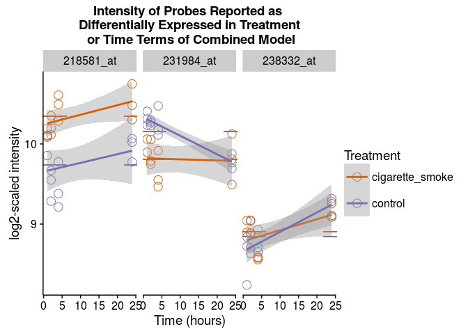

That looks pretty drastic, but I'm not sure it's wrong. 

```r
tT.yeast$probeID <- rownames(tT.yeast)
(tT.yeast %<>% tbl_df())
```

```
## Source: local data frame [10,928 x 7]
## 
##         logFC  AveExpr          t      P.Value    adj.P.Val        B
##         (dbl)    (dbl)      (dbl)        (dbl)        (dbl)    (dbl)
## 1  -10.111470 7.043828 -108.92958 9.477652e-14 1.035718e-09 20.96284
## 2   -8.473827 6.852455  -89.86550 4.277079e-13 2.336996e-09 20.05204
## 3   -8.990866 8.378757  -80.69881 9.932237e-13 3.617983e-09 19.47328
## 4   -7.304449 5.427876  -72.70264 2.248189e-12 5.717049e-09 18.86696
## 5   -8.577513 6.886731  -71.30964 2.615780e-12 5.717049e-09 18.74990
## 6   -8.081401 6.729502  -69.09726 3.347614e-12 5.881184e-09 18.55620
## 7   -8.444769 7.037351  -67.77269 3.895175e-12 5.881184e-09 18.43543
## 8   -8.926037 8.104420  -66.44446 4.547787e-12 5.881184e-09 18.31054
## 9   -4.895122 7.692760  -65.91159 4.843582e-12 5.881184e-09 18.25934
## 10  -6.053323 6.743367  -61.70349 8.116417e-12 8.521536e-09 17.83138
## ..        ...      ...        ...          ...          ...      ...
## Variables not shown: probeID (chr)
```

Here, I'll use biomaRt to get gene IDs and ensembl gene IDs.  We know from the homework that this experiment is using the Affymetrix Yeast Genome Array 2.0 platform, and we can do a quick check on GEO to confirm.  [GSE37599](http://www.ncbi.nlm.nih.gov/geo/query/acc.cgi?acc=GSE37599), and [GPL2529](http://www.ncbi.nlm.nih.gov/geo/query/acc.cgi?acc=GPL2529), Affymetrix Yeast Genome 2.0 Array.  Perfect!

```r
# ensembl <- useMart("ensembl") # set up biomaRt to use the ensembl database
# datasets <- listDatasets(ensembl) # store our datasets so we can see which to use
# ensembl <- useDataset("scerevisiae_gene_ensembl", mart = ensembl) # use the human data set!
# filters <- listFilters(ensembl) # find what filters we can use and cross fingers that it's here
# attributes <- listAttributes(ensembl) # ditto with the attributes
# yeast_probe_IDs <- getBM(attributes = c("external_gene_name", "ensembl_gene_id", "affy_yeast_2"), filters = "affy_yeast_2", values = yeast.fixed$probeID, mart = ensembl) # query the probeIDs
# head(yeast_probe_IDs)
# colnames(yeast_probe_IDs)[3] <- "probeID"
# nrow(yeast_probe_IDs)
# nrow(yeast.fixed)
# yeast.fixed.genes.all <- left_join(yeast.fixed, yeast_probe_IDs, by = "probeID")
# nrow(yeast.fixed.genes.all)
# yeast.fixed.genes <- right_join(yeast.fixed, yeast_probe_IDs, by = "probeID") # inner_join() also works here
# nrow(yeast.fixed.genes) ## Good, 6259 hits is a lot. Let's check to make sure we don't have any NAs in our gene IDs
# sum(is.na(yeast.fixed.genes$external_gene_name))
# ## Good none, but if we look at the data, particularly head(n = 10), we can actually see a missing value, it's just not encoded as "NA". I HATE IMPROPER NA ENCODING
# ## the workaround...
# yeast.fixed.genes %>% 
# 	dplyr::filter(external_gene_name == "") %>% 
# 	nrow()
# ## Ouch, seriously? What about the ensembl gene IDs?
# yeast.fixed.genes %>% 
# 	dplyr::filter(ensembl_gene_id == "") %>% 
# 	nrow()
# ## Okay, that's much better. Before I continue though, I must rectify this NA encoding...
# yeast.fixed.genes$external_gene_name %<>% 
# 	gsub("^$", NA, x = .)
# 
# ## Check our work...
# yeast.fixed.genes %>% 
# 	dplyr::filter(external_gene_name == "") %>% 
# 	nrow()
# sum(is.na(yeast.fixed.genes$external_gene_name))
# ## Much better!
```

Briefly, let's compare biomaRt's ability to match probes with that recommended by the assignment. I believe we should get the same number of hits.

```r
# source("http://bioconductor.org/biocLite.R")    # Installing biocLite package
# biocLite()                                      # Load the package 
# biocLite("yeast2.db")                           # Download the package using biocLite
# library("yeast2.db")                            # Load the yeast2.db package 
mget("1772391_at", yeast2ORF)                   # See what gene is that probe for 
```

```
## $`1772391_at`
## [1] "YIL057C"
```

```r
gene.ids <- mget(yeast.fixed$probeID, yeast2ORF) # this will generated a named list. Let's make it into a data.frame
gene.ids.df <- data.frame(
	"probeID" = names(gene.ids),
	"geneID" = unlist(gene.ids), 
	stringsAsFactors = FALSE
)
## This is perfect, we'll see where we've got NAs
## Number of Hits:
gene.ids.df %>% 
	dplyr::filter(!is.na(geneID)) %>% 
	nrow()
```

```
## [1] 5705
```

```r
## Number of whiffs:
gene.ids.df %>% 
	dplyr::filter(is.na(geneID)) %>% 
	nrow()
```

```
## [1] 5223
```

```r
## Good, well at least we've got more hits than whiffs, but I got more hits with biomaRt.  Let's save our hits. 
gene.id.hits <- gene.ids.df %>% 
	dplyr::filter(!is.na(geneID)) %>% 
	tbl_df()

yeast.genes <- right_join(tT.yeast, gene.id.hits, by = "probeID")
yeast.fg.genes <- right_join(yeast.fg, gene.id.hits, by = "probeID")
yeast.fixed.genes <- right_join(yeast.fixed, gene.id.hits, by = "probeID")
```

Okay, so we've got 5705 hits out of 10928, that's not fantastic, but could be worse.  I got 5768 with biomaRt, but don't feel like dealing with a probe mapping to multiple gene IDs as `uniqueRows = TRUE` just wasn't working, and I couldn't seem to find the right `merge()` arguments (or how to properly use `semi_join()`).

Let's pull out our answers and clean up the table.  I'm deliberately not saving the probes without gene hits, as it was unclear in the homework.

```r
yeast.genes %<>% 
	select(-AveExpr, -B)
colnames(yeast.genes) <- c("log.fc", "test.stat", "p.value", "q.value", "probe.id", "gene.id")
write_tsv(yeast.genes, "limma.microarray.results.tsv")
```


## 6.3 Microarray DEA continue

>*Illustrate the differential expression between the batch and the chemostat samples for the top hit (i.e., probe with the lowest p- or q-value).*

```r
yeast.genes %<>% 
	arrange(q.value)
head(yeast.genes, n = 1)
```

```
## Source: local data frame [1 x 6]
## 
##      log.fc test.stat      p.value      q.value   probe.id gene.id
##       (dbl)     (dbl)        (dbl)        (dbl)      (chr)   (chr)
## 1 -10.11147 -108.9296 9.477652e-14 1.035718e-09 1772391_at YIL057C
```

Alright! Let's look at probe "1772391_at", or YIL057C, a "Protein of unknown function; involved in energy metabolism under respiratory conditions; expression induced under carbon limitation and repressed under high glucose; RGI2 has a paralog, RGI1, that arose from the whole genome duplication."<sup>[1](http://uswest.ensembl.org/Saccharomyces_cerevisiae/Gene/Summary?db=core;g=YIL057C;r=IX:247902-248396;t=YIL057C)</sup>

Let's visualize this probe:

```r
yeast.fg %>% 
	filter(probeID == "1772391_at") %>% 
	group_by(group) %>% 
	do(mutate(., mean = mean(intensity))) %>% 
	ggplot(aes(x = group, y = intensity)) + geom_point(stat = "identity", shape = 1, size = 5) + ylim(0, 13) + 
	geom_point(aes(y = mean), shape = 95, size = 12) +
	ggtitle("Intensity of Probe 1772391_at, YIL057C ")
```


>*How many probes are identified as differentially expressed at a false discovery rate (FDR) of 1e-5?*

```r
tT.yeast.cutoff <- topTable(efit.yeast, adjust.method="fdr", number = Inf, p.value = 1e-5)
nrow(tT.yeast.cutoff)
```

```
## [1] 732
```

Here we only get 732 differentially expressed genes. Not too shabby. Let's save this file and move on.

```r
tT.yeast.cutoff$probeID <- rownames(tT.yeast.cutoff)
yeast.DE.genes <- inner_join(tT.yeast.cutoff, gene.id.hits, by = "probeID") %>% tbl_df()
yeast.DE.genes %<>% 
	select(-AveExpr, -B)
colnames(yeast.DE.genes) <- c("log.fc", "test.stat", "p.value", "q.value", "probe.id", "gene.id")
write_tsv(yeast.DE.genes, "limma.microarray.results.tsv")
```


# 7 RNA-seq analysis

## 7.1 Load RNA Count Data and Sanity Check

Row names are from Satan!! They are utterly ethereal and can be lost at moment's notice. Fixed with `sed` for the sake of automation.

```r
yeast.seq <- readr::read_delim("yeast_counts_fixed.tsv", delim = "\t")
yeast.seq
```

```
## Source: local data frame [6,542 x 7]
## 
##        gene    b1    b2    b3    c1    c2    c3
##       (chr) (int) (int) (int) (int) (int) (int)
## 1  15S_rRNA    11     3     5    13     5    17
## 2  21S_rRNA    40    26    10    71    41    48
## 3      HRA1    31    52    40    12    18    32
## 4      ICR1    63    87    53    51    78   100
## 5      LSR1   112   106    60   139   142   127
## 6      NME1    17    21    15     7     6     2
## 7     Q0045     0     0     0     0     0     2
## 8     Q0050     4     2     2    11     0     3
## 9     Q0055     5     8     1     5     5     2
## 10    Q0065     0     1     0     1     0     1
## ..      ...   ...   ...   ...   ...   ...   ...
```

Alright, we've got 6542 genes listed with 6 samples, as before.  The difference between this and our microarray is that here we don't have probes, but actual genes, as identified by stampy aligner and subsequent transcript quantification.  Therefore, you can see we've already got a number of genes similar to our genes as identified by our probe ID to gene ID conversion. A lot of the probes on a microarray are bright or dark controls, and depending on the array (though not the affy array that was used), nonspecific binding probes, and various QC probes used in proprietary "black box" normalization algorithms.  

Anyways, let's continue by checking for the sample ID swap.

```r
tilegradient.short <- tilegradient[1:5]
yeast.seq.cor <- yeast.seq %>% 
	dplyr::select(-gene) %>% 
	cor()
yeast.seq.cor %<>% 
	
	reshape2::melt(value.name = "correlation")
ggplot(yeast.seq.cor, aes(x = Var1, y = Var2, fill = correlation)) + 
	geom_tile() +
	scale_fill_gradientn(colors = tilegradient.short)
```

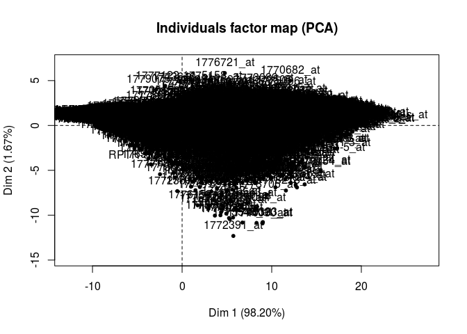

## 7.2 DEA of deep sequencing data

Looks great! No sample ID swap here.  Let's start with edgeR.  Perhaps we should try using the DGElist object. 

```r
yeast.seq.dg <- DGEList(counts = yeast.seq[2:7], genes = yeast.seq[1], group = yeast.design$group)
yeast.seq.dg <- calcNormFactors(yeast.seq.dg)
yeast.seq.dg
```

```
## An object of class "DGEList"
## $counts
##    b1  b2 b3  c1  c2  c3
## 1  11   3  5  13   5  17
## 2  40  26 10  71  41  48
## 3  31  52 40  12  18  32
## 4  63  87 53  51  78 100
## 5 112 106 60 139 142 127
## 6537 more rows ...
## 
## $samples
##        group lib.size norm.factors
## b1     batch  3420851    1.0015947
## b2     batch  4487585    0.9778343
## b3     batch  3415378    0.9513156
## c1 chemostat  2529571    1.0381177
## c2 chemostat  2990956    1.0082359
## c3 chemostat  3695672    1.0254379
## 
## $genes
## [1] "15S_rRNA" "21S_rRNA" "HRA1"     "ICR1"     "LSR1"    
## 6537 more rows ...
```

```r
# yeast.genes <- yeast_probe_IDs %>% dplyr::select(-probeID)
# colnames(yeast.genes) <- c("gene", "ensembl_gene_id")
# yeast.seq.dg$genes <- inner_join(yeast.seq.dg$genes, yeast.genes, by = "gene")
# yeast.seq.dg$genes <- inner_join(yeast.seq.dg$genes, yeast_probe_IDs)
```

Okay, looks good.  

Fortunately we've already got our design matrix!

```r
DM.yeast.seq <- model.matrix(~group, yeast.design)
colnames(DM.yeast.seq) <- c("(Intercept)", "chemostat")
rownames(DM.yeast.seq) <- colnames(yeast.seq)[2:7]
DM.yeast.seq
```

```
##    (Intercept) chemostat
## b1           1         0
## b2           1         0
## b3           1         0
## c1           1         1
## c2           1         1
## c3           1         1
## attr(,"assign")
## [1] 0 1
## attr(,"contrasts")
## attr(,"contrasts")$group
## [1] "contr.treatment"
```

Now onto dispersion estimation

```r
yeast.seq.dg <- estimateGLMCommonDisp(yeast.seq.dg, DM.yeast.seq)
yeast.seq.dg <- estimateGLMTrendedDisp(yeast.seq.dg, DM.yeast.seq)
yeast.seq.dg <- estimateGLMTagwiseDisp(yeast.seq.dg, DM.yeast.seq)
plotBCV(yeast.seq.dg)
```

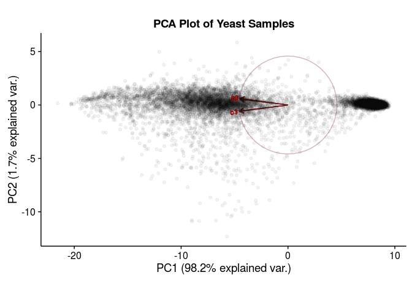


```r
yeast.seq.fit <- glmFit(yeast.seq.dg, DM.yeast.seq)
yeast.seq.lrt <- glmLRT(yeast.seq.fit)
tT.yeast.seq <- topTags(yeast.seq.lrt, adjust.method = "fdr", p.value = 1e-5, n = Inf)
nrow(tT.yeast.seq$table)
```

```
## [1] 2726
```

```r
tT.yeast.seq$table %>% 
	head()
```

```
##         gene     logFC    logCPM       LR PValue FDR
## 3000 YIL057C 10.017784  8.232213 2225.646      0   0
## 4803 YMR175W  9.360732  7.968916 1768.366      0   0
## 3500 YJR095W  9.352922  7.777350 2300.008      0   0
## 4726 YMR107W  9.007061  8.747094 2566.600      0   0
## 3795 YKL217W  8.510151 11.391497 1760.147      0   0
## 6186 YPL201C  7.587718  7.073795 1845.458      0   0
```

```r
plotSmear(yeast.seq.dg)
```


```r
yeast.test.deep <- exactTest(yeast.seq.dg)

yeast.test.deep$table$threshold <- as.factor(abs(yeast.test.deep$table$PValue) < 0.05)
ggplot(yeast.test.deep$table, aes(x = logCPM, y = logFC, color = threshold)) +
	geom_point() + scale_color_manual(name = "P Value < 0.05", values = c("#56B4E9", "#FF661D"))
```

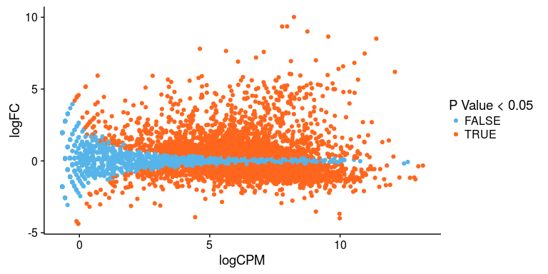

Unfortunately, as you can see, the negative binomial method employed by edgeR (and DESeq) does not fit yeast data well, due to the nature of yeast genes.  Therefore, this method is likely not the best for determining hits.  If there is time, I will work on limma-voom in question 9.


Finally, let's pull our topTags results into a specific data.frame as specified by the homework.  

```r
edger.deep.results <- tT.yeast.seq$table %>% 
	dplyr::select(-logCPM) %>% 
	tbl_df()
colnames(edger.deep.results) <- c("gene.id", "log.fc", "test.stat", "p.value", "q.value")
write_tsv(edger.deep.results, "edger.deep.results.tsv")
```


## 7.3 DEA of low sequencing data

```r
yeast.seq.low <- readr::read_delim("yeast_counts_low_fixed.tsv", delim = "\t")
yeast.seq.low.dg <- DGEList(counts = yeast.seq.low[2:7], genes = yeast.seq.low[1], group = yeast.design$group)
yeast.seq.low.dg <- calcNormFactors(yeast.seq.low.dg)
yeast.seq.low.dg
```

```
## An object of class "DGEList"
## $counts
##   b1 b2 b3 c1 c2 c3
## 1  0  0  0  0  0  0
## 2  4 10  5  9  5 16
## 3  3 13  7  6  5 10
## 4 21 36 16 11  3  6
## 5  1  1  1  0  2  0
## 7121 more rows ...
## 
## $samples
##        group lib.size norm.factors
## b1     batch    76990    1.0078380
## b2     batch   100953    0.9957098
## b3     batch    75435    0.9719395
## c1 chemostat    55758    1.0330754
## c2 chemostat    66758    0.9856305
## c3 chemostat    82217    1.0069110
## 
## $genes
## [1] "YHR055C" "YPR161C" "YOL138C" "YDR395W" "YGR129W"
## 7121 more rows ...
```

```r
# yeast.genes <- yeast_probe_IDs %>% dplyr::select(-probeID)
# colnames(yeast.genes) <- c("gene", "ensembl_gene_id")
# yeast.seq.dg$genes <- inner_join(yeast.seq.dg$genes, yeast.genes, by = "gene")
# yeast.seq.dg$genes <- inner_join(yeast.seq.dg$genes, yeast_probe_IDs)
```

Okay, looks good.  

Fortunately we've already got our design matrix!

```r
DM.yeast.seq.low <- model.matrix(~group, yeast.design)
colnames(DM.yeast.seq.low) <- c("(Intercept)", "chemostat")
rownames(DM.yeast.seq.low) <- colnames(yeast.seq.low)[2:7]
DM.yeast.seq.low
```

```
##    (Intercept) chemostat
## b1           1         0
## b2           1         0
## b3           1         0
## c1           1         1
## c2           1         1
## c3           1         1
## attr(,"assign")
## [1] 0 1
## attr(,"contrasts")
## attr(,"contrasts")$group
## [1] "contr.treatment"
```

Now onto dispersion estimation

```r
yeast.seq.low.dg <- estimateGLMCommonDisp(yeast.seq.low.dg, DM.yeast.seq)
yeast.seq.low.dg <- estimateGLMTrendedDisp(yeast.seq.low.dg, DM.yeast.seq)
yeast.seq.low.dg <- estimateGLMTagwiseDisp(yeast.seq.low.dg, DM.yeast.seq)

plotBCV(yeast.seq.low.dg)
```


```r
yeast.seq.low.fit <- glmFit(yeast.seq.low.dg, DM.yeast.seq)
yeast.seq.low.lrt <- glmLRT(yeast.seq.low.fit)
tT.yeast.seq.low <- topTags(yeast.seq.low.lrt, adjust.method = "fdr", p.value = 1e-5, n = Inf)
nrow(tT.yeast.seq.low$table)
```

```
## [1] 487
```

```r
tT.yeast.seq.low$table %>% 
	head()
```

```
##         gene    logFC    logCPM        LR        PValue           FDR
## 660  YOR374W 6.543083 12.096203 2465.2678  0.000000e+00  0.000000e+00
## 626  YKL217W 8.611697 11.374921 1030.3982 4.435077e-226 1.580218e-222
## 3605 YAL054C 6.465005 10.549084  865.0616 3.865262e-190 9.181286e-187
## 5198 YDR343C 5.242965 10.829360  612.5780 3.076371e-135 5.480555e-132
## 5936 YFL014W 5.114111 10.003787  522.9857 9.483343e-116 1.351566e-112
## 91   YBR067C 6.423952  9.882987  504.4971 9.988435e-112 1.186293e-108
```

```r
plotSmear(yeast.seq.low.dg)
```

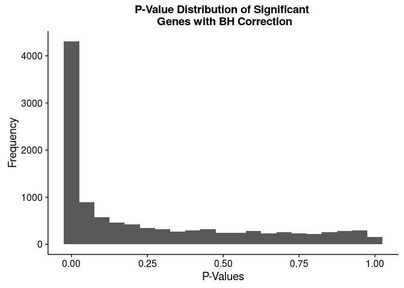

```r
yeast.test.low <- exactTest(yeast.seq.low.dg)
yeast.test.low$table$threshold <- as.factor(abs(yeast.test.low$table$PValue) < 0.05)
ggplot(yeast.test.low$table, aes(x = logCPM, y = logFC, color = threshold)) +
	geom_point() + scale_color_manual(name = "P Value < 0.05", values = c("#56B4E9", "#FF661D"))
```


And let's write out our results as with deep sequencing!

```r
edger.low.results <- tT.yeast.seq.low$table %>% 
	dplyr::select(-logCPM) %>% 
	tbl_df()
colnames(edger.low.results) <- c("gene.id", "log.fc", "test.stat", "p.value", "q.value")
write_tsv(edger.low.results, "edger.low.results.tsv")
```

## 7.4 	Deep vs low sequencing

>*Create a Venn diagram showing all genes identified as differentially expressed (at FDR of 1e-5) in the two previous RNA-Seq analyses and answer the following questions based on the diagram:*

Let's create our Venn Diagram

```r
venncolors <- brewer.pal(3, "Set3")[1:2]

yeast.seq.overlap <- calculate.overlap(
	x = list(
		"deep" = edger.deep.results$gene.id, 
		"low"  = edger.low.results$gene.id
	)
)
str(yeast.seq.overlap)
```

```
## List of 3
##  $ a1: chr [1:2726] "YIL057C" "YMR175W" "YJR095W" "YMR107W" ...
##  $ a2: chr [1:487] "YOR374W" "YKL217W" "YAL054C" "YDR343C" ...
##  $ a3: chr [1:487] "YIL057C" "YMR175W" "YJR095W" "YMR107W" ...
```

```r
# yeast.seq.overlap %<>% get.venn.partitions()
draw.pairwise.venn(area1 = length(yeast.seq.overlap$a1), 
				   area2 = length(yeast.seq.overlap$a3), 
				   cross.area = length(yeast.seq.overlap$a2), 
				   fill = venncolors, 
				   category = c("Deep", "Low"), 
				   ext.text = FALSE
)
```


```
## (polygon[GRID.polygon.2326], polygon[GRID.polygon.2327], polygon[GRID.polygon.2328], polygon[GRID.polygon.2329], text[GRID.text.2330], text[GRID.text.2331], text[GRID.text.2332], text[GRID.text.2333])
```

>*How many genes were identified by edgeR in both low and deep count data?*

Looks good, seems like our low depth sequencing data is a perfect subset (487) of our deep sequencing (2239).  Therefore, overall we've got just 2240 hits, and it seems like lower depth sequencing just reduces our power to detect differentially expressed genes (albeit perhaps with some other costs).

>*How many genes were identified in all the analyses?*

Okay, let's check the overlap for all of these studies. We can see how many matches we get between the 487 genes from low depth sequencing with the microarray results.  

```r
intersect(yeast.DE.genes$gene.id, edger.low.results$gene.id) %>% length()
```

```
## [1] 267
```

Interesting, about 267 genes match. For fun, let's do another quick Venn Diagram.  


```r
venncolors <- brewer.pal(3, "Set3")[1:2]

yeast.seq.overlap <- calculate.overlap(
	x = list(
		"lowseq"  = edger.low.results$gene.id, 
		"microarray" = yeast.DE.genes$gene.id
	)
)
str(yeast.seq.overlap)
```

```
## List of 3
##  $ a1: chr [1:487] "YOR374W" "YKL217W" "YAL054C" "YDR343C" ...
##  $ a2: chr [1:725] "YIL057C" "YOR388C" "YMR303C" "YMR206W" ...
##  $ a3: chr [1:267] "YOR374W" "YKL217W" "YAL054C" "YBR067C" ...
```

```r
draw.pairwise.venn(area1 = length(yeast.seq.overlap$a1), 
				 area2 = length(yeast.seq.overlap$a2), 
				 cross.area = length(yeast.seq.overlap$a3), 
				 fill = venncolors, 
				 category = c("Low Seq", "Microarray"), 
				 ext.text = FALSE
)
```

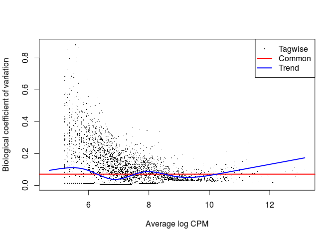

```
## (polygon[GRID.polygon.2334], polygon[GRID.polygon.2335], polygon[GRID.polygon.2336], polygon[GRID.polygon.2337], text[GRID.text.2338], text[GRID.text.2339], text[GRID.text.2340], text[GRID.text.2341], text[GRID.text.2342])
```

>*Comment on the effect of sequencing depth on the DEA results.*

As mentioned above, "...it seems like lower depth sequencing just reduces our power to detect differentially expressed genes (albeit perhaps with some other costs)."


# 8 Compare DEA results from RNA-Seq and arrays

## 8.1 Plots of interesting and boring genes

Let's find some genes to look at! We want:  
- 2 genes reported as differentially expressed in BOTH analyses  
- 1 gene reported as differentially expressed in only the microarray assay  
- 1 gene reported as differentially expressed in only the RNA-seq assay  
- 1 gene reported as not differentially expressed in either assay  

To not be overzealous, I'll be pulling results from the low depth sequencing. 

```r
set.seed(20)
(our.two.hits <- intersect(yeast.DE.genes$gene.id, edger.low.results$gene.id) %>% 
	base::sample(size = 2)
)
```

```
## [1] "YBR294W" "YKL216W"
```

Let's fiddle around with our count table to make it ready for plotting.

```r
yeast.seq.low.melt <- yeast.seq.low %>% 
	melt() %>% tbl_df()
```

```
## Using gene as id variables
```

```r
colnames(yeast.seq.low.melt) <- c("geneID", "sample", "counts")
yeast.seq.low.melt %<>% 
	mutate(group = gsub("[0-9]$", "", sample))
yeast.seq.low.melt %<>% 
	mutate(group = gsub("^b$", "batch", group))
yeast.seq.low.melt %<>% 
	mutate(group = gsub("^c$", "chemostat", group))
yeast.seq.low.melt
```

```
## Source: local data frame [42,756 x 4]
## 
##     geneID sample counts group
##      (chr) (fctr)  (int) (chr)
## 1  YHR055C     b1      0 batch
## 2  YPR161C     b1      4 batch
## 3  YOL138C     b1      3 batch
## 4  YDR395W     b1     21 batch
## 5  YGR129W     b1      1 batch
## 6  YPR165W     b1     33 batch
## 7  YPR098C     b1      6 batch
## 8  YPL015C     b1      3 batch
## 9  YCL050C     b1     14 batch
## 10 YAL069W     b1      1 batch
## ..     ...    ...    ...   ...
```

```r
tail(yeast.seq.low.melt)
```

```
## Source: local data frame [6 x 4]
## 
##      geneID sample counts     group
##       (chr) (fctr)  (int)     (chr)
## 1  tL(UAG)J     c3      0 chemostat
## 2  tR(UCU)E     c3      0 chemostat
## 3  tS(AGA)B     c3      0 chemostat
## 4     snR43     c3      1 chemostat
## 5  tL(UAA)D     c3      0 chemostat
## 6 tV(AAC)G3     c3      0 chemostat
```


### 2 genes reported as differentially expressed in BOTH analyses  

I'm not going to write a function, because this way it is easier for me to change specific aspects of the plot. 

```r
yeast.fg.genes %>% 
	filter(geneID %in% our.two.hits) %>% 
	group_by(group, geneID) %>% 
	do(mutate(., mean = mean(intensity))) %>% 
	ggplot(aes(x = group, y = intensity)) + geom_point(stat = "identity", shape = 1, size = 5) + ylim(0, 13) + 
	geom_point(aes(y = mean), shape = 95, size = 12) + facet_wrap(~geneID) +
	ggtitle("Microarray \n \n Intensity of Two Genes Reported as Differentially \n Expressed in Both Microarray Data and RNA-Seq Data") + 
	ylab("log2-scaled intensity") + xlab("physiological growth conditions")
```

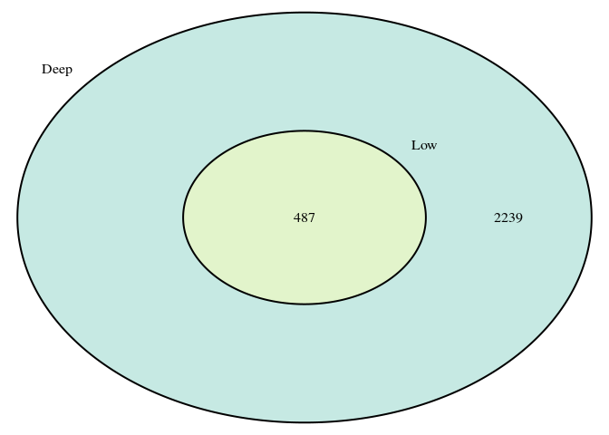


```r
yeast.seq.low.melt %>% 
	filter(geneID %in% our.two.hits) %>% 
	group_by(group, geneID) %>% 
	do(mutate(., mean = mean(counts))) %>% 
	ggplot(aes(x = group, y = counts)) + geom_point(shape = 1, size = 5) + 
	geom_point(aes(y = mean), shape = 95, size = 12) + facet_wrap(~geneID) +
	ggtitle("RNA-Seq \n \n Intensity of Two Genes Reported as Differentially \n Expressed in Both Microarray Data and RNA-Seq Data") + 
	xlab("physiological growth conditions")
```

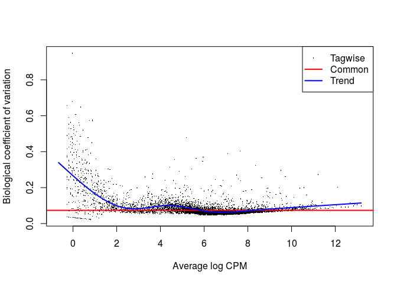

### 1 gene reported as differentially expressed in only the microarray assay


```r
set.seed(20)
(our.array.hit <- setdiff(yeast.DE.genes$gene.id, ## setdiff will return elements in the FIRST argument but not in the second
					edger.low.results$gene.id) %>% 
	base::sample(size = 1)
)
```

```
## [1] "YMR123W"
```

```r
## Let's just double check I've got the setdiff equation working correctly though, shall we?
potential.hits <- setdiff(yeast.DE.genes$gene.id, edger.low.results$gene.id)
potential.hits %>% length()
```

```
## [1] 456
```

```r
intersect(potential.hits, yeast.DE.genes$gene.id) %>% length() ## we want this to be 456, the same length as our number of hits
```

```
## [1] 456
```

```r
intersect(potential.hits, edger.low.results$gene.id) %>% length() ## this should be zero. 
```

```
## [1] 0
```

Phew, looks good! Now we've got hits from `yeast.DE.genes` (our microarray results), but not `edger.low.results` (our low depth sequencing results).

```r
yeast.fg.genes %>% 
	filter(geneID %in% our.array.hit) %>% 
	group_by(group) %>% 
	do(mutate(., mean = mean(intensity))) %>% 
	ggplot(aes(x = group, y = intensity)) + geom_point(stat = "identity", shape = 1, size = 5) + ylim(0, 13) + 
	geom_point(aes(y = mean), shape = 95, size = 12) + facet_wrap(~geneID) + ## keeping in facet_wrap to get that nice gene heading
	ggtitle("Microarray \n \n Intensity of Gene Reported as Differentially \n Expressed in Microarray Data, but Not RNA-seq Data") + 
	ylab("log2-scaled intensity") + xlab("physiological growth conditions")
```

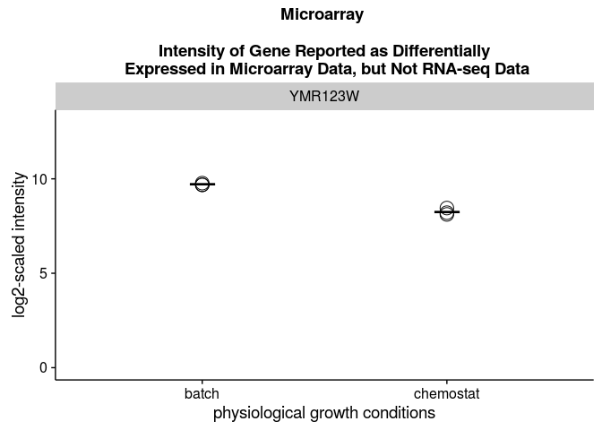


```r
yeast.seq.low.melt %>% 
	filter(geneID %in% our.array.hit) %>% 
	group_by(group) %>% 
	do(mutate(., mean = mean(counts))) %>% 
	ggplot(aes(x = group, y = counts)) + geom_point(shape = 1, size = 5) + 
	geom_point(aes(y = mean), shape = 95, size = 12) + facet_wrap(~geneID) + ## keeping in facet_wrap to get that nice gene heading
	ggtitle("RNA-Seq \n \n Counts of Gene Reported as Differentially \n Expressed in Microarray Data, but Not RNA-seq Data") + 
	xlab("physiological growth conditions")
```


### 1 gene reported as differentially expressed in only the RNA-seq assay  

```r
set.seed(20)
(our.seq.hit <- setdiff(edger.low.results$gene.id, ## setdiff will return elements in the FIRST argument but not in the second
					yeast.DE.genes$gene.id) %>% 
	base::sample(size = 1)
)
```

```
## [1] "YNL115C"
```


```r
yeast.fg.genes %>% 
	filter(geneID %in% our.seq.hit) %>% 
	group_by(group) %>% 
	do(mutate(., mean = mean(intensity))) %>% 
	ggplot(aes(x = group, y = intensity)) + geom_point(stat = "identity", shape = 1, size = 5) + ylim(0, 13) + 
	geom_point(aes(y = mean), shape = 95, size = 12) + facet_wrap(~geneID) + ## keeping in facet_wrap to get that nice gene heading
	ggtitle("Microarray \n \n Intensity of Gene Reported as Differentially \n Expressed in RNA-seq Data, but Not Microarray Data") + 
	ylab("log2-scaled intensity") + xlab("physiological growth conditions")
```

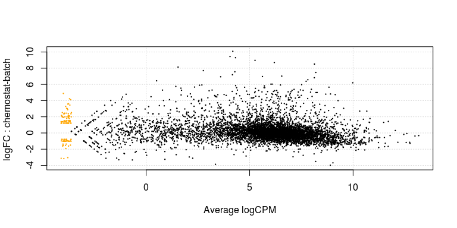


```r
yeast.seq.low.melt %>% 
	filter(geneID %in% our.seq.hit) %>% 
	group_by(group) %>% 
	do(mutate(., mean = mean(counts))) %>% 
	ggplot(aes(x = group, y = counts)) + geom_point(shape = 1, size = 5) + 
	geom_point(aes(y = mean), shape = 95, size = 12) + facet_wrap(~geneID) + ## keeping in facet_wrap to get that nice gene heading
	ggtitle("RNA-Seq \n \n Counts of Gene Reported as Differentially \n Expressed in RNA-seq Data, but Not Microarray Data") + 
	xlab("physiological growth conditions")
```

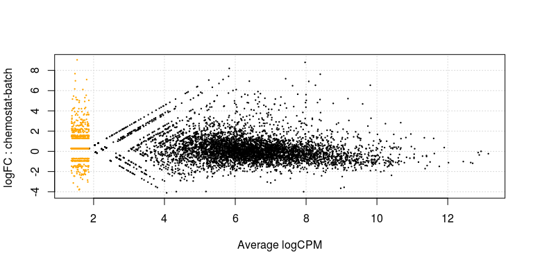
### 1 gene reported as not differentially expressed in either assay 


```r
seq.null.hits <- setdiff(yeast.seq.low$gene, ## setdiff will return elements in the FIRST argument but not in the second
						 edger.low.results$gene.id) 

array.null.hits <- setdiff(yeast.fixed.genes$geneID, ## setdiff will return elements in the FIRST argument but not in the second
						   yeast.DE.genes$gene.id) 

set.seed(20)
(our.null.hit <- intersect(seq.null.hits,
					array.null.hits) %>% 
	base::sample(size = 1)
)
```

```
## [1] "YDR297W"
```


```r
yeast.fg.genes %>% 
	filter(geneID %in% our.null.hit) %>% 
	group_by(group) %>% 
	do(mutate(., mean = mean(intensity))) %>% 
	ggplot(aes(x = group, y = intensity)) + geom_point(stat = "identity", shape = 1, size = 5) + ylim(0, 13) + 
	geom_point(aes(y = mean), shape = 95, size = 12) + facet_wrap(~geneID) + ## keeping in facet_wrap to get that nice gene heading
	ggtitle("Microarray \n \n Intensity of Gene Reported as Not Differentially \n Expressed in RNA-seq Data or Microarray Data") + 
	ylab("log2-scaled intensity") + xlab("physiological growth conditions")
```


```r
yeast.seq.low.melt %>% 
	filter(geneID %in% our.null.hit) %>% 
	group_by(group) %>% 
	do(mutate(., mean = mean(counts))) %>% 
	ggplot(aes(x = group, y = counts)) + geom_point(shape = 1, size = 5) + 
	geom_point(aes(y = mean), shape = 95, size = 12) + facet_wrap(~geneID) + ## keeping in facet_wrap to get that nice gene heading
	ggtitle("RNA-Seq \n \n Counts of Gene Reported as Not Differentially \n Expressed in RNA-seq Data or Microarray Data") + 
	xlab("physiological growth conditions")
```


<center>\~Fin\~</center>

********
This page was last updated on  Wednesday, March 16, 2016 at 10:42PM
