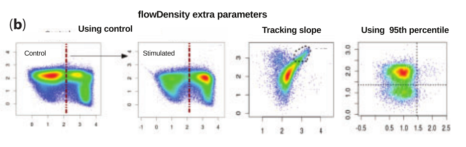

## [FloReMi: Flow Density Survival Regression Using Minimal Feature Redundancy](http://www.dx.doi.org/10.1002/cyto.a.22734)

### Published in *Cytometry Part A*, August 2015

*****

### Goals & Findings
This paper was published in response to the [FlowCAP IV challenge](http://flowcap.flowsite.org/), initiated to better predict clinical outcome of patients from blood draw samples.  Specifically, the goal of the FlowCAP IV challenge was to predict the time until progression to AIDS for HIV patients, given peripheral blood mononuclear cells (PBMC) analyzed in different conditions by flow cytometry. The FlowCAP consortium is run in part by the BC Cancer Agency and University of British Columbia.  
This paper, the winner of the challenge, found that their method of minimal feature redundancy worked well during cross validation when combined with predictive models such as the Cox Proportional-Hazards model, the Additive Hazards model, and the Random Survival Forests model.  However, upon testing testing novel data, the authors found that even with their method, only the Random Survival Forest model did significantly better than random, mostly due to its resilience to overfitting.  

### Data

The authors were provided with the FlowCAP IV challenge dataset, high-dimensional (multicolor) flow cytometry dataset with sixteen different markers:  

- FSC-A, FSC-H, SSC-A - three markers describing cells' size and shape  
- IFNγ, TNFα, CD4, CD27, CD107-A, CD154, CD3, CCR7, IL2, CD8, CD57, CD45RO, V-Amine/CD14 - various immune markers  
The samples were split into two groups: stimulated with HIV antigen and unstimulated. 
The authors were provided first with a training data set with which to develop their algorithm/pipeline, and later provided with a test dataset on which to test the efficacy of their algorithm.  

### Analysis

The FloReMi algorithm performs in four main steps.  

#### 1. Preprocessing.  

The authors needed to automate a standard flow cytometry workflow because of the high dimensionality of the data, and in order for their research to be reproducible. 

- First is quality control, inspecting uniformity of "events", or cells detected over time to remove clumps of cells or blank spots (~5.30% removed).  
- Next, the authors removed margin events cells that saturated the detector when fluorescing, or events below detection limits.  These such events are not reliable measurements (~2.30% removed).  
- Next the authors removed doublets (cell pairs) by computing the front scatter height to area ratio (FSC-A/FSC-H) to remove further unreliable readings (~4.45% removed).  
- Next, the authors performed two standard flow cytometry steps, compensation and transformation.  
	+ Compensating for crossover between excitation spectra of multiple fluorochromes is crucial in multicolor flow cytometry, particularly when measuring 13 features.  
	+ Transformation is simply a data transformation done for easier analysis.  
- Finally the authors gated on live T-cells (the CD14lo/CD3hi population) with flowDensity, an automated gating program developed at the BC Cancer Research Agency. CD14 is a monocyte/macrophage marker and CD3 is a T-cell marker.  

#### 2. Feature Extraction  
Next, the authors moved to unsupervised learning with feature extraction.  This step is composed of three main parts.  

- First, flowDensity was used again to determine splits for 10 of the 16 features in the dataset (FSA-A, SSC-A, CD4, CD27, CD107-A, CD154, CCR7, CD8, CD57, and CD45RO).  FlowDensity determines best split based on density distribution, and splits between peaks, as this figure illustrates.  
  

- In this step, they excluded FSC-H, CD3, and CD14, because they were already taken into account in preprocessing.  Additionally, IFNγ, TNFα, and IL-2 were removed to reduce computation time.  Though this sacrifices a great deal of information, these intracellular stains often don't have clear peaks, which makes automatic gating very difficult.  Next, the flowType dynamic programming algorithm was used to determine subsets based on these splits, identifying many cell populations that would not be manually identifiable.  In total, roughly 60,000 subsets were identified.  

- Finally, "features" of each subset were extracted--mean fluorescence intensity for each of the 13 immune markers (including IFNγ, TNFα, and IL-2), as well as the percentage of cells.  This left the authors with 2.5 million features per patient (3^10 * 14) x 3 (three groups - stimulated, unstimulated, and difference).  

#### 3. Feature Selection.  
This step is a supervised machine learning method, and is key to the "minimal feature redundancy" highlighted in this paper's title.  The idea was to select features with high correlation to survival time, but because of the nature of survival analysis, a simple metric such as pearson correlation could not be used due to censored values (patients that had not yet progressed to AIDS).  Therefore, the authors proceeded with the Cox proportional-hazards model.  

- First, each feature of the 2.5 million were fed into the hazards model--this returns a p-value and concordance index.  Next, the features must be picked.  However, features highly correlated with each other have a negative impact on training and classification (the multicollinearity problem), so redundancy must be minimized.  
- To combat this, the authors started adding the highest correlated features first, comparing pearson correlation *between features* as they went, and used a cutoff of corr < 0.2 to rule out correlated features.  This cutoff may seem stringent, but with 2.5 million features per patient, the authors could afford to be stringent.  Also remember that these features are the MFI of specific subtypes of cells, described by combinations of markers, and correlated features may only differ by a few markers in that subtype.  

#### 4. Survival Time Prediction.  
Finally, with the features selected, the authors evaluated three different regression techniques to predict survival time (time to AIDS) of patients.  The authors performed leave-one-out cross validation on their training sets, creating a final model with the entire training dataset.  Finally, the model's performance was evaluated with p-values and concordance index.  

- For the Cox proportional-hazards model, features were added until the concordance index did not improve.  The concordance index plateaued after approximately 13 features were added (see figure).  

- For the Random Survival Forests, survival trees were generated where each split "maximizes survival distance between the daughter nodes".  A forest with 500 regression trees was generated, using the same 13 features as the Cox PH model.  Interestingly, this model returns mortality, not survival time, with mortality being scaled 0-1, and converted to survival time.  
- Finally, "regularization for semiparametric additive hazards regression" was used, which is (as you can probably guess from the title), a regularized version of a standard hazards model.  This method actually performs its own feature selection akin to LASSO or elastic net, choosing the 100 best features and performing 5-fold cross validation.  These parameters were tuned, with similar results whether 80 or 200 features were supplied.  

### Results

All models had p-values of ~0 when subjected to leave-one-out cross validation, and an impressive concordance index >0.8.  Remember, for concordance:  

- 1   = perfect prediction  
- 0.5 = random prediction  
- 0   = inverse (perfect) prediction  

However, when run on the freshly supplied test dataset, the Cox PH model and the Additive Hazards model had concordance indices of NEARLY RANDOM (0.5).  Fortunately for the authors, the Random Survival Forests model still had a concordance index of 0.672 when run on the test dataset.  

This makes sense given that random forests are particularly robust to overfitting.  

In this figure, I will draw your attention to the large spread of points in all of the models on the test dataset.  In addition, the correlation for Cox PH and Additive Hazards model are incredibly poor, with only the Random Survival Forests model having a positive slope, albeit with an enormous spread.  However, the authors are quick to point out the importance of their feature selection algorithm here.  Without this step, multicollinearity reduces the concordance index of the Random Survival Forests model to 0.5.  

It is likely that overfitting is the main culprit to the poor scores on the test dataset.  The authors suggest that the features selected in training the model are specific to the training population, and are therefore poor predictors overall. 

### Critique
Interestingly, the model predicts that some of the best features for predicting survival time are "negative" features. Looking at **Table 3**, you can see that the vast majority of the subset identifiers are negative populations, with 2/13 of the subsets being entirely composed of negative markers.  This is worrisome, as it leads me to believe that there *are* other markers not studied here that better identify these populations.  Just off the top of my head, the exclusion of IFN-γ, IL-2, and TNFα in the feature extraction step could contribute to this problem.  

Continuing with that thought, the exclusion of IFN-γ, IL-2, and TNFα in Feature Extraction is particularly worrysome due to their functional importance.  IL-2 especially, which is a T cell growth factor, and of importance to Tregs, may play a role in HIV. In order to reduce the computation time necessary when including these cytokines, the authors could explore novel algorithms for automatic gating aside from flowDensity, which may have better luck with distributions that are not cleanly bimodal.  Though these cytokines were still used in feature selection, none of them appear in the top 13 list used in the Cox PH & Random Survival Forests models.  From an experimental design viewpoint, it would be interesting to repeat this study with new markers/stains.  

Another weakness of this algorithm is its reliance on the Cox proportional-hazards model, which has its drawbacks.  Particularly, the Cox PH model assumes that the hazard ratio for any given patient does not change over time.  I believe this particular assumption is often untrue, as hazards may often diverge due to environmental/lifestyle factors, or simply due to change in treatment--which happens often with HIV patients.  

Even in the Random Survival Forests approach, the Cox PH model was used for feature selection.  There is still a possible weakness in the feature selection step here, as random forests are particularly susceptible to highly correlated data which distorts the randomness of trees.  Even though the authors attempted to control for highly correlated features, they only used a pearson correlation to this end.  I believe they could have looked at the identifiers of the subsets as well, and restricted their overlap.  For example, the first two features used were the percentage of cells in the unstimulated group with CD4/CD27 double negative population.  Though there were other differences between these groups, I find it hard to believe that they could be so different as to warrant being the top two features.  Perhaps the authors could have 

Finally, “scaling” mortality (0-1 scale) to survival time seems a bit sketchy.  That being said, though it is less than ideal, the results speak for themselves.  However, it would be interesting if this method could be adapted to allow for greater performance, as random forests seem to have the best performance overall.  

*****

