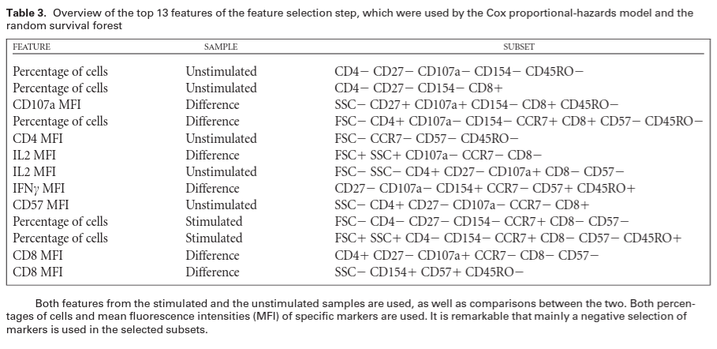
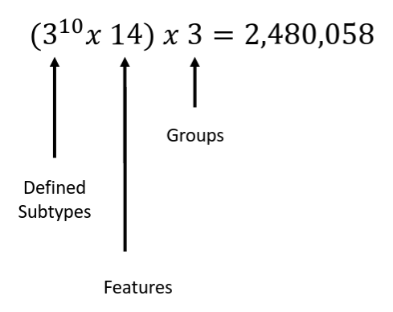
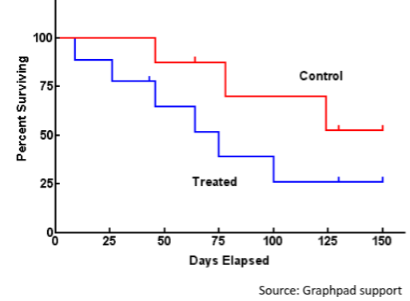
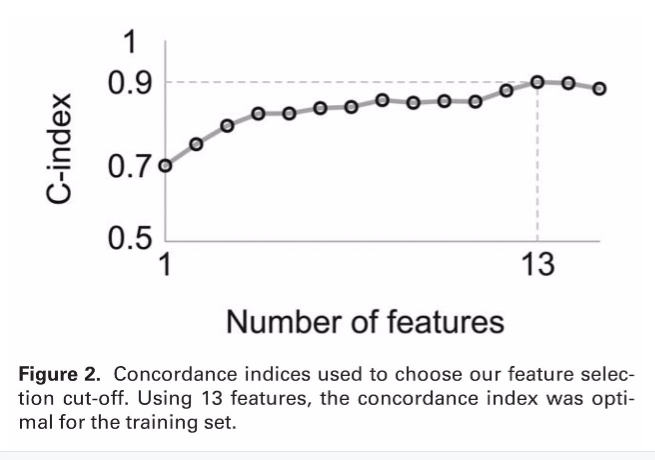
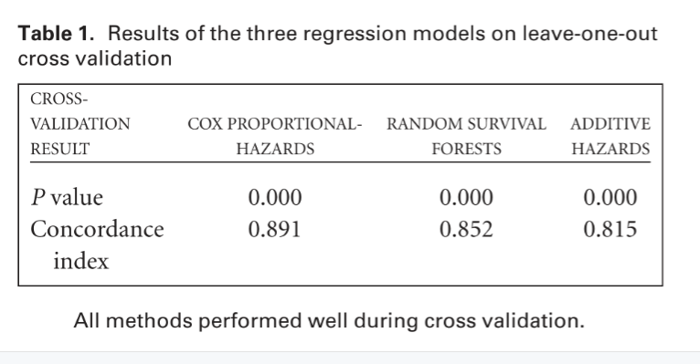
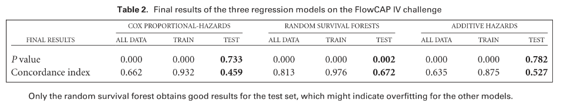
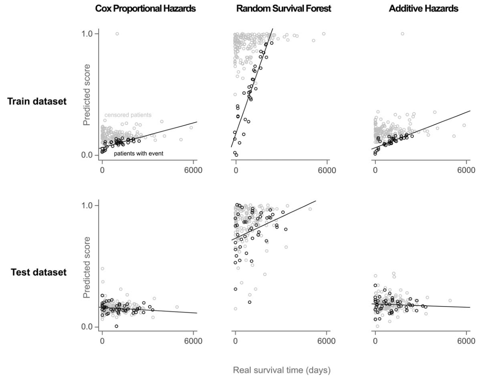
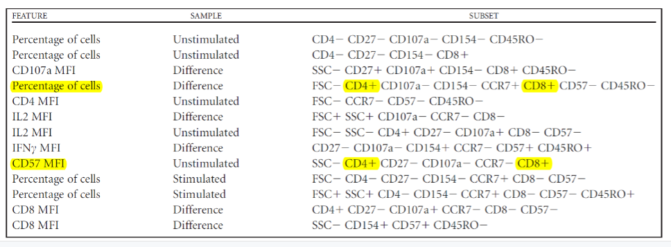
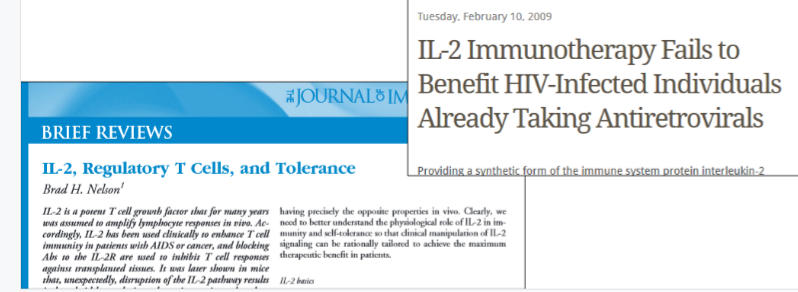

### [FloReMi: Flow Density Survival Regression Using Minimal Feature Redundancy](http://www.dx.doi.org/10.1002/cyto.a.22734)

#### Published in *Cytometry Part A*, August 2015

*****

#### Overview
The goal of the FlowCAP IV challenge was to predict the time until progression to AIDS for HIV patients, a task which was manually studied by Ganesan, et al.[1](#references)

#### Data

#### Analysis
The FloReMi algorithm performs in four main steps.  
1. Preprocessing.  I will not touch on this further as this step is part of a standard flow cytometry workflow, and is not computationally-based.  
2. Feature Extraction.  This step is unsupervised machine learning, and sets up feature selection.  
3. Feature Selection. This step is a supervised machine learning method, and is key to the "minimal feature redundancy".  
4. Survival Time Prediction.  Finally, with the features selected, the Cox Proportional Hazards model is used to fit a logsitic regression model to our selected features, predicting survival time of patients.  

2. Feature Extraction
- Determine splits 
	+ flowDensity for automatic gating in one dimension.  
	+ Wonderfully optimized; no clustering!  
- Define subsets from thresholds determined by flowDensity:  

- Compute all 14 features for each subtype of each sample for both stimulated, unstimulated, and diff between stim & unstim. 

 ~~ Interjection ~~  

What is the Cox Proportional Hazards Model?  
- Survival time is described as a probability distribution  
- Hazard Ratio: ratio between chance for event in one group vs other group  
- “Proportional Hazards” means you can have multiple groups  
	+ Age, treatment, risk factors, etcetera  
- Cox PH Regression will fit & tell you what groups matter  
- “Censored values” allow for events not yet detected to be fit in regression  
- Susceptible to highly correlated values  

 
  

3. Feature Selection
- Reduce number of features to allow for regression  
- Can’t use Pearson correlation because of censored values  
- Computer p-value of Cox proportional-hazard  
	+ Feed 2.5 million features into the hazards model  
- Sort on p-value  
- Select only uncorrelated  
	+ Pick features iteratively, discard if corr > 0.2  

4. Survival Time Prediction  
- Compute concordance  
	+ 0.5 = Random  
	+ 1.0 = Perfect  
	+ 0.0 = Predicted perfectly... just opposite  
- TNFα related features not present  
- Add uncorrelated features until concordance does NOT improve  
  
- Random Survival Forest  
	+ Survival trees where each split “maximizes survival distance between daughter nodes”  
	+ Takes censored values into account  
	+ Same 13 features as Cox PH  
	+ Returns MORTALITY, not survival time  
	+ Scaled mortality survival time: 0-1  
- Regularization for Semiparametric Additive Hazards Regression  
	+ Performs its own feature selection similar to LASSO or elastic net  
	+ Authors took 100 “best” features & trained with 5  

Step Done: Results  
  
- Overfitting  
	+ Random Forests inherently resilient to overfitting  
	+ Susceptible to highly correlated data, distorts randomness of trees  
	+ BUT authors attempted to control for correlation  

Findings
- Findings are limited
- Partially due to dataset
- Authors admit “mostly negative markers”
- Could be redone with new markers

- Emphasizes possible importance of CD4+/CD8+ (double positive) T cells

#### Critique

- Exclusion of IFN-γ,IL-2, and TNFαin Feature Extraction (3 days)  
	+ IL-2 especially, T cell growth factor, and importance to Tregs  
- Still used in feature selection  
  
- Cox Proportional Hazards Model has drawbacks  
- Assumption that hazard ratio doesn’t change over time  
	+ Can be untrue when hazards diverge (i.e. different treatment courses)
- Even with Random Survival Forest, Cox PH Model was used for feature selection
- “Scaling” mortality to survival time seems a bit sketchy
	+ But then again, results speak for themselves
>*"Regression forests are for nonlinear multiple regression. They allow the analyst to view the importance of the predictor variables."*
>*"Survival forests are a model-free approach to survival analysis. They allow the analyst to view the importance of the covariates as the experiment evolves in time"*

*****

#### References 

1. Ganesan A, Chattopadhyay PK, Brodie TM, Qin J, Gu W, Mascola JR, Michael NL,Follmann DA, Roederer M. Immunologic and virologic events in early HIV infectionpredict subsequent rate of progression. J Infect Dis 2010;201:272–284.