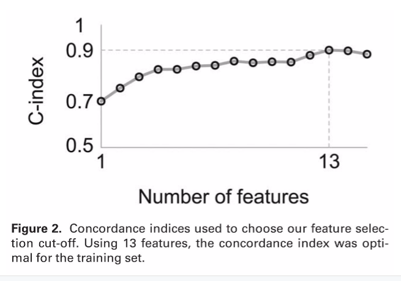

### [FloReMi: Flow Density Survival Regression Using Minimal Feature Redundancy](http://www.dx.doi.org/10.1002/cyto.a.22734)

#### Published in *Cytometry Part A*, August 2015

*****

1. Preprocessing.  An automated approach to a standard flow cytometry workflow composed of six parts.  
	+ Quality Control - Inspect uniformity of data over time (~5.30% removed)  
	+ Remove margin events - Remove min/max, and oversaturated events (~2.30% removed)  
	+ Remove doublets - Compute FSC-A/FSC-H ratio (~4.45% removed)  
	+ Compensation - Traditional flow preprocessing  
	+ Transformation - Traditional flow preprocessing  
	+ Select live T-cells - Automatic gating with flowDensity on CD14lo/CD3hi
2. Feature Extraction.  This is an unsupervised machine learning process composed of three parts.  
	+ Determine Splits  
	+ Take hi/lo intensities from automatic gating, and use them to find subsets  
	+ Extract features of each subset as defined by flowType  
3. Feature Selection. This step is a supervised machine learning method, and is key to the "minimal feature redundancy".  
4. Survival Time Prediction.  Finally, with the features selected, the Cox proportional-hazards model is used to fit a logsitic regression model to our selected features, predicting survival time of patients.  

2. Feature Extraction
- Determine splits 
	+ flowDensity for automatic gating in one dimension.  
	+ Wonderfully optimized; no clustering!  
- Define subsets from thresholds determined by flowDensity:  

- Compute all 14 features for each subtype of each sample for both stimulated, unstimulated, and diff between stim & unstim. 

 **~~ Interjection ~~**  

What is the Cox proportional-hazards Model?  
- Survival time is described as a probability distribution  
- Hazard Ratio: ratio between chance for event in one group vs other group  
- “proportional-hazards” means you can have multiple groups  
	+ Age, treatment, risk factors, etcetera  
- Cox PH Regression will fit & tell you what groups matter  
- “Censored values” allow for events not yet detected to be fit in regression  
- Susceptible to highly correlated values  

 
  

3. Feature Selection
- Reduce number of features to allow for regression  
- Can’t use Pearson correlation because of censored values  
- Computer p-value of Cox proportional-hazard  
	+ Feed 2.5 million features into the hazards model  
- Sort on p-value  
- Select only uncorrelated  
	+ Pick features iteratively, discard if corr > 0.2  

4. Survival Time Prediction  
- Compute concordance  
	+ 0.5 = Random  
	+ 1.0 = Perfect  
	+ 0.0 = Predicted perfectly... just opposite  
- TNFα related features not present  
- Add uncorrelated features until concordance does NOT improve  
  
- Random Survival Forest  
	+ Survival trees where each split “maximizes survival distance between daughter nodes”  
	+ Takes censored values into account  
	+ Same 13 features as Cox PH  
	+ Returns MORTALITY, not survival time  
	+ Scaled mortality survival time: 0-1  
- Regularization for Semiparametric Additive Hazards Regression  
	+ Performs its own feature selection similar to LASSO or elastic net  
	+ Authors took 100 “best” features & trained with 5  
